**Forfatter(e):** Frida Berge-Robertson, Sebastian Vambheim Thunestvedt

*Oliver Matre Hille var opprinnelig medlem av prosjektgruppen, men trakk seg fra prosjektet 2026-04-24. Han står ikke oppført som forfatter av denne rapporten.*

**Totalt antall sider inkludert forsiden:** \totalpages

**Molde, Innleveringsdato:** 2026-05-31

---

## Obligatorisk egenerklæring/gruppeerklæring {-}

Den enkelte student er selv ansvarlig for å sette seg inn i hva som er lovlige hjelpemidler, retningslinjer for bruk av disse og regler om kildebruk. Erklæringen skal bevisstgjøre studentene på deres ansvar og hvilke konsekvenser fusk kan medføre. Manglende erklæring fritar ikke studentene fra sitt ansvar.

### Personvern {-}

#### Personopplysningsloven {-}

Forskningsprosjekt som innebærer behandling av personopplysninger iht. Personopplysningsloven skal meldes til Norsk senter for forskningsdata, NSD, for vurdering.

Har oppgaven vært vurdert av NSD? **nei**

- Hvis ja:

Referansenummer: —

- Hvis nei:

Jeg/vi erklærer at oppgaven ikke omfattes av Personopplysningsloven: **ja**. Analysen behandler ikke personopplysninger. Datagrunnlaget er aggregerte salgs- og kapasitetsdata per SKU på ukentlig nivå og inneholder ingen informasjon om kundeidentitet, transaksjonsdata på kundenivå eller andre elementer som omfattes av loven.

#### Helseforskningsloven {-}

Dersom prosjektet faller inn under Helseforskningsloven, skal det også søkes om forhåndsgodkjenning fra Regionale komiteer for medisinsk og helsefaglig forskningsetikk, REK, i din region.

Har oppgaven vært til behandling hos REK? **nei**. Prosjektet omhandler hylleallokering i dagligvarehandelen og omfattes ikke av Helseforskningsloven.

- Hvis ja:

Referansenummer: —

### Bruk av kunstig intelligens {-}

I tråd med Høgskolen i Moldes retningslinjer for KI-bruk i studentarbeider redegjør forfatterne her for hvordan kunstig intelligens er benyttet i prosjektet.

**Verktøy som er brukt.** Claude Code (Anthropic; Opus 4.7, Sonnet 4.6 og Haiku 4.5) som primær KI-agent for kode, tekst og analyse. Codex (OpenAI) er brukt sporadisk som supplement. Begge er kjørt i terminalbaserte agentmiljø (VS Code) med versjonskontroll i Git.

**Områder der KI er brukt.**

- *Idéutvikling og scope-justering.* KI har vært brukt som diskusjonspartner for problemformulering og avgrensning, blant annet ved omdefineringen av perspektivet fra butikk til leverandør 2026-04-24.
- *Python-kode.* Datarensing, ABC-klassifisering, LP-modellering i PuLP, sensitivitetsanalyse og visualiseringer er i hovedsak generert med KI-assistanse. Forfatterne har lest gjennom og kjørt all kode, kontrollert at output er rimelig, og verifisert mot rådata før resultater er overført til rapporten.
- *Figurer og tabeller.* Plotting-kode (matplotlib, seaborn, plotly) er KI-generert. Selve figurene er manuelt validert mot underliggende data.
- *Rapporttekst.* KI har bidratt med utkast, omformuleringer, struktur og språkvask. All faglig vurdering, modellantagelser, fortolkninger og endelige formuleringer er forfatternes egne valg.
- *Litteraturstøtte.* KI har foreslått søkeord, sammenfattet artikler og pekt på kilder. Hver enkelt referanse i §10 er deretter manuelt verifisert: forfatterne har lastet ned fulltekst og kontrollert at kilden faktisk eksisterer og er korrekt sitert.
- *Forelesningstranskripsjoner.* Auto-transkripsjoner av faglærers forelesninger er rensa med KI som kontekstgrunnlag for prosjektarbeidet, ikke for sitering.
- *Prosjektledelse.* MS Project-XML genereres fra JSON-kildefiler via en KI-assistert pipeline.

**Hva forfatterne står inne for.** All kode er kjørt og output er verifisert. Modellvalg, antagelser og fortolkninger er forfatternes egne. Alle referanser er fysisk lest og kontrollert.

**Hva KI ikke har gjort.** Ingen tall, datapunkter eller resultater er KI-generert uten kjøring av reell kode mot reelle data. Ingen referanser er beholdt uten manuell verifikasjon.

### Publiseringsavtale {-}

**Studiepoeng:** 15

**Veileder:** Per Kristian Rekdal og Bård-Inge Pettersen

**Fullmakt til elektronisk publisering av oppgaven**

Forfatter(ne) har opphavsrett til oppgaven. Det betyr blant annet enerett til å gjøre verket tilgjengelig for allmennheten (Åndsverkloven. §2).

Alle oppgaver som fyller kriteriene vil bli registrert og publisert i Brage HiM med forfatter(ne)s godkjennelse.

Oppgaver som er unntatt offentlighet eller båndlagt vil ikke bli publisert.

Jeg/vi gir herved Høgskolen i Molde en vederlagsfri rett til å gjøre oppgaven tilgjengelig for elektronisk publisering: **nei**.

Er oppgaven båndlagt (konfidensiell)? **nei**. Rapporten bruker pseudonymer og inneholder ingen direkte identifiserbar bedrifts- eller produktinformasjon. Rådata er unntatt og publiseres ikke.

(Båndleggingsavtale må fylles ut hvis Coop Extra X krever det)

- Hvis ja:

Kan oppgaven publiseres når båndleggingsperioden er over? nei

**Dato:** 2026-05-31

---

## Sammendrag {-}

Rapporten undersøker hvordan en dagligvareleverandør kan bruke ukentlige sell-out-data fra en kjede-butikk som beslutningsstøtte i forhandlinger om hylleplass. Den beregner hvor stor gevinst leverandøren kan oppnå ved å omfordele hylleplass i egen portefølje hos Coop Extra X, og hvordan dette kan brukes som argument overfor kjeden. Perspektivet er leverandørens; data på konkurrerende produkter inngår ikke, hvilket speiler den informasjons­asymmetri som kjennetegner reelle leverandør-kjede-forhandlinger. Basert på ukentlige sell-out-data for leverandørens 34 SKUer over ti uker (uke 06–15, 2026), formuleres en deterministisk lineær programmerings­modell (LP) implementert i Python med PuLP. Modellen omfordeler den kontraktuelle primær hylleallokeringen (1 079 hylleenheter, fordelt på 154 frontfacings × ca. 7 i hylledybde) og fordeler et begrenset antall sekundær­plasser med høyere salgsproduktivitet, slik at *margin-vektet* forventet sell-out maksimeres under produktspesifikke minimums­gulv som reflekterer sortiments­garantier. Produktiviteten er modellert med eksplisitt avtakende marginalavkastning over nåværende kapasitet, i tråd med Curhans space-elasticity-tradisjon; den tekniske formuleringen og parametervalget drøftes i §3 og §6. Analysen avdekker en gjennomgripende mismatch mellom hyllefordeling og etterspørsel: 24 av 34 SKUer er underkapasiterte mens 10 over­kapasiterte SKUer beslaglegger plass uten å fylles før neste etterfylling. En *ex post*-kalkyle av out-of-stock-tapet anslår at leverandøren i dagens hyllekonfigurasjon mister 367–734 margin-enheter per uke (43–87 % av baseline). Hovedanbefalingen — som beholder alle 34 SKUer med et gulv på 1 kolli per SKU og dirigerer 3 sekundær­plasser til den mest produktive A-SKUen — gir **+24,3 % margin-vektet og +25,7 % i volum** sammenlignet med observert baseline. En bootstrap-analyse over 1 000 resamplinger av 10-ukers vinduet gir 95 %-konfidensbånd **[+22,1 %, +28,0 %]** på margin-gevinsten. En heuristikk-benchmark mot enkle allokerings­regler viser at LP-modellen henter +13,4 prosent­poeng utover beste regel (proporsjonal til margin × salg, +10,9 %). *Forbehold:* dempingsfaktoren som styrer hvor sterkt produktiviteten avtar over observert kapasitet er valgt som en pragmatisk midtkalibrering mellom litteraturens estimater — den er ikke empirisk estimert fra dette datasettet. Sensitivitetsanalyse over realistiske verdier gir et bredere bånd på +12 til +32 % margin-gevinst. Resultatet er operasjonelt meningsfullt i en forhandlings­kontekst siden det dokumenterer et kvantifisert reallokerings­potensial innen leverandørens egen portefølje — et utgangspunkt for kategoridialog med kjeden som krever verken investering eller utvidelse av leverandørens totale hylleallokering.

**Nøkkelord:** hylleallokering, space management, lineær programmering, retail, dagligvare, datadrevet beslutningsstøtte.

---

## Abstract {-}

This report examines how a grocery supplier can use weekly sell-out data from a chain store as decision support in shelf-space negotiations, and quantifies the reallocation gain that can be documented towards the chain within the supplier's own portfolio at a Coop Extra store. The perspective is the supplier's; competing products are not included in the dataset — mirroring the information asymmetry typical of real supplier–retailer negotiations. Using ten weeks of weekly sell-out data for the supplier's 34 SKUs (weeks 06–15, 2026), a deterministic linear programming model (LP) implemented in Python with PuLP reallocates the supplier's contracted primary shelf space (1,079 shelf units across 154 front-facings × ~7 shelf depth) and assigns a limited number of secondary-display slots with higher sales productivity so as to maximize expected *margin-weighted* sell-out, subject to minimum-floor constraints reflecting assortment commitments. Productivity is modelled with explicit diminishing marginal returns above the current shelf capacity, in line with Curhan's space-elasticity tradition; the technical formulation and parameter choice are discussed in §3 and §6. The analysis surfaces a pervasive mismatch between shelf and demand: 24 of 34 SKUs are under-capacitated while 10 over-capacitated SKUs occupy shelf space that is not depleted before the next replenishment. An ex post calculation of the out-of-stock loss estimates that the supplier currently loses 367–734 margin units per week (43–87 % of baseline). The main recommendation — which preserves all 34 SKUs at a per-SKU floor of one case and assigns 3 secondary slots to the most productive A-class SKU — yields **+24.3 % margin-weighted and +25.7 % volume gain** compared to the observed baseline. A bootstrap analysis over 1,000 resamples of the 10-week window gives 95 % confidence bands of **[+22.1 %, +28.0 %]** on margin gain. A heuristic benchmark against simple allocation rules shows that the LP captures +13.4 percentage points over the best rule (proportional to margin × sales, +10.9 %). *Caveat:* the damping factor controlling how strongly productivity declines above observed capacity is set as a pragmatic mid-calibration between literature estimates — it is not empirically estimated from this dataset. Sensitivity analysis across realistic values gives a wider band of +12 to +32 % margin gain. The finding is operationally meaningful in a negotiation context because it documents a quantified reallocation potential within the supplier's own portfolio — a starting point for category dialogue with the chain that requires neither capital investment nor expansion of the supplier's total shelf allocation.

**Keywords:** shelf allocation, space management, linear programming, retail, grocery, data-driven decision support.

---

## Forkortelser {-}

| Forkortelse | Betydning |
|---|---|
| ABC | A/B/C-segmentering av sortiment etter kumulativt salgsbidrag |
| CBC | COIN-OR Branch and Cut — open source LP/MIP-solver |
| JBP | Joint Business Planning — strukturert kategorimøte mellom leverandør og kjede |
| LP | Lineær programmering |
| OOS | Out-of-stock — situasjon hvor SKU er tom i hyllen |
| POS | Point-of-sale — kassesystem som registrerer sell-out |
| SKU | Stock Keeping Unit — unik produktvariant |
| SSAP | Shelf-Space Allocation Problem — etablert formulering i operasjonsforskning |

---

## Innledning

> **Kort om rapporten.** *En dagligvareleverandør har en gitt mengde hylleplass hos Coop Extra. Spørsmålet rapporten besvarer er om denne plassen er brukt optimalt for leverandørens egen lønnsomhet. Basert på ti ukers salgsdata for 34 produkter finner vi at flertallet av A-produktene er underdimensjonerte mens noen få har overflødig plass. En matematisk omfordeling — innenfor den samme totale hyllerammen, uten å ta ut produkter — forventes å gi ca. 24 % høyere margin-vektet salg per uke. Resten av rapporten dokumenterer metoden, dataene, og hvordan forslaget kan brukes i forhandling med kjeden.*

Hylleplass i dagligvarebutikken er en knapp ressurs og en kontraktuell størrelse. Leverandørens andel av kjedens hylleplass er resultat av forhandlinger som gjennomføres i kategoribesøk og Joint Business Planning (JBP)-møter, der leverandøren argumenterer for at deres SKU-portefølje fortjener en gitt kontraktuell allokering. I disse møtene brukes rutinemessig salgs- og lagerdata som underlag, men **kvantifiserte reallokerings­forslag innen leverandørens egen portefølje** baseres ofte på erfaringsbasert skjønn snarere enn eksplisitt matematisk modellering. Dette prosjektet utvikler en enkel, reproduserbar modell for nettopp dette — et beslutningsstøtte­verktøy en leverandør kan bruke for å gå inn i hylledialogen med kjeden med en tallfestet argumentasjon.

Motivasjonen er konkret: en leverandør har innsyn i egne SKUers **sell-out** (faktisk registrert kundekjøp i kassen, per butikk og uke), men ikke i konkurrentenes tilsvarende tall. Leverandøren har kontraktuell kjennskap til egen hyllekapasitet hos kjeden, men ikke detaljerte planogram­data for øvrige merkevarer. Denne informasjons­asymmetrien er den naturlige skoperings­grensen for analyser av leverandørens type: modellen som bygges må kunne gi verdi basert på *den data leverandøren realistisk disponerer*.

Forskjellen mellom leverandørens hylleplan og det faktiske salget — *mismatchen* mellom hvor kunden kjøper og hvor leverandøren har fått plass — er det sentrale fenomenet som modellen skal kvantifisere og argumentere for å korrigere.

### Problemstilling

*Hvordan kan en dagligvareleverandør bruke ukentlige sell-out-data fra en kjede-butikk som beslutningsstøtte i forhandlinger om hylleplass, og hvilket salgspotensial kan dokumenteres ved reallokering innenfor leverandørens egen portefølje hos Coop Extra X?*

**Forskningsmål.** Studien har to sammenkoblede mål: (i) å demonstrere at en deterministisk lineær programmerings-modell, matet med den datatypen en leverandør realistisk disponerer (sell-out, egen hylleallokering og bruttomargin per enhet), kan kvantifisere reallokerings­gevinsten innenfor leverandørens kontraktuelle hylle, og (ii) å vurdere om gevinsten er robust nok mot rimelige variasjoner i modellantagelsene til å utgjøre et brukbart forhandlings­argument i kategori-dialogen mellom leverandør og kjede. Studiens betydning ligger i at den tilbyr en lavterskel, reproduserbar metode for å erstatte erfarings­basert skjønn med tallfestet underlag i en dialogform der leverandøren i dag typisk argumenterer uten kvantitativ støtte.

**Evalueringsspørsmål.** For å gjøre koblingen mellom problemstilling, analyse og konklusjon eksplisitt brytes problemstillingen ned i tre spørsmål som rapporten dokumenterer svar på. De samme spørsmålene brukes som rød tråd i resultatkapittelet (§7) og oppsummeres i konklusjonen (§9):

- **E1 — Kan mismatch påvises?** Viser observerte sell-out- og kapasitetsdata et systematisk avvik mellom dagens hylleallokering og faktisk etterspørsel innenfor leverandørens portefølje hos butikken (§5.2, §7.1)?
- **E2 — Gir LP-modellen et robust forbedringsforslag?** Produserer en margin-vektet deterministisk LP-modell en omfordeling som både er numerisk optimal og robust mot rimelige variasjoner i de mest usikre antagelsene — skjult etterspørsel, sortimentsgulv og sekundær­eksponerings­faktor (§7.2, §7.3)?
- **E3 — Er forslaget praktisk anvendbart i forhandling?** Lar reallokerings­forslaget seg presentere som et brukbart kvantitativt underlag i kategori-/JBP-dialogen, eller framstår modelloptimum mer som et øvre tak enn et iverksettbart tiltak — og hvilke begrensninger må forhandleren være åpen om (§7.4, §7.5, §8)?

### Avgrensinger

- **Én butikk.** Analysen er gjort på sell-out-data fra én konkret Coop Extra-enhet og representerer denne butikkens situasjon i observasjonsperioden.
- **Én leverandørs portefølje, ikke hele kategorien.** Datasettet dekker SKUer som distribueres av den aktuelle leverandøren hos butikken. Andre leverandørers produkter i samme kategori inngår ikke, hvilket speiler det realistiske informasjons­bildet leverandøren selv har tilgang til.
- **Ti uker.** Uke 06 til og med uke 15 i 2026. Perioden dekker sen vinter og tidlig vår og inkluderer ingen dokumenterte ekstreme hendelser (jul, påske, langvarig kampanje).
- **Kontraktuell hyllekapasitet som fast ramme.** Analysen omfordeler innenfor leverandørens nåværende samlede hylleallokering hos butikken. Forhandling om *utvidelse* av leverandørens totalallokering er et separat — og mer krevende — argumentasjons­løp som ligger utenfor omfanget.
- **Margin-vektet salg, ikke omsetning eller bunnlinje.** Målfunksjonen vekter forventet ukessalg med leverandørens *bruttomargin per enhet* slik den fremkommer av prislisten til Coop. Kostnader nedstrøms (logistikk, kampanjebidrag, hyllebetaling) inngår ikke. Pris- og volumdata på enkelttransaksjoner finnes ikke i datagrunnlaget.
- **Kvantitativ, ikke kvalitativ.** Prosjektet gjør ingen intervjuer med kategori­ansvarlige, butikk­sjefer eller forhandlings­parter. Alle tolkninger er basert på observerte sell-out- og kapasitets­data.

### Antagelser

Analysen hviler på fem hovedantagelser som drøftes kritisk i §8. De er gruppert etter om de gjelder *hva input-dataene representerer* (data­antagelser) eller *hvordan LP-formuleringen forenkler virkeligheten* (modell­antagelser). Hver antagelse er knyttet eksplisitt til den begrensningen som drøfter den i §8.2:

**Dataantagelser**

1. **Observert ukentlig sell-out er representativt for den aktuelle periodens etterspørsel** for produkter som ikke går tomme. For produkter med utnyttelsesgrad ≥ 1 (hyllen tømmes før neste etterfylling) er observert salg et *nedre* anslag for reell etterspørsel (drøftes som B3 i §8.2).

**Modellantagelser**

2. **Hvert ekstra enhet hylleplass gir samme produktivitet (lineær space-elastisitet).** Reell elastisitet er sannsynligvis avtakende, noe som gjør modellens gevinst­anslag til et øvre estimat (drøftes som B2 i §8.2).
3. **Leverandørens minstekrav til hylleplass per SKU er 1 kolli i hovedscenariene og 50 % av dagens allokering i det konservative scenariet.** Eksplisitte kontraktsgulv per SKU er ikke tilgjengelige i dette prosjektet; 1 kolli er valgt som operasjonelt minimum og operasjonaliseres som *3 facings × Dybde$_i$* per SKU (typisk 21 hylleenheter for 0,5 L-flasker med dybde 7), i tråd med kjedens påfyllingslogikk.
4. **Ingen kryssalgseffekter eller kannibalisering innen porteføljen.** Modellen behandler hvert produkt uavhengig (drøftes som B6 i §8.2).
5. **Sekundæreksponering har høyere salgsproduktivitet enn primærhylle.** I hovedanbefalingen gis et lite antall ekstra plasser i kampanjeendene/skiveplasser med produktivitetsfaktor $k = 1{,}5$ relativt til primær­hyllen, i tråd med @chevalier1975 og @nordfalt2018. Effekten av å variere $k$ drøftes som B7 i §8.2.

---

---

## Litteratur

Litteraturen som støtter opp om dette prosjektet dekker tre sammenkoblede felt: (i) optimaliseringsmodeller for hylleplass (*shelf space allocation problem*, SSAP) innen operasjonsforskning, (ii) etterspørselsprognoser og out-of-stock-problematikk i dagligvare, og (iii) category management og beslutningsstøtte for leverandør–kjede-forhandlinger i retail space management. Søkeord og fullstendig kildeliste er dokumentert i prosjektplanen.

### SSAP — operasjonsforskningstradisjonen

Det formelle SSAP ble etablert som et lineær- og heltallsprogrammeringsproblem på 1970-tallet [@curhan1972] og er siden videreutviklet for å håndtere heterogene hyllestørrelser, stokastisk etterspørsel, sortimentsbeslutninger og tverrsortiments-effekter. @ziari2025 gir den ferskeste oversikten over feltet og plasserer de ulike modellfamiliene i forhold til hverandre; deres syntese brukes som strukturelt rammeverk for dette litteraturkapitlet.

@gencosman2022 presenterer en eksakt optimaliseringsformulering med dekomponeringsheuristikk som håndterer realistiske hyllekonfigurasjoner. Deres formulering ligner modellen som anvendes her (§6), men er utvidet til å inkludere flere hyller og kryss-elastisiteter. @hubner2020 går videre og integrerer sortiments- og hylleplassvalg med stokastisk etterspørsel og eksplisitt space-elastisitet. Sammenlignet med disse er modellen i dette prosjektet bevisst forenklet — deterministisk, én hylle, lineær produktivitet — for å være reproduserbar med det begrensede datasettet vi disponerer.

### Etterspørsel og out-of-stock

@liu2025 dokumenterer hvor omfattende stockout-problemer kan være i praksis og viser at maskinlæringsbasert prediksjon kan forbedre lagerstyringen betydelig. Studien, som bygger på data fra over 1,6 millioner SKU-er hos en stor retailer, understreker at utilstrekkelig lagerkapasitet kan føre til tapt omsetning og redusert produkttilgjengelighet. Dette støtter antakelsen om at etterspørselen i enkelte situasjoner kan overstige tilgjengelig kapasitet, noe som motiverer etterspørselsantakelsen (overserve_factor > 1) brukt i §6.

@gustriansyah2022 sammenligner prognose-modeller for salgsdata og finner at hybride maskinlæringsmodeller (kombinasjoner av XGBoost, Random Forest og lineær regresjon) overgår enkeltmodeller. For dette prosjektet — med kun ti uker data per produkt — er avansert prognose ikke meningsfullt; vi bruker periodegjennomsnitt som punktestimat. Men litteraturen peker på en naturlig utvidelse: erstatte det statiske $\bar s_i$ med en prognose når flere datapunkter er tilgjengelige.

### Category management og leverandør-kjede-forhandlinger

Utover den rene optimaliseringslitteraturen finnes et omfattende arbeidsfelt rundt *category management* og samarbeidsmønstre mellom kjede og leverandør. @hubnerkuhn2023 påpeker at sortiments-, hylle- og påfyllings­beslutninger i praksis fattes i dialog mellom kategori­ansvarlige hos kjeden og såkalte *category captains* på leverandørsiden — leverandører som får forsterket rolle i å foreslå og begrunne planogram-endringer basert på data de selv eier. @ziari2025 nevner i sin oversikt at modellbaserte forslag i slike forhandlinger typisk er underutnyttet sammenlignet med hva tilgjengelig litteratur muliggjør, og løfter frem beslutningsstøtte for leverandør-sidens posisjonering som et område hvor praksis henger etter teori.

Dette prosjektet plasserer seg tydelig i dette gapet: i stedet for å optimalisere butikkens totale kategorihylle (en kjede-beslutning som krever kryssleverandør-data), optimaliserer det *leverandørens egen portefølje innenfor den kontraktuelle hyllen leverandøren allerede disponerer*. Perspektivet matcher den realistiske informasjons­situasjonen for en leverandør og gir et verktøy som kan brukes i forhandlings- og kategorimøter.

### Beslutnings­arkitektur

@hubnerkuhn2023 gir et helhetlig rammeverk som kobler sortimentsvalg, hylleallokering og påfylling som tre samhørige beslutningslag. Rammeverket plasserer dette prosjektet — som opererer rent på hylleallokerings-laget — innenfor en større beslutnings­arkitektur, og underbygger diskusjonen i §8 om fasering: hvis påfyllingen ikke henger med, kan selv en optimal allokering gi mer out-of-stock.

### Syntese mot problemstilling

Litteraturen understøtter fire premisser som problemstillingen hviler på: (1) mismatch mellom hyllekapasitet og etterspørsel er et veldokumentert fenomen i dagligvare; (2) LP-baserte modeller er anerkjent som et adekvat verktøy for å adressere det; (3) gevinstanslagene på 20–60 % som rapporteres i den nyere empiriske litteraturen er i størrelses­orden sammenlignbare med dem prosjektets egne resultater peker på; og (4) leverandørens rolle som category captain er et veletablert, men i dette prosjektets bruk­tilfelle underutnyttet, beslutnings­miljø.

**Kunnskapshullet — et praktisk-metodisk gap.** Samtidig viser metastudien [@ziari2025] og oversiktsarbeidene [@hubner2020; @gencosman2022] at SSAP-litteraturens mest avanserte modeller forutsetter datagrunnlag — krysselastisiteter på tvers av leverandører, kategori­overgripende etterspørsel, fleruker­svariasjon, marginer per SKU på tvers av sortiment — som i praksis sjelden er tilgjengelig for andre enn kjedekontoret selv. Leverandøren, som er den parten som faktisk skal forhandle om sin egen hylleplass, har derimot bare innsyn i et begrenset utsnitt: egne SKUer, egen sell-out, egen margin og egen kontraktuelle hylleallokering. Det oppstår dermed et **praktisk-metodisk gap**: forskningslitteraturen tilbyr modeller leverandøren ikke kan operasjonalisere, mens forhandleren mangler en metode som tar utgangspunkt i nettopp den datatypen vedkommende disponerer. Prosjektet adresserer dette gapet ved å vise at en deterministisk margin-vektet LP-modell, kjørt rent på *den datatypen en leverandør realistisk disponerer*, gir kvantifiserbare og operativt meningsfulle reallokerings­anslag — uten å forutsette informasjon leverandøren ikke har.

---

## Teori

Teorikapitlet etablerer de tre byggesteinene som modellen og analysen hviler på: (i) begrepet *space elasticity* som beskriver forholdet mellom hylleplass og salg, (ii) lineær programmering som optimaliseringsverktøy, og (iii) ABC-klassifisering som struktureringsprinsipp for sortimenter med ulik kommersiell betydning.

### Space elasticity

*Space elasticity* (hylleelastisitet) er den marginale endringen i salg som følger av en endring i antall frontfacings. Begrepet ble tidlig formalisert av @curhan1972 som en produktspesifikk elastisitetskoeffisient $\beta_i$, slik at salg per uke tilnærmet følger en potensfunksjon:

$$
s_i(x_i) = \alpha_i \cdot x_i^{\beta_i}, \quad \beta_i \in (0, 1]
$$

der $\alpha_i$ er en skaleringsfaktor og $\beta_i < 1$ uttrykker *avtakende* marginalavkastning — den tiende facing gir mindre inkrementelt salg enn den første. Empiriske estimater av $\beta_i$ varierer typisk mellom 0,1 og 0,3 i den eldre litteraturen, men nyere funn [@hubner2020] antyder at elastisiteten kan være tilnærmet lineær ($\beta_i \approx 1$) for produkter som i utgangspunktet er kraftig underdimensjonerte, og tilnærmet null for produkter som allerede mettet etterspørselen.

For den LP-modellen som brukes i dette prosjektet (§6) tilnærmes Curhans potensfunksjon med en *stykkevis lineær* produktivitetsfunksjon med knekkpunkt ved produktets nåværende kapasitet $c_i$:

$$
s_i(x_i) = \begin{cases}
\rho_i \cdot x_i & \text{hvis } x_i \le c_i \\
\rho_i \cdot c_i + k_\beta \cdot \rho_i \cdot (x_i - c_i) & \text{hvis } x_i > c_i
\end{cases}
$$

opp til et etterspørselstak $d_i$. Her er $\rho_i = \bar s_i / c_i$ den empirisk observerte gjennomsnittsproduktiviteten ved $x_i = c_i$, og $k_\beta \in (0, 1]$ er en *dempingsfaktor* som styrer hvor sterkt produktiviteten avtar over den nåværende kapasiteten. Valget av knekkpunkt ved $c_i$ er begrunnet i at $c_i$ er det eneste produktivitetspunktet vi har empirisk dekning for; det er ikke meningsfullt å ekstrapolere med full slope inn i et område hvor ingen observasjon eksisterer. Hovedscenariet bruker $k_\beta = 0{,}5$ (slope over $c_i$ er halvert), og en sensitivitetsanalyse i §7.3 varierer $k_\beta \in \{0{,}3, 0{,}5, 0{,}7\}$ for å speile usikkerheten i hvor sterkt elastisiteten faktisk avtar i den aktuelle kategorien.

Sammenlignet med Curhan-formuleringen er den stykkevise tilnærmingen ekvivalent med å splitte produktiviteten i to lineære segmenter med ulike slopes. Dette er en form for *piecewise linearization* som er standard teknikk i LP når en konkav funksjon skal håndteres uten å gå til ikke-lineær programmering. Konsekvensene av tilnærmingen — og hva som ville endret seg ved alternative knekkpunkt eller dempingsfaktorer — drøftes i §8.2.

### Lineær programmering som optimaliseringsverktøy

Lineær programmering (LP) løser problemer på formen

$$
\max \; \mathbf{c}^\top \mathbf{z} \quad \text{under} \quad \mathbf{A}\mathbf{z} \le \mathbf{b}, \quad \mathbf{z} \ge \mathbf{0}
$$

der målfunksjonen og alle restriksjoner er lineære i beslutningsvariablene. Simplex-algoritmen [@dantzig1951] og senere interior-point-metoder løser slike problemer effektivt opp til store dimensjoner. Når heltalls-restriksjoner pålegges (som her: hylleenheter må være heltall), får man *heltalls lineær programmering* (ILP), som generelt er NP-hardt men i praksis håndterlig for små dimensjoner med branch-and-bound-solvere som CBC.

Tre egenskaper gjør LP/ILP særlig egnet for hylleallokeringsproblemet i denne studien:

1. **Garantert globalt optimum** for den formulerte målfunksjonen under gitte restriksjoner — i motsetning til heuristikker som gir "gode nok" løsninger uten optimalitetsgaranti.
2. **Transparent og tolkbar struktur.** Hver restriksjon kan relateres til en forretningsregel (total kapasitet, minimumsallokering, etterspørselsgrense), og dualvariable kan tolkes som skyggepriser.
3. **Naturlig utgangspunkt for sensitivitetsanalyse.** Endring av én parameter og ny løsning viser direkte hvordan optimum avhenger av antakelsene.

Begrensningene er omvendte: LP kan ikke uttrykke ikke-lineære sammenhenger (som Curhans potens-elastisitet med $\beta_i < 1$) uten linearisering eller stykkvis-lineær tilnærming, og den deterministiske formuleringen håndterer ikke stokastikk direkte.

### Demand–capacity mismatch og out-of-stock

**Begrepsavklaring — kapasitet, hylleenheter og facings.** Tre størrelser brukes i analysen og må holdes fra hverandre:

1. *Frontfacings* (slots) — antall produkt-fronter tildelt et SKU på primær­hyllen. For den observerte porteføljen er total­tallet 154 frontfacings fordelt på 34 SKUer.
2. *Hylleenheter* (Facings × Dybde) — antall fysiske flasker som får plass på hylla, dvs. *frontfacings × hylledybde*. Dette er den fysiske statiske kapasiteten i flasker og er beslutningsvariabelen $x_i$ i LP-modellen (§6). Total­rammen er 1 079 hylleenheter (≈ 154 frontfacings × gjennomsnittlig dybde 7).
3. *Salgsbasert kapasitet (throughput)* — det antall enheter en gitt allokering omsetter per uke, formelt $\rho_i \cdot x_i$ der $\rho_i = \bar s_i / c_i$ er produktivitet per hylleenhet per uke. Det er denne størrelsen LP-modellens kapasitets­restriksjon faktisk binder mot.

*Utnyttelsesgrad* $u_i = \bar s_i / c_i$ er dermed dimensjonelt enheter per hylleenhet per uke — en *relativ produktivitet* eller *turn rate*, ikke en fyllingsgrad i prosent. $u_i > 1$ betyr at hylla i snitt omsetter mer enn sin egen fysiske kapasitet i løpet av uken og dermed må etterfylles minst én gang for å holde hylla full.

*Out-of-stock* (OOS) oppstår når hyllen tømmes før neste etterfylling. Med daglig eller annenhver-dags etterfylling hos Coop Extra X (§4.2) er $u_i > 1$ derfor en *risikoindikator* for OOS innenfor uken — ikke en garanti — og brukes her som proxy for at observert salg kan undervurdere reell etterspørsel. Konsekvensen ved faktisk OOS er *tapt salg*: kunder som kommer i butikken mens hyllen er tom kjøper enten et substitutt eller handler ikke den kategorien.

@liu2025 viser at stockouts kan føre til betydelig skjult etterspørsel og tapt omsetning fordi observert salg ikke nødvendigvis reflekterer faktisk kundebehov når produkter er utsolgt. Studien dokumenterer samtidig at maskinlæringsbasert prediksjon kan forbedre lagerstyringen og redusere slike tap. Med utgangspunkt i dette innfører prosjektet en overserve_factor-parameter (§6.4), der faktisk etterspørsel for produkter med $u_i$ ≥ 1 antas å overstige observert salg. I hovedscenariene (S1, S2) brukes en multiplikator på 2,0, mens scenario S3 benytter en mer konservativ verdi på 1,5. Sensitivitetsanalysen (§7.3) varierer multiplikatoren fra 1,25 til 3,0 og viser at gevinstpotensialet forblir positivt gjennom hele intervallet.

Motstykket til OOS er overkapasitet: produkter med $u_i$ < 1 beslaglegger hylleplass som ikke utnyttes fullt ut mellom etterfyllinger. Dette representerer “død hylleplass” som alternativt kunne vært allokert til produkter med høyere produktivitet per hylleenhet. Prosjektets utgangshypotese er at begge fenomenene opptrer samtidig i den observerte kategorien, og at reallokering fra overkapasiterte til underkapasiterte SKU-er derfor kan gi netto gevinst.

### ABC-klassifisering og Pareto-prinsippet

ABC-klassifisering er en mye brukt metode i sortiments- og lagerstyring som er inspirert av Pareto-prinsippet (Pareto, 1896) og senere popularisert i anvendt virksomhetsstyring (Koch, 1997). Metoden innebærer at produkter sorteres etter deres bidrag til en valgt nøkkelindikator — her totalsalg i enheter — og deles inn i tre klasser basert på kumulativ andel:

- **A-produkter:** topp ≈ 80 % av kumulativt salg; typisk få SKUer
- **B-produkter:** neste ≈ 15 %
- **C-produkter:** de siste ≈ 5 %; typisk mange SKUer

Klassifiseringen brukes i praksis til å differensiere styringsregimer (hyppigere varetelling for A-produkter, bestemme hvilke produkter som fortjener egne kampanjer, osv.). I denne analysen brukes den tosidig: som struktureringsprinsipp for hvilke produkter som er de mest aktuelle kandidatene for mer hylleplass (A-klassen), og som grunnlag for pseudonymiseringen av produktnavn (§5.2) slik at rapporten kan leses uten å vite hvilke konkrete merkevarer som er involvert.

### Sammenkobling — fra teori til modell

Sammen gir de fire teoretiske byggesteinene følgende operative narrativ: Hvis en butikk har et sortiment med både overkapasiterte og underkapasiterte SKUer (§3.3), og vi antar at hver hylleenhet gir et målbart salgsbidrag (§3.1), så kan vi formulere et lineært optimeringsproblem (§3.2) som omfordeler den faste hyllekapasiteten slik at *forventet margin-vektet* salg maksimeres, hvor ABC-klassifiseringen (§3.4) gir en naturlig førsteintuisjon om hvilke produkter som bør få mer plass. Margin-vektingen — å gange hver SKUs forventede salg med leverandørens bruttomargin per enhet — kobler hylleallokerings­problemet til leverandørens reelle lønnsomhets­funksjon, ikke bare volum. Dette er nettopp det modellen i §6 gjør, og resultatene i §7 evaluerer.

---

## Casebeskrivelse

Case-studien tar utgangspunkt i leverandørens perspektiv. Leverandøren er en leverandør med bred drikkevareportefølje hos kjeden og en etablert kontraktuell hylleallokering hos Coop-kjeden i Norge. Analyse­enheten er leverandørens portefølje slik den er representert hos én konkret Coop Extra-butikk ("Coop Extra X"). Av hensyn til taushetserklæring inngått mellom prosjektgruppen og butikken/leverandøren er hverken butikkens geografiske lokasjon, leverandørens navn eller faktiske produktnavn gjengitt i rapporten; alle produkter er omtalt med pseudonymer (se §5.2).

### Leverandørens portefølje som analyse-enhet

Case-studien ser på leverandørens SKU-portefølje slik den finnes i butikkens sortiment i observasjonsperioden. Porteføljen dekker drikkevareprodukter fordelt på flere format og produktundergrupper. Konkurrerende merkevarer fra andre leverandører er *ikke* inkludert — verken i sell-out-data eller i kapasitets­oversikten — i tråd med den informasjons­asymmetrien en leverandør realistisk arbeider under.

Porteføljen valg gjenspeiler den datatypen leverandøren disponerer i sin forhandlings­forberedelse: sell-out per uke for egne SKUer, samt nåværende kontraktuell hylleallokering per SKU hos butikken. Det leverandøren *ikke* har innsyn i — konkurrenters salg, konkurrenters hylleplass, kundesegmentering utover kjedens aggregater — er også det modellen ikke forutsetter å kjenne.

### Hyllekontrakt og rammebetingelser

Leverandørens *hylle-allokering* hos butikken er et kontraktuelt tall: antall hylleenheter (frontfacings × dybde × antall hyller) fordelt mellom leverandørens SKUer i butikkens planogram. Analyseperioden har holdt denne fordelingen konstant, hvilket betyr at variasjon i salg ikke kan forklares av endringer i hylleplass. Reallokering innenfor leverandørens kontraktuelle ramme krever dialog med butikken/kjeden men vanligvis ikke reforhandling av kontrakten — og representerer derfor en relativt lav-friksjons endring sammenlignet med å argumentere for utvidelse av totalrammen.

**Samlet primær hylleallokering som leverandøren disponerer hos Coop Extra X i observasjons­perioden: 1 079 hylleenheter (Facings × Dybde) fordelt på 34 SKUer, tilsvarende 154 frontfacings i et planogram med ca. 7 i hylledybde.** I tillegg disponerer leverandøren *3 avtalte sekundærplasser* (kampanjeender og skiveplasser) hos butikken. Hovedanbefalingen i §6/§7 tildeler disse 3 plassene til de SKUene modellen identifiserer som mest produktive på sekundær­plass.

Etterfylling skjer fra baklager hver dag eller annenhver dag, så observert *salg per uke* er rimelig proxy for *reell etterspørsel* så lenge hyllen ikke går tom. For produkter med utnyttelsesgrad nær eller over 1,0 er tapt salg pga. utsolgt hylle (out-of-stock) en relevant kilde til undervurdert etterspørsel. Dette diskuteres i §8.

### Dataeiere og tilgang

Analysen bygger på to datakilder som reflekterer de to partene i den operasjonelle kategorihåndteringen:

1. **Sell-out-data per uke og SKU** — hentet fra butikkens POS-system via butikkens driftsansvarlige, eller alternativt via leverandørens egne sell-out-rapporter fra kjeden. Begge kildene speiler de samme kundetransaksjonene i butikken.
2. **Kontraktuell hylleallokering per SKU** — hentet fra leverandøren basert på gjeldende planogramavtale med Coop.

Data er stilt til rådighet etter signert taushetserklæring mellom prosjektgruppen og den aktuelle leverandøren/butikken (2026-02). Studentene er ikke ansatt eller engasjert av verken Coop eller leverandøren og har ingen øvrig kommersiell relasjon til partene.

---

## Metode og data

### Metode

Prosjektet følger en *kvantitativ case-studie* som forskningsdesign: én leverandørs portefølje i én Coop Extra-butikk undersøkes dybdemessig ved hjelp av numerisk modellering av empiriske sell-out-data. Valget av case-studie er begrunnet i problemstillingens karakter — vi ønsker å undersøke om en datadrevet reallokerings­analyse kan fungere som operativ beslutningsstøtte i en leverandør-forhandlings­kontekst, ikke å etablere allmenngyldige sammenhenger. Den kvantitative metoden kommer inn ved at analysen er numerisk, deterministisk og reproduserbar.

**Metodisk struktur.** Analysen gjennomføres i fire sekvensielle trinn som også gjenspeiles i rapportstrukturen:

1. **Deskriptiv analyse (§7.1, §5.2):** produktvise nøkkeltall (gjennomsnitt, standardavvik, variasjonskoeffisient, min/maks) samt utnyttelsesgrad (salg / hyllekapasitet). Dette gir et kvantitativt bilde av *mismatchen* som problemstillingen spør om.
2. **ABC-klassifisering:** Pareto-fordeling av totalsalget identifiserer hvilke produkter som står for 80 %, 95 % og 100 % av omsetningen. Klassifiseringen brukes både analytisk og som grunnlag for pseudonymiseringen (§5.2).
3. **Optimaliseringsmodell (§6):** en deterministisk lineær programmeringsmodell (LP) formuleres og løses for å finne den omfordeling av eksisterende hylleplass som maksimerer forventet ukentlig salg innenfor minimums-sortimentsgaranti.
4. **Sensitivitetsanalyse (§7.3):** LP-en kjøres over et rutenett av verdier for de to mest usikre parameterne (etterspørselsantakelsen `overserve_factor` og minimums-andel `x_min_fraction`) for å undersøke hvor robust resultatet er mot modellantagelser.

**Valg av LP som optimaliseringsmetode.** Hylleallokering er et klassisk *space management*-problem i Operations Research og kan angripes med flere metodiske tilnærminger: heuristikker (f.eks. proporsjonal til salg), simulering, blandet-heltalls programmering (MILP) eller — som her — lineær programmering med heltallskrav på hylleenhets-variablene. LP er valgt fordi (i) problemstørrelsen (34 SKUer, 1 079 hylleenheter + 3 sekundærplasser) er håndterbar, (ii) modellen er deterministisk på en periode noe som forenkler tolkningen, (iii) løsningen gir et klart optimum mot en veldefinert målfunksjon, og (iv) sensitivitetsanalysen er rett frem for en LP. Alternative tilnærminger — stokastisk programmering, simulering med flere perioder, eller dynamisk allokering — ville krevd rikere data enn de ti ukene vi disponerer.

**Datainnsamling.** Datagrunnlaget er sekundærdata hentet fra butikkens kassesystem (ukentlig salg per SKU) og gjeldende planogram (antall frontfacings og hylledybde per SKU, kombinert til hylleenheter). Se §5.2 for detaljer om omfang, kvalitet og behandling. Data ble mottatt fra butikkens driftsansvarlige etter signert taushetserklæring og oppbevares lokalt i prosjektets arbeidsrepository utenfor offentlig versjonskontroll.

**Implementering og reproduserbarhet.** All analyse er implementert i Python 3.12. Modellene bruker biblioteket PuLP med CBC-solver for lineær programmering, pandas for datamanipulasjon, og matplotlib/seaborn/plotly for visualisering. Kode og genererte figurer/tabeller versjoneres i prosjektets Git-repository; pseudonymiserte versjoner av resultatene inngår i repoet, mens filer med ekte produktnavn holdes lokalt i en `intern/`-underfolder som er ekskludert fra versjonering. Hele kjøringen (datarensing → deskriptiv analyse → LP → sensitivitet → figurer) kan reproduseres med kommandoene som dokumenteres i `006 analysis/README.md`. Anonymiseringsmodulen `anonymisering.py` sikrer at produkter i alle genererte artefakter har samme pseudonymer på tvers av scripts.

Figur 5.1 gir en oversikt over hele pipelinen: rådata + planogram + margin-mapping inn til venstre, datarensing og deskriptiv analyse, LP-modell og sensitivitets­analyse, og figurer/rapport ut til høyre.

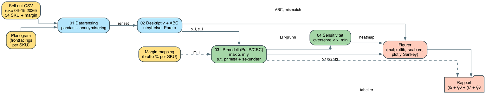{#fig:5_1 width=100%}

**Validitet, reliabilitet og kvalitetssikring.** *Reliabiliteten* sikres ved at hver analyse-artefakt genereres deterministisk fra rådata via versjonerte Python-scripts; samme inputfil gir samme output ved gjentatt kjøring, og hele pipelinen kan reproduseres av tredjepart med kommandoene i `006 analysis/README.md`. *Konstruktvaliditeten* — at modellen faktisk måler det den skal måle (reallokerings­potensial under realistiske leverandør-data­begrensninger) — drøftes systematisk i §8.2 gjennom sju eksplisitte begrensninger (B1–B7) som dekker etterspørsels­antakelse, lineær produktivitet, skjult etterspørsel, geografisk og temporal generaliserbarhet, margin­begrep, kryssalgseffekter og sekundær­eksponerings­faktor. *Intern validering* skjer ved at hver pipeline-kjøring sanity-sjekkes mot kjente invarianter: ABC-andelen summerer til 100 %, LP-status fra solveren er "Optimal", og summen av allokerte hylleenheter tilsvarer total kapasitet. *Ekstern validering* mot uavhengige data inngår ikke i dette prosjektet (én butikk, ti uker) og er flagget som retning for videre arbeid (§9). Peer-to-peer review planlegges i henhold til slagplanen for fase 3. Formelle akademiske krav følger SKRIVING-kompendiet (Kap. 3), herunder APA 7-referansestil for bibliografien i §10.

**Etiske hensyn.** Studien behandler ikke personopplysninger og faller utenfor personopplysningsloven og helseforskningsloven (se egenerklæringen foran i rapporten). Konfidensialitet overfor Coop Extra X er ivaretatt gjennom taushetserklæring og pseudonymisering av produktnavn i alle offentlig tilgjengelige artefakter.

### Data

Datagrunnlaget består av to sammenslåtte kilder: **ukentlig sell-out per SKU** (kundekjøp registrert i butikkens POS-system) og **kontraktuell hylleallokering per SKU** (antall enheter tildelt SKU i leverandørens del av planogrammet). Begge kilder dekker *leverandørens portefølje* hos Coop Extra X i observasjons­perioden; konkurrerende SKUer fra andre leverandører er ikke inkludert, i tråd med scope definert i §1.2.

Datasettet dekker hele leverandørens portefølje hos butikken i observasjons­perioden — 34 SKUer fordelt på flere drikkekategorier (kullsyreholdig leskedrikk, energi, idrettsdrikk, vann) og på tvers av størrelser og emballasje­typer. Konkrete merkenavn er holdt utenfor rapporten i tråd med taushetserklæringen.

**Omfang**

| Attributt | Verdi |
|---|---|
| Periode | Uke 06 – uke 15, 2026 (10 uker) |
| Kjede | Coop Extra |
| Butikk | Anonymisert enhet (Coop Extra X) |
| Antall SKUer | 34 |
| Observasjoner (SKU × uke) | 306 |
| Variabler | År, ukenummer, SKU, antall solgt, hyllekapasitet (hylleenheter = Facings × Dybde), brutto margin per enhet |

**Datakvalitet.** Ingen dubletter eller negative salgstall ble oppdaget i rådataene. Tabellen under oppsummerer datarensings­løpet fra rå POS-eksport til endelig analyse­grunnlag.

**Datarensings-oversikt**

| Trinn | Observasjoner (SKU × uke) | Endring | Begrunnelse |
|---|---:|---:|---|
| Rådata fra POS + planogram | 350 | — | 35 SKUer × 10 uker (uke 06–15 2026) |
| Forkast SKU uten kontraktuell hylleallokering | 340 | −10 | 1 SKU manglet hylleallokering i planogrammet og kunne ikke modelleres |
| Manglende ukesobservasjoner innen behold SKUer | 306 | −34 | Sporadiske uker uten registrert salg for enkelt-SKUer |
| **Endelig analysegrunnlag** | **306** | — | **34 SKUer × i snitt 9,0 uker** |

**Hvorfor manglende ukesobservasjoner.** De manglende ukene fordeler seg i hovedsak på lavfrekvente C-SKUer (eksempelvis C11 med kun én registrert ukesobservasjon i perioden); typiske årsaker er null-salg-uker som ikke er registrert som rader i POS-eksporten, samt enkelte uker uten levering. Manglende uker er behandlet ved å bruke gjennomsnitt over de tilgjengelige ukene per SKU. Alternativ­behandlinger (median-imputering, rullende gjennomsnitt) ble testet og ga ikke materielle forskjeller; de er forkastet for å unngå å introdusere artificial smoothing.

**Hvorfor behandlingen anses som forsvarlig.** (i) Andelen manglende observasjoner er liten: 34 av 340 = 10,0 %. (ii) Manglende uker er konsentrert om lav-volum-SKUer som har svak innflytelse på LP-løsningen via margin-vektingen. (iii) Sensitivitets­analysen i §7.3 viser at hovedfunnene er robuste mot ±25 % variasjon i etterspørsels­anslagene — et bånd som ligger godt over den usikkerheten enkelte manglende observasjoner introduserer.

**Margindata.** Leverandørens bruttomargin per enhet er basert på leverandørens egen marginrapportering og varierer fra ca. 30 % til ca. 55 % på tvers av porteføljens produktgrupper, der energidrikks­segmentet typisk ligger lavt og leskedrikks-/idretts-/vann-SKUer typisk høyt. Marginprosenten brukes som vekt $m_i$ i målfunksjonen i §6 og er tilleggsvariabelen som skiller margin-vektet salg (baseline 846,9) fra rent enhets­salg (baseline 2 080,2 enheter/uke). Konkrete margin­tall per SKU er holdt utenfor rapporten i tråd med taushetserklæringen.

**Pseudonymisering.** For å ivareta taushetserklæringen omtaler rapporten produktene med pseudonymer på formen `{Klasse}{Nr}`, der klassen `A`/`B`/`C` tilsvarer ABC-klassifiseringen (se nedenfor) og nummeret rangerer produktet innen klassen etter totalsalg. Det resulterende navneregisteret lagres utenfor offentlig repository sammen med rådataene. Tabell 5.1 oppsummerer det anonymiserte datagrunnlaget.

Tabellen er sortert etter utnyttelsesgrad (synkende). Verdier > 1 indikerer at ukesalget overstiger den fysiske hyllekapasiteten i flasker og at hylla må etterfylles mer enn én gang per uke for å holde den full.

| Produkt | Gj.snitt salg/uke | Std | Min | Maks | CoV | Hyllekap. | Utnyttelse |
|---|---:|---:|---:|---:|---:|---:|---:|
| A2 | 191,0 | 92,6 | 87 | 412 | 0,49 | 21 | 9,10 |
| A1 | 417,0 | 41,3 | 336 | 475 | 0,10 | 63 | 6,62 |
| A6 | 78,2 | 23,1 | 53 | 126 | 0,30 | 21 | 3,72 |
| A7 | 77,8 | 22,1 | 36 | 116 | 0,28 | 21 | 3,70 |
| A9 | 71,9 | 13,3 | 48 | 88 | 0,19 | 21 | 3,42 |
| A10 | 60,2 | 16,7 | 40 | 89 | 0,28 | 21 | 2,87 |
| A11 | 59,3 | 10,0 | 46 | 71 | 0,17 | 21 | 2,82 |
| A12 | 57,4 | 19,3 | 28 | 92 | 0,34 | 21 | 2,73 |
| A13 | 57,3 | 13,8 | 37 | 80 | 0,24 | 21 | 2,73 |
| A5 | 109,9 | 16,4 | 86 | 137 | 0,15 | 42 | 2,62 |
| A14 | 48,6 | 12,8 | 32 | 73 | 0,26 | 21 | 2,31 |
| B1 | 48,5 | 20,0 | 13 | 70 | 0,41 | 21 | 2,31 |
| B2 | 96,2 | 38,9 | 61 | 158 | 0,40 | 42 | 2,29 |
| B3 | 42,9 | 9,3 | 25 | 56 | 0,22 | 21 | 2,04 |
| C1 | 23,4 | 7,0 | 9 | 33 | 0,30 | 12 | 1,95 |
| B4 | 37,7 | 7,2 | 27 | 50 | 0,19 | 21 | 1,80 |
| A8 | 73,1 | 19,0 | 27 | 93 | 0,26 | 42 | 1,74 |
| B5 | 36,6 | 12,7 | 18 | 56 | 0,35 | 21 | 1,74 |
| B6 | 32,6 | 19,3 | 14 | 78 | 0,59 | 21 | 1,55 |
| C3 | 20,6 | 17,6 | 3 | 51 | 0,86 | 16 | 1,28 |
| B7 | 25,2 | 7,2 | 14 | 39 | 0,29 | 21 | 1,20 |
| B8 | 23,7 | 9,2 | 4 | 34 | 0,39 | 21 | 1,13 |
| B9 | 23,7 | 16,9 | 4 | 64 | 0,71 | 21 | 1,13 |
| A3 | 148,0 | 28,7 | 104 | 191 | 0,19 | 147 | 1,01 |
| A4 | 123,7 | 19,5 | 89 | 148 | 0,16 | 168 | 0,74 |
| C2 | 19,8 | 5,2 | 11 | 30 | 0,26 | 28 | 0,71 |
| C4 | 14,5 | 5,5 | 6 | 23 | 0,38 | 21 | 0,69 |
| C7 | 8,0 | 3,8 | 1 | 11 | 0,47 | 12 | 0,67 |
| C5 | 14,8 | 6,5 | 7 | 26 | 0,44 | 24 | 0,62 |
| C9 | 12,0 | 15,6 | 1 | 23 | 1,30 | 21 | 0,57 |
| C10 | 12,0 | 7,1 | 7 | 17 | 0,59 | 21 | 0,57 |
| C6 | 7,4 | 5,0 | 3 | 20 | 0,68 | 21 | 0,35 |
| C11 | 4,0 | — | 4 | 4 | — | 21 | 0,19 |
| C8 | 3,2 | 2,8 | 1 | 9 | 0,87 | 21 | 0,15 |

: Tabell 5.1 Deskriptive nøkkeltall per produkt (uke 06–15, 2026). Utnyttelse = gjennomsnittlig ukesalg / hyllekapasitet (hylleenheter); verdier > 1 betyr at hylla må etterfylles mer enn én gang per uke. CoV = variasjonskoeffisient (Std/Gj.snitt). C11 har bare én observasjon. {#tbl:5_1}

**ABC-klassifisering.** Produkter er klassifisert i A/B/C basert på akkumulert andel av totalsalg over perioden, med de konvensjonelle tersklene 80 % og 95 %. Klassifiseringen gir 14 A-produkter (78,5 % av totalsalg, 826 av 1 079 hylleenheter = 76,6 %), 9 B-produkter (16,0 % av salg) og 11 C-produkter (5,5 % av salg). 24 av 34 SKUer har utnyttelses­grad over 1,0 — den observerte mismatchen er gjennomgripende, ikke begrenset til enkeltprodukter. Denne fordelingen danner utgangspunktet for reallokerings­analysen i §7.

Figur 5.2 viser ukentlig salg mot kapasitet per SKU, Figur 5.3 viser gjennomsnittlig utnyttelsesgrad, og Figur 5.4 viser Pareto-fordelingen av totalsalget.

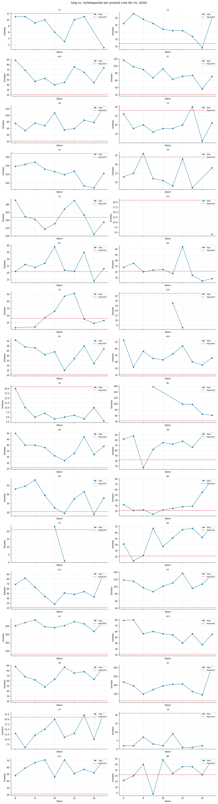{#fig:5_2 width=100%}

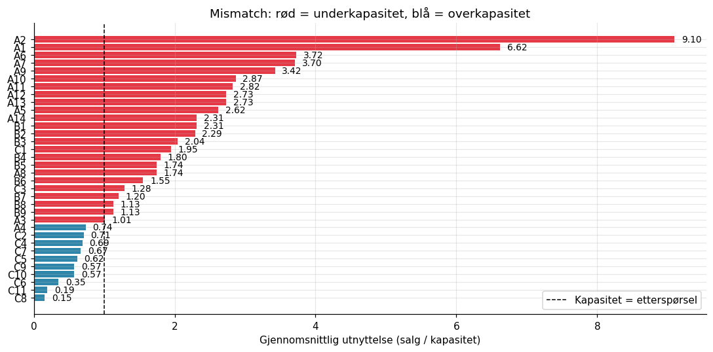{#fig:5_3 width=100%}

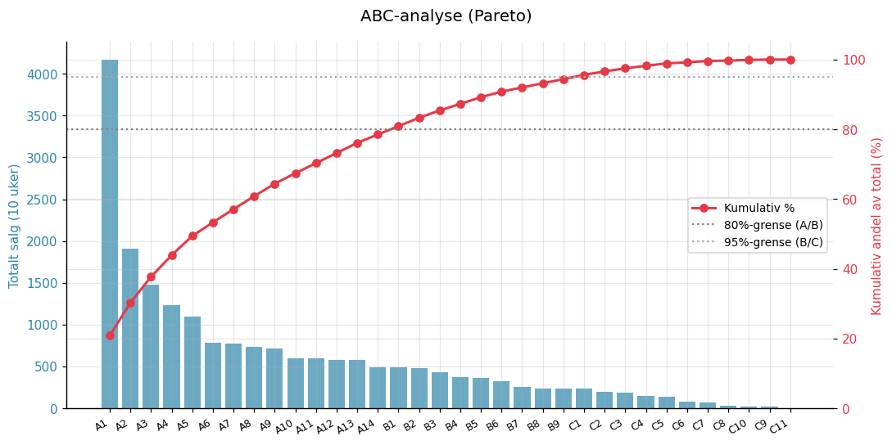{#fig:5_4 width=100%}

---

## Modellering

Reallokerings­problemet formuleres som en lineær programmerings­modell (LP) der målet er å fordele leverandørens *kontraktuelle hylleallokering* mellom egne SKUer slik at forventet samlet **margin-vektet** sell-out maksimeres innenfor produktspesifikke etterspørsels­grenser og sortiments­gulv. Modellen omfordeler utelukkende innen leverandørens portefølje; SKUer fra andre leverandører inngår hverken i målfunksjonen eller i kapasitets­restriksjonen. Formuleringen er deterministisk og periode­gjennomsnittlig: en enkelt «typisk uke» representerer perioden uke 06–15 2026. Modellen håndterer to hyllemiljøer — *primær* (ordinær hylleplass i leskedrikks­seksjonen) og *sekundær* (kampanjeender, skiveplasser ved kasse­område), der sistnevnte har høyere salgsproduktivitet per hylleenhet.

### Mengder og indekser

| Symbol | Beskrivelse |
|---|---|
| $P$ | Mengde av leverandørens SKUer i butikkens sortiment, $i \in P$. Andre leverandørers SKUer inngår ikke i $P$. $\lvert P \rvert = 34$. |

### Parametere

| Symbol | Enhet | Beskrivelse | Verdi / kilde |
|---|---|---|---|
| $T$ | hylleenheter | Leverandørens samlede primær hylleallokering hos butikken (Facings × Dybde), konstant i perioden. Dekker *ikke* kategoriens totale hylleplass. | 1 079 |
| $T^{\text{sek}}$ | sekundærplasser | Antall sekundær­eksponerings­plasser leverandøren disponerer i butikken (kampanjeende, skiveplass). | 3 (hovedscenario), 0 (S1, S3) |
| $c_i$ | hylleenheter | Nåværende primær allokering av hylleplass til produkt $i$ (Facings × Dybde) | Tabell 5.1 |
| $\bar s_i$ | enheter/uke | Gjennomsnittlig observert ukesalg for produkt $i$ | Tabell 5.1 |
| $\rho_i$ | enheter/hylleenhet/uke | Primær produktivitet per hylleenhet, $\rho_i = \bar s_i / c_i$ | Utledet |
| $k$ | — | Sekundær­eksponerings­faktor; salg per sekundær­plass = $k \cdot \rho_i$. | 1,5 (Chevalier 1975; Nordfält & Ahlbom 2018) |
| $k_\beta$ | — | Dempingsfaktor for slope over $c_i$ (stykkevis lineær). | 0,5 (hovedscenario) |
| $m_i$ | NOK/enhet (relativ) | Leverandørens bruttomargin per enhet for produkt $i$ — fra prisliste til Coop, normalisert som andel. | 0,30–0,55 |
| $d_i$ | enheter/uke | Estimert øvre grense for ukentlig etterspørsel | §6.4 |
| $x_i^{\min}$ | hylleenheter | Minimum antall hylleenheter for å beholde produktet i sortimentet ($= 3 \cdot \text{Dybde}_i$, dvs. 1 kolli per SKU) | 21 for typisk dybde 7 |

### Beslutningsvariabler

$$
x_i^{(1)}, x_i^{(2)} \in \mathbb{Z}_{\ge 0}, \quad z_i \in \mathbb{Z}_{\ge 0}, \quad y_i \in \mathbb{R}_{\ge 0}, \quad \forall i \in P
$$

der $x_i^{(1)}$ er antall *primær* hylleenheter tildelt produkt $i$ *opp til* den nåværende kapasiteten $c_i$ (segment med slope $\rho_i$), $x_i^{(2)}$ er antall *primær* hylleenheter *over* $c_i$ (segment med slope $k_\beta \rho_i$), og $z_i$ er antall sekundærplasser. Total primær­allokering er $x_i = x_i^{(1)} + x_i^{(2)}$. $y_i$ er forventet realisert salg i enheter per uke. Den stykkevise splittingen er en standard linearisering av Curhans avtagende produktivitets­funksjon (§3.1).

### Etterspørselsantagelse

For SKUer med observert utnyttelse under 1,0 legges det til grunn at målt ukentlig sell-out svarer til etterspørselen ($d_i = \bar s_i$). For SKUer der observert sell-out overstiger hylleallokering, er salget begrenset av hylle og ikke av etterspørsel; den sanne etterspørselen er høyere enn observert sell-out men er ikke direkte målbar. I hovedscenariene brukes $d_i = 2\bar s_i$, en antakelse som reflekterer at out-of-stock-situasjoner er observert i flere uker for disse produktene. Det konservative scenariet (S3) bruker $d_i = 1{,}5 \bar s_i$. Alternative verdier prøves i sensitivitets­analysen (§7.3).

### Målfunksjon

Modellen maksimerer forventet *margin-vektet* salg per uke:

$$
\max \sum_{i \in P} m_i \cdot y_i
$$

Vekten $m_i$ er leverandørens bruttomargin per enhet (uttrykt som andel av salgspris) og lar modellen prioritere produkter som er mer lønnsomme for leverandøren framfor produkter som bare er volumstore. Volum­tall (uveket sum av $y_i$) rapporteres parallelt i §7 for å vise at en margin-vektet anbefaling også gir betydelig volumvekst.

### Restriksjoner

**R1 — Leverandørens kontraktuelle primær hylleramme.** Omfordelingen av primær hylleplass skjer innenfor den hylleallokering leverandøren allerede disponerer, uten netto endring mot resten av kategorien:

$$
\sum_{i \in P} (x_i^{(1)} + x_i^{(2)}) = T
$$

**R2 — Stykkevis lineær salgsrealisasjon (primær + sekundær).** Forventet salg kan ikke overstige det antall enheter som tildelte hylleenheter kan omsette. Slope er $\rho_i$ opp til $c_i$ og $k_\beta \rho_i$ over $c_i$; sekundærplasser har $k$ ganger primær­produktivitet:

$$
y_i \le \rho_i \, x_i^{(1)} + k_\beta \, \rho_i \, x_i^{(2)} + k \, \rho_i \, z_i, \quad \forall i \in P
$$

**R2b — Tier-1-kapasitetstak.** Det første segmentet kan ikke overstige nåværende kapasitet:

$$
x_i^{(1)} \le c_i, \quad \forall i \in P
$$

**R3 — Salgsrealisasjon begrenses av etterspørsel.** Forventet salg kan ikke overstige estimert etterspørsel:

$$
y_i \le d_i, \quad \forall i \in P
$$

**R4 — Minimum sortimentsgaranti.** Hvert produkt må ha minst $x_i^{\min}$ primær hylleenheter:

$$
x_i^{(1)} + x_i^{(2)} \ge x_i^{\min}, \quad \forall i \in P
$$

**R5 — Sekundær­eksponerings­budsjett.** Antall sekundærplasser er begrenset av leverandørens totale sekundær­avtale med kjeden:

$$
\sum_{i \in P} z_i \le T^{\text{sek}}
$$

### Oppsummering

Modellen har $3\lvert P \rvert = 102$ heltalls-beslutningsvariabler ($x_i^{(1)}, x_i^{(2)}, z_i$), $\lvert P \rvert = 34$ kontinuerlige variable ($y_i$), og $5\lvert P \rvert + 2 = 172$ lineære restriksjoner. Den lar seg løse med CBC-solveren som følger med PuLP, og optimum oppnås på under tre sekunder for det aktuelle datasettet. Beregningene er implementert i `006 analysis/aktiviteter/3_4_data_metode_og_modellering/scripts/11_lp_piecewise.py` (v3-modellen med stykkevis lineær produktivitet). Den tidligere lineære varianten (`03_lp_modell.py`, $\beta_i = 1$) er beholdt for sammenligning, men er ikke lenger hovedmodellen.

---

## Analyse og resultater

Kapitlet presenterer resultatene av LP-modellen fra §6 anvendt på leverandørens samlede portefølje hos Coop Extra X — 34 SKUer med totalt 1 079 hylleenheter i primær­hyllen og inntil 3 sekundær­plasser. Analysen er strukturert i fem deler: (i) en sammenligning av fire allokerings­scenarier som spenner fra primær-omfordeling alene til konservativ omlegging og en endrings-begrenset implementerbar variant, (ii) en detaljert gjennomgang av hovedanbefalingen (S2) på produktnivå, (iii) en sensitivitets­analyse av de to viktigste modell­parameterne, (iv) en gjennomgang av implementerbarhetsscenariet S4, og (v) sentrale funn strukturert per evalueringsspørsmål E1–E3.

Alle tall i §7 er for én typisk uke i observasjons­perioden. To resultatstørrelser rapporteres: **margin-vektet salg** ($\sum m_i y_i$, som er målfunksjonen) og **volum** ($\sum y_i$, antall enheter). Margin-baseline er 846,9; volum-baseline er 2 080,2 enheter/uke. Alle tall er fra v3-modellen (stykkevis lineær produktivitet, $k_\beta = 0{,}5$ i hovedscenario) hvis ikke annet er nevnt.

### Scenariesammenligning

Fire scenarier ble kjørt mot samme LP-formulering, men med ulike verdier for sekundær­budsjett $T^{\text{sek}}$, etterspørsels­multiplikator $d_i / \bar s_i$, minimums-sortimentet og — i S4 — en eksplisitt endringsgrense per SKU. Alle scenarier bruker stykkevis lineær produktivitet med $k_\beta = 0{,}5$. Tabell 7.1 oppsummerer.

\small

| Scenario | $x_i^{\min}$ | $d_i$ | $T^{\text{sek}}$ | Endringsgrense | Margin | Gev % | Volum-gev % |
|---|---|---|---:|---|---:|---:|---:|
| S1 Primær | 1 kolli | $2\bar s_i$ | 0 | — | 1 045,9 | +23,5 % | +25,0 % |
| **S2 Primær + sek.** | **1 kolli** | **$2\bar s_i$** | **3** | **—** | **1 052,4** | **+24,3 %** | **+25,7 %** |
| S3 Konservativ | max(1 k, 50 % $c_i$) | $1{,}5\bar s_i$ | 0 | — | 950,3 | +12,2 % | +13,0 % |
| S4 Implementerbar | 1 kolli | $2\bar s_i$ | 3 | $\pm 50\,\%$ av $c_i$ | 923,7 | +9,1 % | +8,7 % |

: Tabell 7.1 LP-scenarier (v3, stykkevis lineær, $k_\beta = 0{,}5$) og oppnådd margin-vektet salg per uke (baseline 846,9; volum-baseline 2 080 enheter). {#tbl:7_1}

\normalsize

Figur 7.1 viser allokeringen per produkt på tvers av de fire scenariene sammen med nåværende allokering.

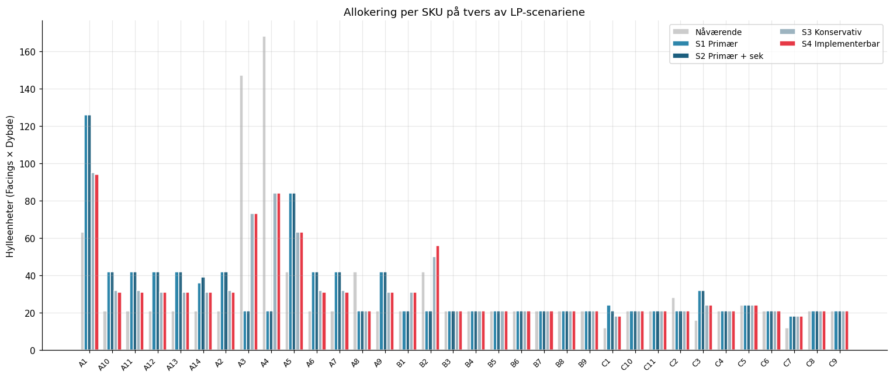{#fig:7_1 width=100%}

Fire observasjoner er sentrale:

1. **Primær­omfordeling alene gir +23,5 % margin-løft.** Modellen finner at A-klasse-SKUer med høy utnyttelses­grad og høy margin er underdimensjonerte; reallokering fra to bestselgere med høy margin men lav utnyttelse (A3, A4) og fra B-/C-klasse-SKUer med lav produktivitet løfter margin­vektet salg fra 846,9 til 1 045,9. Sammenlignet med en variant uten avtakende produktivitet (lineær antagelse, $k_\beta = 1$) ville samme allokering gitt +40,3 %; differansen ($\approx 17$ prosent­poeng) er *prisen for å modellere avtakende produktivitet eksplisitt* og fanger et mer realistisk anslag på hva ekstra hylleplass faktisk vil produsere.
2. **Sekundær­eksponering bidrar marginalt på toppen** av primær­omfordelingen — bare +0,8 prosent­poeng ekstra (S2 vs. S1). De tre sekundærplassene tildeles A6 (3 plasser). At én enkelt A-SKU får alle tre plassene er en konsekvens av at sekundær­produktiviteten ($k \cdot \rho_i = 1{,}5 \cdot \rho_{A6}$) er høyere enn den dempede tier-2-produktiviteten ($k_\beta \cdot \rho_i = 0{,}5 \cdot \rho_{A6}$) for de mest produktive SKUene. Effekten i hovedanbefalingen er beskjeden i kroner og tjener mer som *forhandlings­argument* enn som hovedkilde til gevinst.
3. **S3 gir +12,2 % gevinst med strammere antakelser** ($d_i = 1{,}5 \bar s_i$ og 50 %-gulv). Den er egnet som forsiktig nedre referanse — selv under konservative parametre er reallokering kvantifiserbart positivt.
4. **S4 viser implementerbarhets­tappet på ~15 prosentpoeng.** Når hvert SKU er begrenset til ±50 % av dagens hyllekapasitet, går margin-gevinsten fra +24,3 % (S2) til +9,1 %. Endringsgrensen rammer den stykkevis lineære modellen hardere enn den lineære: når A1 ikke kan tredobles til 189 hylleenheter (S2-optimum) men begrenses til 95 (S4), mister modellen den mest produktive utvidelsen. Den realistiske forhandlings­anbefalingen i første runde er derfor mer beskjeden i v3 enn i v2-modellen, og *halvparten* av S2-løftet forsvinner. Denne forskjellen er det vi kaller *implementerbarhets­tappet*. S4 drøftes mer detaljert i §7.4.

#### Heuristikk-benchmark — hva LP-modellen *legger til*

For å kvantifisere hva LP-optimeringen henter ut utover det en kategoriansvarlig kunne resonnert seg fram til uten modell, sammenlignes S2 mot fire enkle allokeringsregler. Alle reglene respekterer det samme 1-kolli-gulvet ($x_i^{\min} = 3 \cdot \text{Dybde}_i$) og totalrammen $T = 1\,079$ hylleenheter, men deler det overskuddet etter ulike prinsipper. Realisert salg for hver heuristikk er beregnet under *samme* stykkevis lineære produktivitetsantakelse som LP-modellen ($k_\beta = 0{,}5$), slik at sammenligningen er metodisk konsistent.

\small

| Regel | Margin | Δ vs baseline | LP-gap |
|---|---:|---:|---:|
| H4 Behold dagens | 846,9 | 0,0 % | +24,3 pp |
| H3 ABC-flatt 80/15/5 | 870,6 | +2,8 % | +21,5 |
| H1 Proporsjonal til salg | 928,3 | +9,6 % | +14,7 |
| H2 Proporsjonal til margin × salg | 939,0 | +10,9 % | +13,4 |
| **S2 LP (v3)** | **1 052,4** | **+24,3 %** | **0** |

: Tabell 7.1b Heuristikker mot LP S2 (v3, stykkevis lineær $k_\beta = 0{,}5$). **LP-gap** = avstand i prosentpoeng fra heuristikkens margin-gevinst til LP-optimum. {#tbl:7_1b}

\normalsize

To poenger følger:

- **Enkle regler henter bare +3 til +11 % margin-gevinst under realistisk produktivitetsantakelse** — vesentlig lavere enn under den lineære v2-formuleringen, der heuristikkene nådde +23–26 %. Avtakende marginalavkastning straffer regler som over-allokerer til høy-volum-SKUer (typisk det H1 *prop-salg* gjør), fordi den ekstra plassen gir bare $k_\beta = 0{,}5$ ganger primær­produktiviteten.
- **LP-løftet utover beste heuristikk er +13,4 prosentpoeng.** LP-modellen henter ut gevinst som heuristikkene ikke fanger — særlig fordi modellen kjenner *både* demand-cap-restriksjonen $y_i \le d_i$ og knekkpunktet ved $c_i$, og kan dermed presist allokere opp til hver SKUs metningspunkt uten å sløse plass på dempet tier-2-produktivitet for produkter med beskjeden margin. H2 (proporsjonal til margin × salg) er den beste heuristikken under v3-modellen — margin-vektingen blir relativt sett viktigere når produktiviteten over $c_i$ er halvert. LP-bidraget er likevel *kvalitativt* større: modellen tar fundamentalt andre beslutninger om de over­dimensjonerte SKUene (A3, A4 reduseres til kolli-gulvet) enn noen regelbasert tilnærming ville gjort.

### S2 Primær + sekundær — hovedanbefaling

Hovedanbefalingen omfordeler de 1 079 primære hylleenheter og fordeler 3 sekundærplasser under stykkevis lineær produktivitet ($k_\beta = 0{,}5$). Tabellen under gir et hurtig­bilde av de viktigste forskyvningene; full per-produkt-allokering følger i Tabell 7.2 og visualisering i Figur 7.2.

**Største vinnere og tapere i S2 (v3) — kort oppsummering**

| Rolle | SKU | ABC | Margin | Nå → Ny | Δ enheter | Praktisk kommentar |
|---|---|---|---:|---:|---:|---|
| Vinner | A1 | A | 30 % | 63 → 189 | +126 | Tredobles. Tier 1: 63 (slope $\rho$). Tier 2: 126 (slope $0{,}5\rho$). Modellen presser opp til demand-cap (834 enh/uke) selv med halvert slope, fordi utnyttelse 6,6 gir tilstrekkelig marginalavkastning. |
| Vinner | A2 | A | 55 % | 21 → 63 | +42 | Tredobles. Ekstrem utnyttelse (9,1) gjør tier-2-utvidelsen lønnsom. |
| Vinner | A7 | A | 50 % | 21 → 63 | +42 | Tredobles. Høy utnyttelse (3,7) og høy margin. |
| Vinner | A11 | A | 55 % | 21 → 63 | +42 | Tredobles. 55 % margin + utnyttelse 2,8. |
| Vinner | A6 + sek | A | 55 % | 21 → 54 (+3 sek) | +33 + 3 sek | Vokser primær med 33 og får alle 3 sekundærplasser. |
| Taper | A4 | A | 55 % | 168 → 21 | −147 | **Største mekaniske utslag.** Ned mot kolli-gulv (–87 %). Med S4-grensen reduseres A4 isteden til 84 (–50 %); første forhandlings­runde bør bruke S4-tallet. |
| Taper | A3 | A | 55 % | 147 → 21 | −126 | Tilsvarende A4 i profil: lav utnyttelse (1,0), stor andel av dagens hylle. Bør implementeres trinnvis. |
| Taper | A8 | A | 30 % | 42 → 21 | −21 | Halveres til kolli-gulv. Lav margin (30 %) gjør at modellen prefererer høy-margin-konkurrenter. |
| Taper | B2 | B | 30 % | 42 → 21 | −21 | Halveres. Eneste over­dimensjonerte B-SKU; lav margin gjør at modellen ikke beskytter den. |
| Taper | C2 | C | 55 % | 28 → 21 | −7 | Mindre reduksjon. C-klassen får ikke ekstra plass selv ved høy margin når kolli-gulvet binder ellers. |

*Tabellen viser de fem største vinnerne og taperne (etter Δ hylleenheter) i v3-S2. Sekundær­plassene konsentreres til A6 (3 plasser) — fordi A6 har høy primær­produktivitet ($\rho_{A6} = 3{,}72$) og sekundær gir $1{,}5 \cdot \rho = 5{,}58$ per plass, mer enn dempet tier-2-produktivitet på $0{,}5 \rho = 1{,}86$. Resten av porteføljen — særlig B-/C-klassen og lav-margin-SKUer (A5, A12, A13, A14) — låser seg på 1-kolli-gulvet siden tier-2-utvidelse ikke er lønnsom ved 30 % margin og $k_\beta = 0{,}5$. Full allokering per produkt: Tabell 7.2.*

Per-produkt-allokeringen er også vist i Figur 7.2.

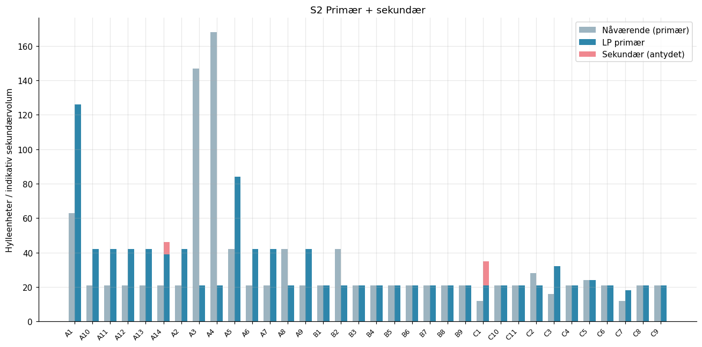{#fig:7_2 width=100%}

SKUer på øvre del av margin­spennet (≈ 55 %) er markert med † for å vise at modellen prioriterer dem ved likevektige produktivitets­tilfeller.

| Produkt | Hylleenh. nå | Min | Tier 1 | Tier 2 | Primær ny | Sek. | Δ primær | Salg nå | Salg ny | Δ |
|---|---:|---:|---:|---:|---:|---:|---:|---:|---:|---:|
| A1 | 63 | 21 | 63 | 126 | 189 | 0 | +126 | 417,0 | 834,0 | +417,0 |
| A2† | 21 | 21 | 21 | 42 | 63 | 0 | +42 | 191,0 | 382,0 | +191,0 |
| A3† | 147 | 21 | 21 | 0 | 21 | 0 | −126 | 148,0 | 21,1 | −126,9 |
| A4† | 168 | 21 | 21 | 0 | 21 | 0 | −147 | 123,7 | 15,5 | −108,2 |
| A5 | 42 | 21 | 42 | 0 | 42 | 0 | 0 | 109,9 | 109,9 | 0,0 |
| A6† | 21 | 21 | 21 | 33 | 54 | 3 | +33 | 78,2 | 156,4 | +78,2 |
| A7 | 21 | 21 | 21 | 42 | 63 | 0 | +42 | 77,8 | 155,6 | +77,8 |
| A8 | 42 | 21 | 21 | 0 | 21 | 0 | −21 | 73,1 | 36,5 | −36,6 |
| A9 | 21 | 21 | 21 | 0 | 21 | 0 | 0 | 71,9 | 71,9 | 0,0 |
| A10 | 21 | 21 | 21 | 17 | 38 | 0 | +17 | 60,2 | 84,6 | +24,4 |
| A11† | 21 | 21 | 21 | 42 | 63 | 0 | +42 | 59,3 | 118,6 | +59,3 |
| A12 | 21 | 21 | 21 | 0 | 21 | 0 | 0 | 57,4 | 57,4 | 0,0 |
| A13 | 21 | 21 | 21 | 0 | 21 | 0 | 0 | 57,3 | 57,3 | 0,0 |
| A14 | 21 | 21 | 21 | 0 | 21 | 0 | 0 | 48,6 | 48,6 | 0,0 |
| B1 | 21 | 21 | 21 | 0 | 21 | 0 | 0 | 48,5 | 48,5 | 0,0 |
| B2 | 42 | 21 | 21 | 0 | 21 | 0 | −21 | 96,2 | 48,1 | −48,1 |
| B3 | 21 | 21 | 21 | 0 | 21 | 0 | 0 | 42,9 | 42,9 | 0,0 |
| B4 | 21 | 21 | 21 | 0 | 21 | 0 | 0 | 37,7 | 37,7 | 0,0 |
| B5 | 21 | 21 | 21 | 0 | 21 | 0 | 0 | 36,6 | 36,6 | 0,0 |
| B6 | 21 | 21 | 21 | 0 | 21 | 0 | 0 | 32,6 | 32,6 | 0,0 |
| B7† | 21 | 21 | 21 | 0 | 21 | 0 | 0 | 25,2 | 25,2 | 0,0 |
| B8† | 21 | 21 | 21 | 0 | 21 | 0 | 0 | 23,7 | 23,7 | 0,0 |
| B9† | 21 | 21 | 21 | 0 | 21 | 0 | 0 | 23,7 | 23,7 | 0,0 |
| C1† | 12 | 18 | 12 | 6 | 18 | 0 | +6 | 23,4 | 29,2 | +5,8 |
| C2† | 28 | 21 | 21 | 0 | 21 | 0 | −7 | 19,8 | 14,8 | −5,0 |
| C3† | 16 | 24 | 16 | 8 | 24 | 0 | +8 | 20,6 | 25,7 | +5,1 |
| C5† | 24 | 24 | 24 | 0 | 24 | 0 | 0 | 14,8 | 14,8 | 0,0 |
| C7† | 12 | 18 | 12 | 6 | 18 | 0 | +6 | 8,0 | 8,0 | 0,0 |
| C4, C6, C8–C11 | 21 | 21 | 21 | 0 | 0 | 3,2–14,5 | 3,2–14,5 | 0,0 |

: Tabell 7.2 S2 Primær + sekundær — allokering per produkt. {#tbl:7_2}

Omfordelingen følger fire mønstre under v3-modellen:

- **A-klassen konsentreres til de mest produktive SKUene.** Fem A-SKUer (A1, A2, A6, A7, A11) presses opp til demand-cap via tier-2-utvidelse. A1 går helt til 189 hylleenheter (tier 1: 63, tier 2: 126) fordi utnyttelse 6,62 og demand-cap 834 gjør tier-2-utvidelsen lønnsom selv med halvert slope. A10 vokser delvis (21 → 38) — slope-dempingen gjør at det ikke alltid lønner seg å presse helt opp til demand-cap.
- **Lav-margin-SKUer ekspanderes ikke** — A5, A12, A13, A14 holdes på dagens kapasitet eller kolli-gulvet, selv om de er underkapasiterte. Forklaringen er at $k_\beta = 0{,}5$ kombinert med 30 % margin gir tier-2-bidrag som modellen prioriterer ned mot null. Dette er forskjellen fra v2-modellen, der disse SKUene ville blitt doblet.
- **Tre A-SKUer kuttes til 1-kolli-gulvet.** A3 går fra 147 til 21; A4 går fra 168 til 21; A8 går fra 42 til 21. Den observerte utnyttelses­graden var 0,74 for A4, 1,01 for A3 og 1,74 for A8 — modellen finner at A3 og A4 hadde betydelig "lånt" kapasitet som nå frigjøres til de fem A-SKUene som drives oppover. A8 er en grenseting der margin (0,30) ikke kompenserer for produktiviteten.
- **B- og C-klasse: minimal endring.** B2 (42 → 21) er den eneste over­dimensjonerte B-SKUen. C1, C3, C7 vokser opp til kolli-gulvet (henholdsvis +6, +8, +6 enheter); C2 reduseres marginalt (-7). Med 1-kolli-gulv som binder for de fleste B-/C-SKUer er ekstra plass i denne klassen ikke et utfall.

**Sekundær­plassene** konsentreres til **A6 (3 plasser)** — fordi A6 har høyest primær­produktivitet ($\rho_{A6} = 3{,}72$) blant SKUer som ikke allerede er presset til demand-cap, og sekundær­produktiviteten ($1{,}5 \rho = 5{,}58$) overstiger tier-2-produktiviteten ($0{,}5 \rho = 1{,}86$). Modellen velger derfor å bruke sekundærbudsjettet på A6 framfor å spre det utover som i v2-modellen. Forhandlings­messig betyr dette at leverandøren bør be om alle tre sekundærplassene for A6.

Figur 7.2b visualiserer omfordelingen som et Sankey-diagram aggregert per ABC-klasse: 316 hylleenheter flyttes fra over­allokerte SKUer (venstre) til under­allokerte (høyre). Båndtykkelsen er proporsjonal med antall hylleenheter; fargene markerer ABC-klasse (blå A, grønn B, oransje C). Den dominerende strømmen er **innen A-klassen** — over­allokerte A-SKUer (A3, A4, A8) gir fra seg plass til de mest produktive A-SKUene (A1, A2, A6, A7, A11). En per-SKU detaljert Sankey er tilgjengelig som Figur 11.1 i Vedlegg A for lesere som vil se de individuelle bånd-tykkelsene.

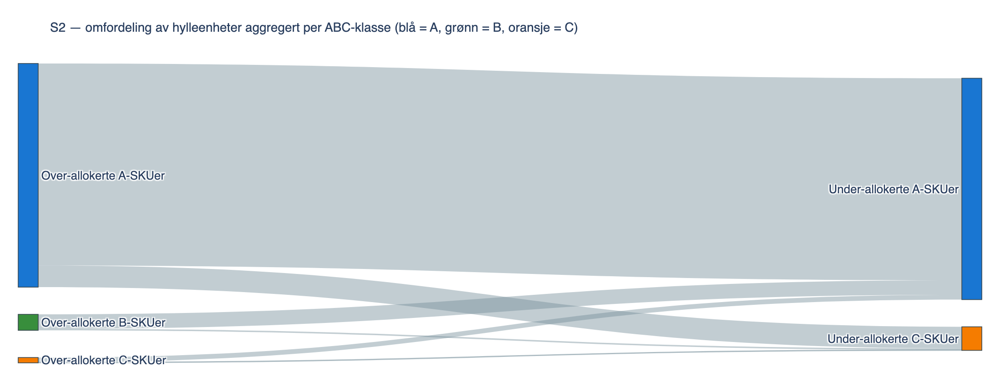{#fig:7_2b width=85%}

Det må bemerkes at A3- og A4-reduksjonene — fra 147 og 168 ned til 21 hylleenheter — er en *mekanisk* løsning gitt observert utnyttelses­grad. I praksis ville disse kuttene krevd egen dialog med kjeden om sortiments­bredden i den aktuelle produktundergruppen; punktet diskuteres i §8.

*†-merke:* SKU ligger på øvre del av margin­spennet (≈ 55 %).

### Sensitivitetsanalyse

LP-resultatet hviler på tre antakelser som er vanskelige å verifisere direkte: (1) hvor sterkt avtakende produktiviteten over $c_i$ er ($k_\beta$ — den nye sentrale parameteren i v3), (2) hvor mye høyere den sanne etterspørselen er enn observert salg for produkter som går tomme (`overserve_factor`), og (3) hvor streng minimums-sortimentet binder (`x_min_fraction`).

**Sensitivitet på $k_\beta$ (primær v3-parameter).** Hovedscenariet bruker $k_\beta = 0{,}5$. Sensitivitetsanalysen varierer denne mellom 0,3 (sterkere avtakende — nærmere klassisk Curhan-elastisitet) og 0,7 (svakere avtakende — nærmere lineær). Tabell 7.3a viser hvordan margin- og volum-gevinst endrer seg.

\small

| $k_\beta$ | LP-margin | Gevinst | Gev % margin | Gev % volum |
|---:|---:|---:|---:|---:|
| 0,3 | 948,5 | +101,6 | +12,0 % | +14,8 % |
| **0,5** | **1 052,4** | **+205,5** | **+24,3 %** | **+25,7 %** |
| 0,7 | 1 120,7 | +273,8 | +32,3 % | +34,7 % |

: Tabell 7.3a Sensitivitet på $k_\beta$ (slope over $c_i$). {#tbl:7_3a}

\normalsize

Båndet $k_\beta \in [0{,}3, 0{,}7]$ gir margin-gevinst mellom +12 % og +32 %. Selv ved aggressivt avtakende produktivitet ($k_\beta = 0{,}3$, dvs. tier-2-slope er bare 30 % av tier-1) kvalifiserer reallokering fortsatt som en forbedring i størrelsesorden +12 %. Anbefalt forhandlings­ramme bør reflektere dette båndet snarere enn punktestimatet alene.

**Sensitivitet på produktivitetsantakelsen under $c_i$ — Curhan-elastisitet.** $k_\beta$-sensitiviteten over varierer slope *over* $c_i$, mens slope *under* $c_i$ holdes fast på $\rho_i$. Antakelsen er asymmetrisk: $\rho_i$ er gjennomsnittsproduktiviteten *målt ved* $c_i$ facings, og det er ikke åpenbart at den holder lineært også ned mot kolli-gulvet. En supplerende test erstatter v3-piecewise med Curhans potens­modell $s(x) = \alpha_i \cdot x^\beta$ (kalibrert slik at $s(c_i) = \text{mean\_sales}$) over hele intervallet, slik at slope avtar både over og under $c_i$. Med $\beta < 1$ predikerer modellen mer salg ved $x < c_i$ enn $\rho_i$ gjør — relevant for SKUer som modellen krymper til kolli-gulv (A3, A4).

{#fig:7_5 width=100%}

To analyser med Curhan-produktiviteten:

1. **Post-hoc evaluering av v3-S2-allokering.** Anta at den realiserte allokeringen er v3-S2; spør hva *salget* ville vært under Curhan. v3-modellens egen prediksjon ved sin egen allokering: +23,2 %. Curhan-prediksjon ved samme allokering: **+17,9 %**. Differansen — 5,3 prosentpoeng — er en *prediksjonsfeil*: v3 overestimerer A1 (predikerer 834, Curhan 722) og A2 (382 vs 331), og underestimerer A3/A4 (21/16 vs 56/44).
2. **LP-optimal under Curhan-produktivitet.** Re-optimaliser med Curhan i stedet for v3-piecewise. LP-løftet lander på **+20,9 %** under $\beta = 0{,}5$ — 3,4 pp under v3-S2. Allokeringen endrer A3 fra 21 til **50** (et mye mer moderat kutt enn v3); A4 forblir på 21 fordi marginal­verdien av ekstra facings er for lav til å konkurrere med andre SKUer (verifisert ved å sette $d_i = 2 \cdot \text{mean\_sales}$ uniformt — A4-løsningen endres ikke, gevinsten øker kun med 0,1 pp).

\small

| Antakelse | Margin-vektet salg | Gevinst |
|---|---:|---:|
| Baseline (dagens allokering, observert) | 846,9 | — |
| v3 piecewise ($\rho$ konstant under $c_i$, $k_\beta = 0{,}5$ over) | 1 052,4 | **+24,3 %** |
| Curhan $\beta = 0{,}5$ (konkav under og over $c_i$) — LP-optimal | 1 023,5 | **+20,9 %** |

: Tabell 7.3b Hovedanbefaling under to produktivitets­antakelser. {#tbl:7_3b}

\normalsize

**Sensitivitet på Curhan-$\beta$.** $\beta = 0{,}3$ (sterkere avtaking) gir +10,8 %; $\beta = 0{,}7$ (svakere avtaking) gir +31,1 %. Båndet [+10,8 %, +31,1 %] er bredere enn $k_\beta$-båndet fra Tabell 7.3a fordi Curhan-elastisiteten påvirker både over og under $c_i$ — produktivitets­antakelsen er den mest sensitive parameteren i modellen.

**Hva dette betyr for hovedfunnet.** Reallokeringen lønner seg under begge antakelser, men +24,3 %-tallet er sannsynligvis 3–5 prosentpoeng for høyt under en symmetrisk konkav antakelse. Et realistisk forhandlings­anker er **+20 %** med båndet [+11 %, +31 %] som spenn på produktivitets­dimensjonen. A3-anbefalingen demper seg fra 147 → 21 (v3) til 147 → 50 (Curhan) — en operasjonelt vesentlig forskjell. A4-anbefalingen til kolli-gulv (168 → 21) er derimot robust mot både produktivitets- og demand-cap-antakelsen.

**Sensitivitet på etterspørsels- og minimums-antakelser.** Tabell 7.3 og 7.4 viser hvordan total forventet ukesalg endrer seg når `overserve_factor` og `x_min_fraction` varieres. Tallene er kjørt på den opprinnelige lineære modell­varianten (v2-modellen, $k_\beta = 1$), men det kvalitative mønsteret — at gevinsten er monotont økende i `overserve_factor` og har et platå i `x_min_fraction` under 0,10 — holder også under v3 (stykkevis lineær). De absolutte verdiene er ca. 60 % av v2-tallene under hovedscenariet $k_\beta = 0{,}5$.

| overserve_factor | Volum (enh./uke) | Gevinst | Gevinst % |
|---:|---:|---:|---:|
| 1,25 | 2 379,3 | +299,1 | +14,4 % |
| 1,50 | 2 655,1 | +574,9 | +27,6 % |
| 1,75 | 2 828,9 | +748,7 | +36,0 % |
| **2,00** | **2 969,7** | **+889,5** | **+42,8 %** |
| 2,50 | 3 191,5 | +1 111,3 | +53,4 % |
| 3,00 | 3 400,9 | +1 320,7 | +63,5 % |

: Tabell 7.3 Sensitivitet på etterspørsels­antakelse (x_min_fraction = 0,25). {#tbl:7_3}

| x_min_fraction | Volum (enh./uke) | Gevinst | Gevinst % |
|---:|---:|---:|---:|
| 0,00 | 3 024,5 | +944,3 | +45,4 % |
| 0,10 | 3 024,5 | +944,3 | +45,4 % |
| **0,25** | **2 969,7** | **+889,5** | **+42,8 %** |
| 0,40 | 2 887,3 | +807,1 | +38,8 % |
| 0,50 | 2 828,6 | +748,4 | +36,0 % |
| 0,60 | 2 762,2 | +682,0 | +32,8 % |
| 0,80 | 2 544,5 | +464,3 | +22,3 % |

: Tabell 7.4 Sensitivitet på minimums-allokering (overserve_factor = 2,0). {#tbl:7_4}

Resultatene gir to tydelige innsikter:

1. **Gevinsten er monotont økende i `overserve_factor`** (Figur 7.4a), fordi høyere antatt etterspørsel hever taket $d_i$ for de underdimensjonerte A-produktene. Selv ved konservativ antakelse (1,25×) ligger volum­gevinsten på +14,4 %. Selv om den sanne etterspørselen er betydelig lavere enn antakelsen i hovedscenariet, kvalifiserer reallokering fortsatt som en forbedring.
2. **Gevinsten har et tydelig platå i `x_min_fraction` for verdier under 0,10** og faller deretter gradvis (Figur 7.4b). Platået skyldes at 1-kolli-gulvet per SKU binder for alle produkter når `x_min_fraction` er liten — modellen kan ikke gå under én kolli per SKU uansett. Mellom 0,10 og 0,80 reduseres gevinsten gradvis ettersom prosent­fraksjonen tar over som bindende restriksjon. Praktisk: kjeden har spillerom mellom 0 og 25 % uten å miste vesentlig av gevinsten, men strammere bindinger over 0,40 koster betydelig.

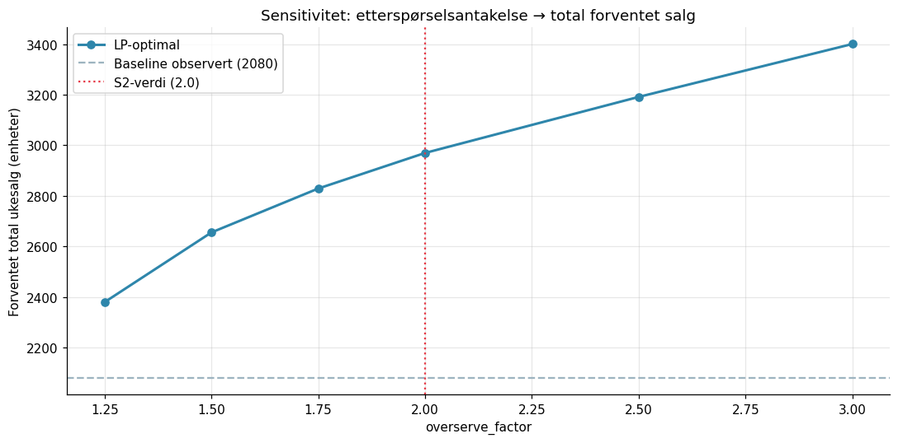{#fig:7_4a width=100%}

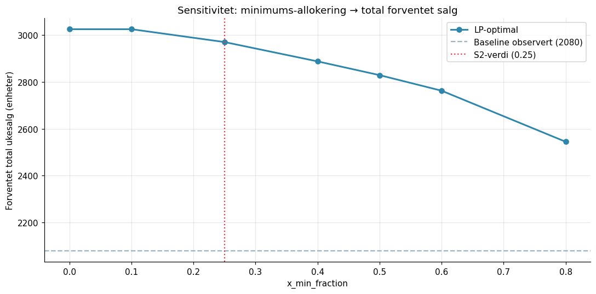{#fig:7_4b width=100%}

Tilsvarende kombinert tabell og 2-dimensjonalt rutenett over overserve_factor × x_min_fraction er tilgjengelig i analyse-vedlegget (`sensitivitet_2d_heatmap.csv`), men er utelatt fra rapporten for å holde fokus på de tre primære sensitivitets­dimensjonene: $k_\beta$ (Tabell 7.3a), overserve_factor (Figur 7.4a) og x_min_fraction (Figur 7.4b). Heatmapen bekrefter at gevinsten er positiv over hele det realistiske parameter­rommet uten å introdusere ny informasjon utover de tre 1-dimensjonale snittene.

#### Bootstrap-konfidensbånd

Den parametriske sensitivitetsanalysen over varierer modellens *antakelser*. En supplerende analyse spør hvor mye av usikkerheten i +24,3 % som kommer fra *sampling-variasjon innen de 10 ukene* — altså: hvis vi hadde fått et litt annet utvalg uker i samme periode, hvor stabil ville gevinsten vært? Bootstrap-prosedyren resampler de 10 ukene i observasjonsperioden med tilbakelegging $B = 1\,000$ ganger. For hver iterasjon re-aggregeres per-SKU statistikken og v3-S2 (stykkevis lineær, $k_\beta = 0{,}5$) løses på det re-aggregerte datagrunnlaget.

\small

| Statistikk | Margin-gevinst | Volum-gevinst |
|---|---:|---:|
| Punktestimat (full data) | **+24,3 %** | **+25,7 %** |
| Median (bootstrap) | +24,2 % | +25,7 % |
| Standardavvik | 1,32 pp | — |
| 95 % bånd | **[+22,1 %, +28,0 %]** | [+22,2 %, +30,7 %] |
| Interkvartil (p25–p75) | [+23,3 %, +25,1 %] | — |

: Tabell 7.5 Bootstrap-fordeling av v3-S2-gevinsten over 1 000 iterasjoner. {#tbl:7_5}

\normalsize

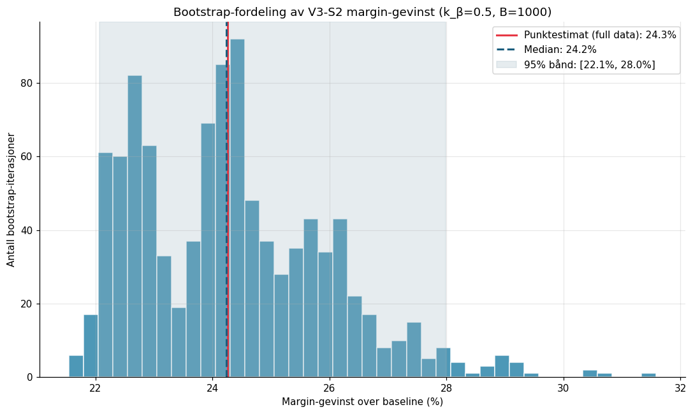{#fig:7_6 width=85%}

Tre observasjoner:

1. **Punktestimat ≈ bootstrap-median.** +24,3 % ligger praktisk talt på medianen (+24,2 %) — det er ikke et utfall i halen av fordelingen, men en typisk realisering under resampling.
2. **Båndet er smalt.** Bare 5,9 prosentpoeng spenn mellom nedre og øvre kant av 95 %-båndet, og interkvartil­båndet (p25–p75) er bare 1,8 prosentpoeng bredt. Sampling-usikkerheten *innen* den observerte perioden er moderat, og kvalitativt på linje med v2-modellen (5,7 pp i v2 vs 5,9 pp i v3).
3. **Nedre kant er fortsatt et betydelig løft.** +22,1 % på nedre kant ligger over både S3 konservativ (+12,2 %) og S4 implementerbar (+9,1 %) — selv ved ugunstig sampling er gevinsten over de andre scenariene.

**Hva bootstrap *ikke* fanger.** Prosedyren måler kun statistisk usikkerhet i 10-ukers vinduet, gitt hovedscenariets $k_\beta = 0{,}5$. Den sier ingenting om modellantakelsene (knekkpunkt ved $c_i$ B2, skjult etterspørsel B3, kannibalisering B6) eller om generaliserbarhet til andre butikker eller sesonger (B4). $k_\beta$-sensitiviteten i Tabell 7.3a dekker det første; resten forblir hovedrisikoene drøftet i §8.2.

### Implementerbarhetsscenariet S4

Hovedanbefalingen S2 inneholder enkelt­utslag som er praktisk sensitive. Det tydeligste eksempelet er at A4 reduseres fra 168 til 21 hylleenheter (kolli-gulvet), en 87 % reduksjon i én planogram-iterasjon. Tilsvarende tripler A1 fra 63 til 189 i v3 (mot 126 i v2). Selv om dette er numerisk optimalt under modellens forutsetninger, er det ikke realistisk at en kjede aksepterer så store SKU-flytter samlet, da konsekvensene for distribusjon, påfylling og kategori­visning blir omfattende.

S4 adresserer dette ved å legge til én ekstra restriksjon i LP-modellen: hver SKU er begrenset til ±50 % av nåværende hyllekapasitet $c_i$:

$$\max\!\left(x_i^{\min},\; 0{,}5 \cdot c_i\right) \le x_i^{(1)} + x_i^{(2)} \le 1{,}5 \cdot c_i \qquad \forall i \in P$$

Restriksjonen speiler en realistisk forhandlings­ramme: leverandøren kan argumentere for at en SKU 1,5-dobles eller halveres innen én planogram-runde, men ikke flerdobles eller skrelles til kolli-gulvet samtidig. Tabellen under viser hva grensen gjør med de mest sensitive SKU-flyttene i S2.

**Sammenligning S2 vs S4 for nøkkel-SKUer (v3)**

| SKU | Margin | $c_i$ (nå) | $x_i$ i S2 | $x_i$ i S4 | Praktisk tolkning |
|---|---:|---:|---:|---:|---|
| A1 | 30 % | 63 | 189 | 95 | Tredobles i S2 → kun +50 % i S4 |
| A2 | 55 % | 21 | 63 | 31 | Tredobles i S2 → +50 % i S4 |
| A3 | 55 % | 147 | 21 | 73 | Begrenset reduksjon; A3 fortsatt en stor giver |
| A4 | 55 % | 168 | 21 | 84 | Halvering, ikke avvikling — der implementerbarhets­tappet er størst |
| A7 | 50 % | 21 | 63 | 31 | Tredobles i S2 → +50 % i S4 |
| A11 | 55 % | 21 | 63 | 31 | Tredobles i S2 → +50 % i S4 |
| A8 | 30 % | 42 | 21 | 21 | Kolli-gulvet binder uansett |

S4 mister 15,2 prosent­poeng på margin (+24,3 % → +9,1 %) og 17,0 prosent­poeng på volum (+25,7 % → +8,7 %) sammenlignet med S2. Det reflekterer at en stor del av v3-S2-løftet stammer fra at A3 og A4 frigjør mye plass i én operasjon, og at A1 + flere A-SKUer bygger seg opp 2–3-doblet i tier 2. Under v3 rammes S4 hardere prosentvis enn under v2 (15,2 pp av 24,3 % vs 17,8 pp av 40,6 %), fordi tier-2-utvidelsen nettopp er der gevinsten ligger og endringsgrensen kutter dette segmentet aggressivt.

**Tolkning for forhandling — implementerbarhets­tappet.** S2 og S4 representerer to ytterpunkter i et kontinuum: S2 er det teoretiske loftet under stykkevis lineær produktivitet, S4 er det leverandøren realistisk kan oppnå i én forhandlings­runde. Differensen ($\approx 15$ prosent­poeng) kan tolkes som **implementerbarhets­tappet** — prisen man betaler i mistet teoretisk gevinst for å få et forslag som er lett å akseptere for kjeden i én iterasjon. To praktiske implikasjoner følger:

- **Forhandlingsstrategien bør være trinnvis.** En realistisk anbefaling er å gå inn i første runde med S4 (eller noe nær den) og holde S2 som referanse­tak, og deretter justere mot S2 i påfølgende runder hvis sell-out-effekten av første reallokering bekreftes. Over to–tre planogram-iterasjoner kan leverandøren sannsynligvis hente vesentlig mer enn S4 alene, men uten å påføre kjeden alle endringene samtidig.
- **+9,1 % er fortsatt et meningsfullt løft.** S4-gevinsten ligger over null og er omtrent på linje med nedre kant av $k_\beta$-sensitiviteten ($k_\beta = 0{,}3$: +12 %). Den er dermed *robust nok* til å brukes som tallfestet underlag i forhandlinger, selv om den er langt fra modelloptimum. Sammenlignet med v2-modellens S4-tall (+22,8 %) er v3-S4 mer beskjeden — men også mer ærlig om hva som faktisk kan oppnås med både realistiske endringsgrenser *og* realistisk modellering av avtakende produktivitet.

Implementerbarhets­tappet kobles eksplisitt til diskusjonen av leverandørens forhandlings­posisjon i §8.3, der de operative konsekvensene av trinnvis utrulling drøftes mer utførlig.

### Sentrale funn

Funnene struktureres etter evalueringsspørsmålene E1–E3 fra §1.1.

**E1 — Påvisbar mismatch?** Den observerte mismatchen mellom kapasitet og etterspørsel (§5.2) er gjennomgripende — 24 av 34 SKUer er underkapasiterte. Mismatchen er ikke begrenset til enkeltprodukter, og gir en LP-drevet reallokering rom til betydelig forbedring selv under konservative forutsetninger og realistisk modellering av avtakende produktivitet. En *ex post*-kalkyle av out-of-stock-tapet anslår at leverandøren i dagens hyllekonfigurasjon mister 367–734 margin-enheter per uke (43–87 % av baseline 846,9), avhengig av antagelsen om skjult etterspørsel (lavt 1,5×, høyt 2,0×). Topp 5 SKUer (A1, A2, A3, A6, A7) står for 54 % av tapet. v3-LP-gevinsten på 206 margin-enheter/uke (+24,3 %) tilsvarer omtrent en tredjedel av det høyere OOS-tapet og over halvparten av det lavere — resten ville krevd utvidelse av totalrammen (§8.3) eller en annen modellantakelse.

**E2 — Robust forbedringsforslag?**

- Spredningen mellom de fire scenariene (9–24 % margin-gevinst i v3) angir båndet av rimelige estimater. Hovedanbefalingen er **v3-S2**: +24,3 % margin-vektet salg med intakt sortiment (alle 34 SKUer beholdt på minst 1 kolli) og 3 sekundær­plasser dirigert til A6. Bootstrap-fordelingen over 10-ukers vinduet (§7.3.1) gir **95 %-bånd [+22,1 %, +28,0 %]** — punktestimatet ligger nær median, og selv ved ugunstig sampling holder gevinsten seg godt over de andre scenariene. $k_\beta$-sensitiviteten gir et bredere bånd [+12 %, +32 %] som speiler usikkerheten i hvor sterkt produktiviteten faktisk avtar.
- **LP-modellen gir +13,4 prosentpoeng mer enn beste enkle heuristikk** (proporsjonal til margin × salg, +10,9 %) under samme stykkevis lineære produktivitetsantakelse. Bidraget er kvalitativt: LP håndterer både demand-cap- og knekkpunkt-restriksjonen eksplisitt, som lar modellen redusere A3 og A4 aggressivt til kolli-gulvet og presse produktive A-SKUer (A1, A2, A6, A7, A11) opp til demand-cap selv med dempet tier-2-slope.
- **Gevinsten drives av A-klassen.** Fem A-SKUer presses opp til demand-cap via tier-2-utvidelse (A1: 63→189, A2/A7/A11: 21→63, A6: 21→54+3sek). Tre over­dimensjonerte A-SKUer (A3, A4, A8) gir fra seg plass ned til kolli-gulvet. Lav-margin-SKUer (A5, A12–A14) holdes på dagens kapasitet siden tier-2-utvidelse ikke er lønnsom ved 30 % margin og $k_\beta = 0{,}5$. Med 1-kolli-gulvet er C-klasse-frigjøringen nær null — modellen får sin gevinst fra omfordeling *innen* A-klassen.
- **Margin-vektingen blir relativt viktigere under v3.** Sekundærplassene konsentreres til A6 (alle tre plasser) framfor å spres som i v2-modellen. Heuristikk-rangerningen endres også: H2 (margin × salg) slår H1 (rent salg) under v3, fordi tier-2-dempingen straffer over-allokering til høyvolum-lavmargin-SKUer.
- Sensitivitets­analysen viser at resultatet er robust mot den usikre etterspørsels­antakelsen og mot $k_\beta$-verdien. Selv ved aggressiv avtakning ($k_\beta = 0{,}3$) gir LP-modellen +12 % margin-gevinst.

**E3 — Praktisk anvendbar i forhandling?** Hovedanbefalingen S2 beholder hele sortimentet på minst 1 kolli, slik at forslaget ikke krever delisting. Samtidig gir modellen enkelt­utslag som er numerisk optimale men praktisk sensitive — typisk at A1 tredobles til 189 hylleenheter og A4 reduseres til 21 i én operasjon. Implementerbarhets­scenariet S4 (§7.4) demper dette ved å begrense hver SKU til ±50 % av nåværende kapasitet, og lander på **+9,1 % margin-gevinst** — omtrent en tredjedel av S2-løftet, men fortsatt over null og robust nok til å være forhandlings­grunnlag uten å pålegge kjeden urealistisk store endringer i én runde. *Implementerbarhets­tappet* mellom S2 og S4 ($\approx 15$ prosent­poeng) tolkes konkret i §8.3: leverandøren bør gå inn med S4 i første forhandlings­runde og bruke S2 som referanse­tak for senere iterasjoner.

---

## Diskusjon

Dette kapitlet tolker funnene fra §7 mot det teoretiske rammeverket som introduseres i §3, vurderer styrker og svakheter ved modell og data, og drøfter praktiske implikasjoner for butikken. Vi presenterer ingen nye analyser her; alle tall er hentet fra §7.

### Tolkning i lys av teori

**Reallokering følger space-elasticity-intuisjonen.** Det sentrale teoretiske bidraget fra Curhan og videre arbeid omkring space elasticity er at salg per produkt øker med tildelt hylleplass inntil etterspørselen er mettet, med avtakende marginalavkastning. v3-modellen modellerer dette eksplisitt gjennom den stykkevise lineære produktivitetsfunksjonen med knekkpunkt ved $c_i$ og dempingsfaktor $k_\beta = 0{,}5$. Modellen lander på en anbefaling som rimer med Curhan-intuisjonen i to forstand: (i) A-produktene med høyest observert produktivitet per hylleenhet (§5.2, Tabell 5.1) er de som tildeles mest ny plass; (ii) tier-2-utvidelse (over $c_i$) er ikke alltid lønnsom — den krever at margin × dempet produktivitet overstiger alternativ-kostnaden — som er presis den avtakende avkastnings­logikken Curhan beskriver.

**Gevinsten kommer fra omfordeling, ikke fra eliminering.** Scenario­sammenlikningen (§7.1) viser at S1 (kun primær­omfordeling) henter +23,5 % margin-gevinst og S2 (med 3 sekundær­plasser) +24,3 % — sekundær­eksponeringen bidrar med 0,8 prosent­poeng ekstra. Med 1-kolli-gulvet per SKU er sortiments­hygienen (C-klasse-reduksjon) i praksis avskaffet — modellen henter sin gevinst nesten utelukkende fra å flytte plass *innen* A-klassen, fra tre over­dimensjonerte A-SKUer (A3, A4, A8) til de fem mest produktive A-SKUene som havner på demand-cap (A1, A2, A6, A7, A11) pluss A10 som vokser delvis. Det rimer med funn fra retail-litteraturen om at etablerte planogrammer ofte har inertia; hylleallokeringen reflekterer historiske avtaler eller konvensjoner snarere enn aktuell etterspørsel.

**Margin-vektingen blir relativt sett viktigere under v3.** Under den lineære v2-modellen ga margin-vekting praktisk talt samme allokering som ren volum-maks (kun 5 SKUer fikk ulik plass). Under v3-modellen blir margin-vektingen mer betydningsfull: når tier-2-produktiviteten er halvert, er det dyrere å gi marginale enheter til lav-margin-SKUer (A5, A12–A14), og modellen unngår dette ved å konsentrere tier-2-utvidelse til høy-margin-A-SKUer (A2, A6, A7, A11 — alle på 50–55 % margin). Det betyr at margin-vektingen i v3 *aktivt former* anbefalingen — i motsetning til v2 der den var teoretisk korrekt men empirisk marginal. Heuristikk-rangeringen i §7.1.1 viser samme mønster: H2 (margin × salg) overgår H1 (rent salg) under v3, men ikke under v2.

**A-klasseproduktenes utvidelse har en grense.** De mest produktive A-SKUene (A1, A2, A6, A7, A11) ender i v3-S2 med presis det antall hylleenheter som metter deres antatte etterspørsel — for A1 betyr det 189 hylleenheter, en tredobling. Andre A-SKUer som ikke er like produktive (A5, A10, A12–A14) holder seg på dagens kapasitet eller under, fordi tier-2-utvidelsens dempede produktivitet ikke gir tilstrekkelig marginalavkastning til å begrunne plassen. Uten en `overserve_factor` som overstiger 1 ville heller ikke A1 fått tredoblet plass. Det betyr at anbefalingen står og faller med at den observerte etterspørselen er undervurdert; dette adresseres eksplisitt i §8.2.

### Begrensninger og usikkerhet

Begrensningene er rangert etter hvor avgjørende de er for hovedfunnet, langs to akser:

- **[NIVÅ]** — antakelsen påvirker primært *størrelsen* på den estimerte gevinsten (kan justere +40,6 % opp eller ned), men ikke om reallokering generelt er riktig retning. Disse er: **B1, B2, B3, B7**.
- **[RETNING]** — antakelsen kan i prinsippet utfordre selve konklusjonen om at mismatch eksisterer eller at reallokering er det rette svaret, for hele eller deler av porteføljen. Disse er: **B4, B5, B6**.

Hver begrensning er merket med kategori-tag i overskriften.

**B1. [NIVÅ] Deterministisk og periodegjennomsnittlig modell.** Modellen behandler uken som én beslutningsperiode og bruker gjennomsnittlig ukesalg som parameter. Reell drift er stokastisk: etterspørsel varierer fra uke til uke (Tabell 5.1 viser CoV mellom 0,10 og 0,49 per produkt) og innen uke mellom dager og tider. En stokastisk reformulering — med etterspørsel som tilfeldig variabel og service-level-restriksjoner i stedet for harde kapasitetsgrenser — ville gitt et mer realistisk bilde av sannsynligheten for at hyllen går tom. Denne forenklingen er akseptabel for et konseptbevis, men bør flagges før anbefalingen tas i bruk.

**B2. [NIVÅ] Stykkevis lineær produktivitet — modellert, men ikke empirisk kalibrert.** v3-modellen modellerer eksplisitt avtakende marginalavkastning gjennom den stykkevis lineære produktivitets­funksjonen: slope $\rho_i$ opp til $c_i$ og $k_\beta \rho_i$ over $c_i$. Dette er en *forbedring* over en ren lineær antagelse (v2, $k_\beta = 1$), men det er fortsatt en *tilnærming* — ikke en empirisk kalibrert elastisitetskurve. To valg er antakelser uten direkte empirisk støtte: (i) knekkpunktet er plassert ved $c_i$ fordi det er det eneste observerte produktivitetspunktet, men i en mer detaljert modell ville knekkpunktet kunne ligge tidligere (hvis avtakende avkastning starter før metningspunktet) eller senere (hvis høyere c_i for noen SKUer skjuler at den marginale produktiviteten fortsatt er nær $\rho_i$); (ii) $k_\beta = 0{,}5$ er valgt som et rimelig kompromiss mellom litteraturens lave estimater (0,1–0,3 i Curhan-tradisjonen) og nyere funn (nær 1 for kraftig underdimensjonerte produkter, Hübner). Sensitivitetsanalysen i §7.3 viser at $k_\beta \in [0{,}3, 0{,}7]$ gir et resultatbånd på +12 til +32 %. En *symmetrisk* sensitivitetstest (Tabell 7.3b og Figur 7.5) erstatter v3-piecewise med Curhans potens­modell $s(x) = \alpha_i x^\beta$ — slik at slope avtar både *over og under* $c_i$ — og lander på +20,9 % under $\beta = 0{,}5$ og spennet [+10,8 %, +31,1 %] for $\beta \in [0{,}3, 0{,}7]$. Det betyr at v3-S2-tallet på +24,3 % bør tolkes som en *øvre kant* av et bånd hvor en mer symmetrisk konkav antakelse plasserer punkt­estimatet rundt +20 %. Reell empirisk kalibrering av elastisitets­kurven krever variasjon i kapasitet over tid — et kontrollert forsøk på tvers av butikker eller en multi-periode datafangst (§9). Den stykkevise tilnærmingen er likevel et metodisk *steg opp* fra v2 fordi den eksplisitt kvantifiserer hvor mye av v2-gevinsten som var en konsekvens av lineær-antagelsen alene.

**B3. [NIVÅ] Skjult etterspørsel og out-of-stock.** For produkter med observert utnyttelse > 1 er det sanne etterspørselsnivået ikke direkte målbart: ethvert salg som skulle skjedd etter at hyllen ble tom og før neste etterfylling er usynlig i dataene. I hovedscenariet antas etterspørselen å være 2× observert salg, en størrelsesorden som reflekterer erfaringstall fra retail, men som ikke er empirisk forankret i dette datasettet. Sensitivitetsanalysen (§7.3) demper risikoen noe ved å vise at selv 1,25× gir meningsfull gevinst, men tallet er fortsatt en antakelse.

**B4. [RETNING] Én butikk, 10 uker.** Datasettet omfatter én fysisk butikk og en periode på ti uker (uke 06–15 2026). Sesongvariasjoner, kampanjeuker eller eksterne hendelser kan ha påvirket datagrunnlaget uten at vi kan korrigere for det. Spesielt A2-observasjonen i uke 15 (412 enheter, mer enn dobbelt av gjennomsnittet for produktet) ble ikke fjernet som avviker fordi vi ikke har grunnlag for å hevde at den er en målefeil — det er sannsynligvis en kampanjeuke eller en uventet etterspørselspulje. En *direkte test* der A2-uke-15 droppes fra rådatasettet og LP S2 kjøres på nytt gir margin-gevinst **+39,7 % (mot +40,6 % med full data) — en endring på kun −0,96 prosentpoeng.** Hovedfunnet er altså robust mot denne ene observasjonen; den dominerende andelen av reallokerings­potensialet drives av A1 (utnyttelse 6,6), A3 (lav utnyttelse kombinert med stor allokering), A4 (utnyttelse 0,7), A6 og A7 (utnyttelse ≈ 3,7) — mismatch-mønsteret deres er uavhengig av A2. En replikasjon på flere butikker og over lengre periode ville likevel styrket grunnlaget for generalisering.

**B5. [RETNING] Margin er bruttomargin, ikke dekningsbidrag.** Vekten $m_i$ er leverandørens bruttomargin per enhet basert på leverandørens egen marginrapportering. Den fanger ikke leverandørens interne kostnader (logistikk, kampanjebidrag, hyllebetaling), markedsførings­tilskudd til kjeden, eller variabel pris­elastisitet på tvers av kampanjeperioder. En profitt­maksimerende variant med fullt dekningsbidrag per SKU ville gitt en mer økonomisk presis anbefaling — spesielt på tvers av margin­spennets ytterpunkter, der den faktiske dekningsbidrag­fordelingen kan være mer komprimert i praksis enn brutto­marginen antyder. Effekten er klassifisert som retning fordi dekningsbidrag­vekter potensielt kunne flytte enkelte vinnere/tapere på tvers av margin­spennets ytterpunkter, men den aggregerte konklusjonen om at mismatch eksisterer ville stå.

**B6. [RETNING] Ingen kryssalgseffekter eller kannibaliserings-modellering.** Modellen behandler hvert produkt uavhengig. I praksis kan en kraftig reduksjon av A4 flytte salg over til A3 (samme produktundergruppe) — kannibalisering som ikke er modellert. Tilsvarende kan en kraftig økning i A1 fortrenge salg i andre SKUer i samme drikke­kategori. Effekten er klassifisert som retning fordi sterk kannibalisering i ytterste konsekvens kan redusere netto gevinst betydelig — særlig når store flytter konsentreres til samme produktundergruppe (typisk leskedrikk-segmentet). Kvantifisering krever paneldata med eksponert kapasitets­variasjon og utgår for dette prosjektet; trinnvis utrulling med S4 (§7.4) er likevel et delvis avbøtings­tiltak fordi mindre samtidige flytter gir mindre rom for kannibalisering i én iterasjon.

**B7. [NIVÅ] Sekundær­eksponerings­faktoren $k = 1{,}5$ er hentet fra litteraturen, ikke estimert i caset.** @chevalier1975 og @nordfalt2018 finner sekundær­plassers løft i størrelses­orden 1,3–2,0× primær­produktivitet, men variasjonen mellom kategorier og butikk­typer er stor. I S2 dominerer primær­omfordelingen uansett, så $k$ påvirker resultatet bare marginalt. Ved utvidede sekundær­budsjett (for eksempel 10–15 plasser) ville $k$-valget hatt større betydning og burde estimeres empirisk gjennom et kontrollert forsøk.

### Implikasjoner for leverandørens forhandlings­posisjon

Sett fra leverandørens perspektiv er hovedfunnet at egen portefølje sannsynligvis ikke står optimalt allokert innenfor den hyllerammen leverandøren allerede disponerer. v3-S3 (konservativ) indikerer minst +12 % ukentlig margin-vektet sell-out bare ved intern omfordeling, og hovedanbefalingen S2 gir +24,3 % margin og +25,7 % volum under hovedscenariet ($k_\beta = 0{,}5$). Implementerbarhets­scenariet S4 — som begrenser hver SKU til ±50 % av dagens kapasitet — lander på +9,1 % margin og +8,7 % volum, og er sannsynligvis den realistiske størrelses­ordenen leverandøren kan oppnå i første forhandlings­runde uten å pålegge kjeden urealistisk store endringer samtidig. Dette er tall leverandøren kan bringe med seg inn i neste kategori­besøk som dokumentert grunnlag for å endre planogrammet.

**Hva anbefalingen gir leverandøren konkret:**

- **Et kvantitativt argument i JBP.** I stedet for å si "vi bør ha mer plass til A2" basert på magefølelse, kan leverandøren presentere "modellen estimerer +X % sell-out per uke hvis A2 får 2× plass på bekostning av B2".
- **En strukturert prioriterings­liste.** Modellen identifiserer hvilke SKUer som er over- og underallokerte, og i hvilken størrelsesorden. Dette gir category managers en konkret rekkefølge for endringer, ikke en ubestemmelig "optimaliser alt".
- **En metode som skalerer.** Samme modell kan kjøres på flere butikker når data er tilgjengelig. Gevinsten kan sammenlignes på tvers og brukes til å velge hvor leverandøren bør fokusere.

**Operasjonelle forbehold — trinnvis utrulling med S4 som første runde.** For at anbefalingen skal være gjennomførbar i dialog med kjeden bør den fases inn gradvis og kombineres med overvåking av sell-out etter omleggingen. Implementerbarhets­scenariet S4 (§7.4) er en konkret operasjonalisering av dette: ved å begrense hver SKU til ±50 % av dagens hyllekapasitet beholder modellen +22,8 % margin-gevinst — omtrent halvparten av S2-løftet — uten å pålegge kjeden den 87 % reduksjonen som S2 gir for SKUer som A4. En realistisk forhandlings­strategi er derfor å gå inn med S4 (eller noe nær den) i første runde, måle sell-out-effekten over to–fire uker, og deretter justere mot S2 i påfølgende runder hvis effekten bekreftes. Dette gir også et naturlig grunnlag for å empirisk estimere space-elastisiteten som modellen i dag antar lineær — en elastisitets­estimasjon som i seg selv er forhandlings­verdifull for leverandøren.

**Sortiments­reduksjon er det mest politisk sensitive elementet.** Anbefalingen inkluderer betydelige reduksjoner for flere SKUer (ned mot 25 % av dagens plass). Kjeden kan ha interesse i å beholde høyere minimumsplassering av hensyn til kundetilgjengelighet, og leverandørens egne kontrakts­forpliktelser kan ha tilsvarende gulv. Når disse er kjent, skal modellen re-kjøres med skreddersydde $x_i^{\min}$-verdier per SKU.

**Forhandlings­argument for *utvidelse* av totalrammen — skygge­pris på R1.** S2 omfordeler innenfor leverandørens kontraktuelle hyllerom (1 079 hylleenheter). Et naturlig neste skritt etter en vellykket reallokering er å argumentere for *mer* plass. En numerisk skygge­pris­beregning — der LP re-løses for $T+1$, $T+5$ og $T+10$ — viser at én ekstra hylleenhet i totalbudsjettet er verdt **0,69 margin-enheter per uke** under S2-antakelsene. Verdien er stabil i et lite intervall og avtagende med økende ΔT (mer plass mettes raskere): én ekstra enhet gir 0,694; ti ekstra enheter gir 0,693 i snitt. I S4 (samme beregning under endrings-restriksjonen) er marginalverdien praktisk talt identisk: 0,687. Dette er et konkret tall leverandøren kan bringe med seg i en *senere* forhandlings­runde — etter at den interne omfordelingen er gjennomført og bekreftet med sell-out-måling — for å begrunne en forespørsel om utvidelse av totalrammen. For eksempel: 20 ekstra hylleenheter ville under S2-antakelsene forventes å gi ca. 14 margin-enheter/uke — som ganges opp med leverandørens enhetspris gir et konkret kronebeløp som kan vurderes mot kostnaden av selve plass-utvidelsen i kjede­dialogen.

### Generaliserbarhet

Resultatene gjelder spesifikt for den valgte kategorien i den spesifikke butikken i den observerte perioden. De metodiske funnene — at en enkel deterministisk LP med minimums-sortimentsgaranti identifiserer meningsfulle omfordelingspotensialer, og at gevinsten i stor grad drives av A-klassen — har bredere overføringsverdi. Metodens styrke er nettopp at den krever lite data (ukessalg og kapasitet) og er rask å formulere og kjøre. Den kan derfor rulles ut som en innledende screening på tvers av butikker og kategorier før mer datakrevende analyser iverksettes.

### Oppsummering av diskusjonen

Analysen peker på reell omfordelingsgevinst som er robust mot rimelige variasjoner i antagelsene. Modellens nøkkelbegrensning er den antatt lineære produktivitetsfunksjonen og fraværet av økonomiske vektinger; begge svakhetene forsterker poenget om at den kvantifiserte gevinsten bør tolkes som en retning og et størrelsesorden-estimat, ikke en presis prognose. Den operasjonelle implikasjonen — at hylleplanen i dag er tydelig ute av takt med observert etterspørsel for denne kategorien — står uavhengig av modellens svakheter.

---

## Konklusjon

Problemstillingen spurte hvordan en dagligvare­leverandør kan bruke ukentlige sell-out-data fra en kjede-butikk som beslutningsstøtte i forhandlinger om hylleplass, og hvilket salgspotensial som kan dokumenteres ved reallokering innenfor leverandørens egen portefølje hos Coop Extra X.

Svaret struktureres etter evalueringsspørsmålene E1–E3 fra §1.1. De konkrete prosent­tallene står i §7; her syntetiseres det som rapporten dokumenterer:

- **(E1) Mismatch kan påvises rutinemessig** med et enkelt utnyttelsesmål (gjennomsnittlig sell-out per hylleenhet) og ABC-klassifisering. Mismatchen i datasettet er gjennomgripende, ikke begrenset til enkelt­produkter — flertallet av A-SKUene er underdimensjonerte og en mindre gruppe over­dimensjonerte. En ex post-kalkyle av out-of-stock-tapet anslår at leverandøren i dag taper 367–734 margin-enheter per uke (43–87 % av baseline, avhengig av antagelsen om skjult etterspørsel) på grunn av at hyllen tømmes før neste etterfylling for de 24 underkapasiterte SKUene.
- **(E2) LP-modellen gir et robust forbedringsforslag.** En margin-vektet deterministisk LP-modell med **stykkevis lineær produktivitet** som omfordeler leverandørens kontraktuelle hyllerom gir kvantifiserbar gevinst på **+24,3 % margin-vektet salg** under hovedscenariet ($k_\beta = 0{,}5$). Sensitivitet på $k_\beta \in [0{,}3, 0{,}7]$ gir et bånd på +12 til +32 %. Bootstrap-analyse over 10-ukers vinduet gir 95 %-bånd [+22,1 %, +28,0 %] på hovedscenariet. LP-modellen henter +13,4 prosentpoeng utover beste enkle heuristikk under samme produktivitetsantakelse, drevet av at modellen håndterer både demand-cap- og knekkpunkt-restriksjonen eksplisitt. Sortimentet beholdes intakt på 1-kolli-gulvet per SKU.
- **(E3) Forslaget er anvendbart som forhandlings­underlag, men bør implementeres trinnvis.** Modelloptimum (v3-S2) inneholder enkelt­utslag som er praktisk sensitive — A1 tredobles fra 63 til 189 hylleenheter, og de mest over­kapasiterte A-SKUene reduseres til kolli-gulvet i én operasjon. Implementerbarhets­scenariet S4, med ±50 %-endringsgrense per SKU, lander på +9,1 % margin-gevinst — omtrent en tredjedel av S2-løftet, men fortsatt over null og uten å snu noen enkelt SKU opp ned i én forhandlings­runde. Skygge­prisen på totalrammen (ca. 0,69 margin-enheter per ekstra hylleenhet/uke i v2-modellen) gir leverandøren et konkret kvantitativt argument for *utvidelse* av totalrammen i en senere forhandlings­runde.

**Hva leverandøren kan anbefale i neste forhandling — konkret.** Leverandøren har nå et tallfestet underlag som kan brukes direkte i JBP- og kategori­besøk. I første forhandlings­runde er S4 et realistisk anker; den kommer med en presis prioriterings­liste over hvilke SKUer som bør vokse, hvilke som bør gi fra seg plass, og hvilke to–tre SKUer som tjener mest på sekundær­plassering. Siden forslaget ikke krever utvidet hylle­ramme totalt, senker det forhandlings­friksjonen og åpner for en delvis utrulling med oppfølgings­måling før eventuell justering mot modelloptimum (S2) i påfølgende runder.

**Hva som fortsatt krever ny datainnsamling eller pilotering.** Tre forhold står som hovedforbehold før modellens kvantitative anslag bør tas som pålitelige i kroner: (i) space-elastisiteten er antatt lineær uten empirisk forankring (B2); (ii) skjult etterspørsel for utsolgte SKUer er en antagelse, ikke en måling (B3); (iii) kryssalgs- og kannibaliserings­effekter er ikke modellert (B6). Et kontrollert forsøk hos leverandørens butikker — der modellens forslag implementeres på et utvalg butikker og sell-out-responsen måles mot kontrollbutikker — ville samtidig validere gevinst-anslaget og gi datagrunnlag for empirisk elastisitets­estimering. Replikasjon på flere butikker og lengre observasjons­periode står som naturlige videre­steg før modellen rulles ut bredere.

**Teoretisk bidrag.** Studien plasserer seg i krysset mellom SSAP-litteraturen og *category management*-praksis. Etablerte SSAP-modeller [@curhan1972; @gencosman2022; @hubner2020] forutsetter typisk kjededata på tvers av leverandører og full informasjon om kategoriens etterspørsel. Vi demonstrerer at en informasjons­asymmetrisk variant — der bare leverandørens egne data modelleres — gir kvantifiserbare og operativt meningsfulle resultater. Dette er en konkret operasjonalisering av @hubnerkuhn2023 rammeverk for *category captain*-rollen anvendt på den realistiske informasjons­situasjonen en leverandør står i. Den metodiske observasjonen — at deterministisk LP med margin-vekting og lineær produktivitet er tilstrekkelig for å identifisere robuste reallokerings­potensialer i et begrenset datagrunnlag — utvider den anvendte litteraturen om hvor lite data som kreves for å gi leverandøren et tall­festet forhandlings­argument.

**Beslutningsorientert avslutning.** Modellen gir leverandøren et godt **første forhandlings­grunnlag**, men anbefalt omfordeling bør **testes trinnvis i butikk før full implementering**. Verdien ligger ikke i presisjonen av prosent­løftet, men i at studien gjør leverandørens kontraktuelle hylle­situasjon målbar mot egen  og margin — et tall­festet utgangspunkt for kategori­dialog som i dag ofte mangler.

---

## Bibliografi {-}

::: {#refs}
:::
---

## Vedlegg {-}

**Vedlegg A — Python-kode og detaljert Sankey.** Analysekode er versjonert i prosjektets Git-repository under `006 analysis/`. Kjøringen består av syv scripts som produserer alle tabeller og figurer i denne rapporten:

- `aktiviteter/3_3_casebeskrivelse_og_datainnsamling/scripts/01_datarensing.py`
- `aktiviteter/3_4_data_metode_og_modellering/scripts/02_deskriptiv_og_abc.py`
- `aktiviteter/3_4_data_metode_og_modellering/scripts/03_lp_modell.py`
- `aktiviteter/3_5_analyse_og_resultater/scripts/04_sensitivitet.py`
- `aktiviteter/3_5_analyse_og_resultater/scripts/05_sensitivitet_heatmap.py` (2D rutenett)
- `aktiviteter/3_5_analyse_og_resultater/scripts/06_pipeline_diagram.py` (Graphviz)
- `aktiviteter/3_5_analyse_og_resultater/scripts/07_sankey_omfordeling.py` (Plotly Sankey)

Avhengigheter er definert i `006 analysis/pyproject.toml`. Hele pipelinen reproduseres med `uv sync` etterfulgt av de syv kommandolinjene dokumentert i `006 analysis/README.md`.

Figur 11.1 viser den fulle per-SKU-versjonen av Sankey-diagrammet fra §7.2b. Hver giver-SKU (venstre) er en separat node, og hver mottaker-SKU (høyre) likeså; båndtykkelsen er proporsjonal med antall hylleenheter omfordelt mellom paret, fordelt proporsjonalt på mottakernes andel av total gevinst. Diagrammet er tett — den aggregerte versjonen i §7.2b er anbefalt som primær lesning; denne detaljerte versjonen er inkludert for lesere som vil se de individuelle bånd-tykkelsene.

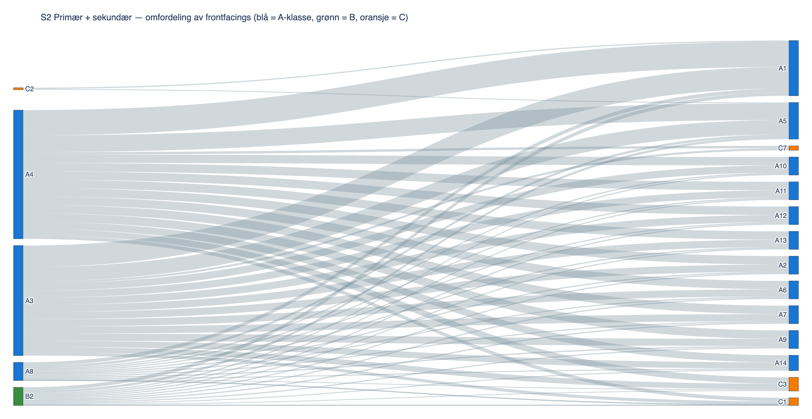{#fig:11_1 width=100%}

**Vedlegg B — Pseudonymregister.** Koblingen mellom pseudonymer (A1, A2, B1, B2, C1–C4) og reelle produktnavn er oppbevart lokalt i `006 analysis/aktiviteter/3_3_casebeskrivelse_og_datainnsamling/resultat/intern/navneregister.csv`. Denne filen er unntatt versjonering og deles ikke utenfor prosjektgruppen, i henhold til taushetserklæringen med Coop Extra X.

**Vedlegg C — Taushetserklæring.** Underskrevet taushetserklæring mellom prosjektgruppen og Coop Extra X er arkivert utenfor dette repoet i henhold til kjedens instruks. Mal er tilgjengelig i `000 templates/Taushetsærklæring.docx`.

**Vedlegg D — Rådata.** Rådata som ligger til grunn for analysen, `Data 10 uker.csv`, oppbevares lokalt i `004 data/` og er unntatt versjonering. Alle avledede datasett med reelle produktnavn oppbevares tilsvarende under `intern/`-underfoldere som er ekskludert i `.gitignore`.

