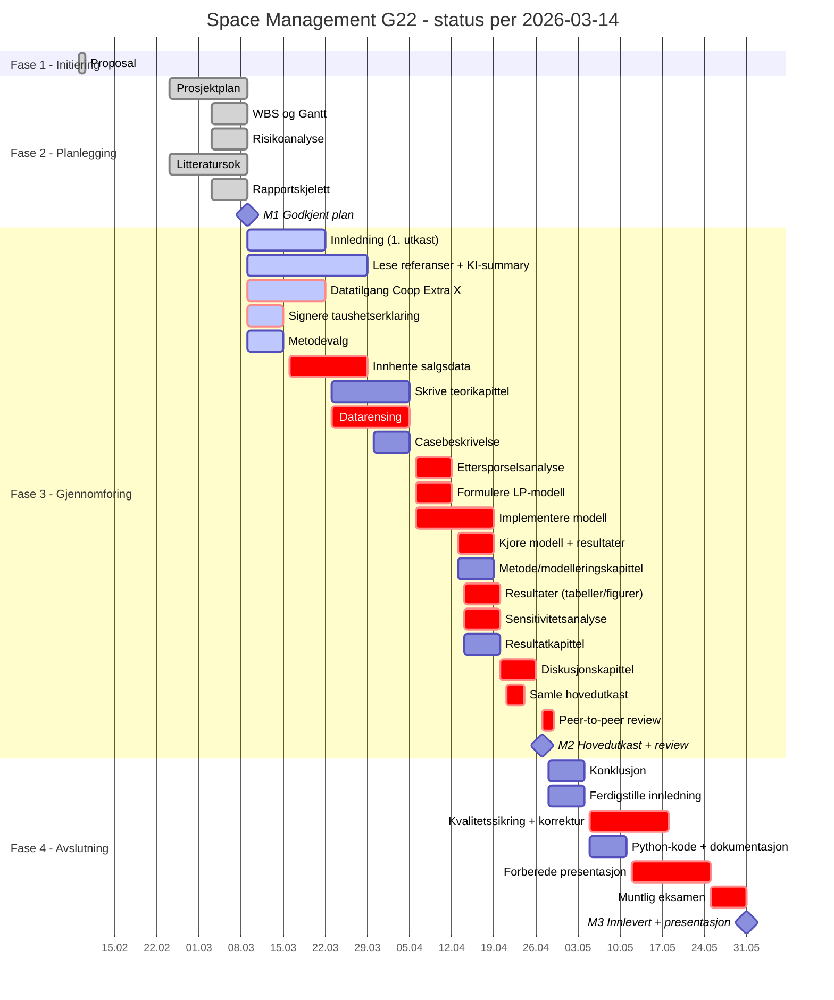

# Status for Space Management G22-prosjektet

Statusdato: 2026-03-14

Denne statusen er basert på planbaseline og aktivitetsstatus i `prosjektplan.md`, `schedule.json` og `wbs.json`.

## Kort status

- Prosjektet er i starten av Fase 3 - gjennomforing.
- Fase 1 (initiering) og Fase 2 (planlegging) er ferdigstilt som planlagt.
- Milepael M0 (9. feb) og M1 (9. mar) er nadd.
- Fase 3 startet 9. mars. Forste oppgaver er datatilgang, litteratur, innledning og metodevalg.
- Hoyeste risiko er R1 (datatilgang fra Coop Extra X, score 15).
- Parallelt arbeid med teori og litteratur gir buffer mot forsinkelser i datatilgang.

## Gjennomfort

| Aktivitet | Periode | Status |
| --- | --- | --- |
| Proposal (Fase 1) | 2026-02-09 | Ferdig |
| Prosjektplan | 2026-02-24 til 2026-03-09 | Ferdig |
| WBS og Gantt (MS Project) | 2026-03-03 til 2026-03-09 | Ferdig |
| Risikoanalyse | 2026-03-03 til 2026-03-09 | Ferdig |
| Litteratursok — identifisere referanser | 2026-02-24 til 2026-03-09 | Ferdig |
| Rapportskjelett i Word-mal | 2026-03-03 til 2026-03-09 | Ferdig |

## Pagaende / neste aktiviteter

| Prioritet | Aktivitet | Planlagt periode | Ressurs | Avhengighet |
| --- | --- | --- | --- | --- |
| 1 | Avklare datatilgang Coop Extra X | 2026-03-09 til 2026-03-22 | Oliver | M1 |
| 1 | Signere taushetserklaring | 2026-03-09 til 2026-03-15 | Oliver | M1 |
| 1 | Beskrive metodevalg | 2026-03-09 til 2026-03-15 | Sebastian | M1 |
| 1 | Innledning + problemstilling (1. utkast) | 2026-03-09 til 2026-03-22 | Frida | M1 |
| 1 | Lese utvalgte referanser + KI-summary | 2026-03-09 til 2026-03-29 | Oliver, Frida | M1 |
| 2 | Innhente salgsdata + hylleplassdata | 2026-03-16 til 2026-03-29 | Oliver | 3.3.1 |
| 2 | Skrive teorikapittel | 2026-03-23 til 2026-04-05 | Frida | 3.2.1 |
| 2 | Datarensing og strukturering | 2026-03-23 til 2026-04-05 | Sebastian | 3.3.3 SS+1u |
| 3 | Ettersporselsanalyse (deskriptiv) | 2026-04-06 til 2026-04-12 | Sebastian | 3.3.4 |
| 3 | Formulere optimaliseringsmodell | 2026-04-06 til 2026-04-12 | Sebastian, Frida | 3.3.4 |

## Milepaeler

| Milepael | Dato | Status |
| --- | --- | --- |
| M0: Godkjent proposal | 2026-02-09 | Oppnadd |
| M1: Godkjent prosjektplan + Gantt | 2026-03-09 | Oppnadd |
| M2: Godkjent hovedutkast + peer review | 2026-04-27 | Planlagt |
| M3: Rapport + kode innlevert, presentasjon | 2026-05-31 | Planlagt |

## Gantt-status

## Sjekkliste for aktiviteter

### Fullfort

#### Proposal (Fase 1)
- [x] Velge omrade og formulere problemstilling
- [x] Definere mal, metode og avgrensninger
- [x] Levere og fa godkjent proposal (M0)

#### Prosjektplan
- [x] Skrive krav, scope, tidsplan, risiko, kommunikasjon, kvalitet
- [x] Intern kvalitetssikring

#### WBS og Gantt
- [x] Legge inn oppgaver, varigheter og avhengigheter i MS Project
- [x] Lagre referanseplan (baseline)

#### Risikoanalyse
- [x] Identifisere risikoer R1-R6
- [x] Vurdere sannsynlighet og konsekvens
- [x] Definere tiltak og beredskapsplaner

#### Litteratursok
- [x] Gjennomfore 3 strategiske litteratursok
- [x] Identifisere 10 nokkelreferanser
- [x] Prioritere artikler a lese forst

#### Rapportskjelett
- [x] Opprette kapittler i LOG650 Word-mal
- [x] Sette inn overskrifter og plassholderinnhold

### Pagaende / neste

#### Avklare datatilgang Coop Extra X
- [ ] Kontakte Coop Extra X
- [ ] Avklare dataformat og omfang
- [ ] Avtale tidsplan for dataleveranse

#### Signere taushetserklaring
- [ ] Forberede taushetserklaring
- [ ] Signere med alle parter

#### Beskrive metodevalg
- [ ] Begrunne kvantitativ tilnarming
- [ ] Beskrive case-studie som forskningsdesign
- [ ] Begrunne LP som metode

#### Innledning + problemstilling (1. utkast)
- [ ] Skrive motivasjon og bakgrunn
- [ ] Formulere presis problemstilling
- [ ] Definere avgrensninger

#### Lese utvalgte referanser
- [ ] Bouzembrak et al. (2025) — litteraturoversikt
- [ ] Dusterhoft et al. (2021) — kjerne-OR-modell
- [ ] Gholami & Bhakoo (2025) — ML stockout
- [ ] Klement & Hubner (2023) — rammeverk
- [ ] Oppsummere hovedfunn

#### Innhente salgsdata + hylleplassdata
- [ ] Motta salgsdata (ukentlig)
- [ ] Motta hylleplassdata per produkt
- [ ] Verifisere datakomplett

#### Datarensing og strukturering
- [ ] Identifisere og handtere manglende verdier
- [ ] Strukturere data for analyse
- [ ] Verifisere datakvalitet

#### Formulere optimaliseringsmodell
- [ ] Definere beslutningsvariabler x_i
- [ ] Formulere malfunksjon (maks omsetning)
- [ ] Definere restriksjoner (total kapasitet, min/maks per produkt)

#### Implementere modell i Python
- [ ] Sette opp PuLP-modell
- [ ] Implementere malfunksjon og restriksjoner
- [ ] Teste med dummydata
- [ ] Kjore med reelle data

## Vurdering

Prosjektet er i rute per 2026-03-14. Fase 1 og Fase 2 er fullfort med M0 og M1 nadd som planlagt. Fase 3 startet 9. mars med flere parallelle oppgaver. Den kritiske linjen gar gjennom datatilgang (R1), datainnhenting, datarensing, modellering og til hovedutkast (M2). Parallelt arbeid med teori, litteratur og metodevalg gir buffer dersom datatilgang blir forsinket. Det viktigste na er a fa avklart datatilgang fra Coop Extra X og starte pa taushetserklaring.
