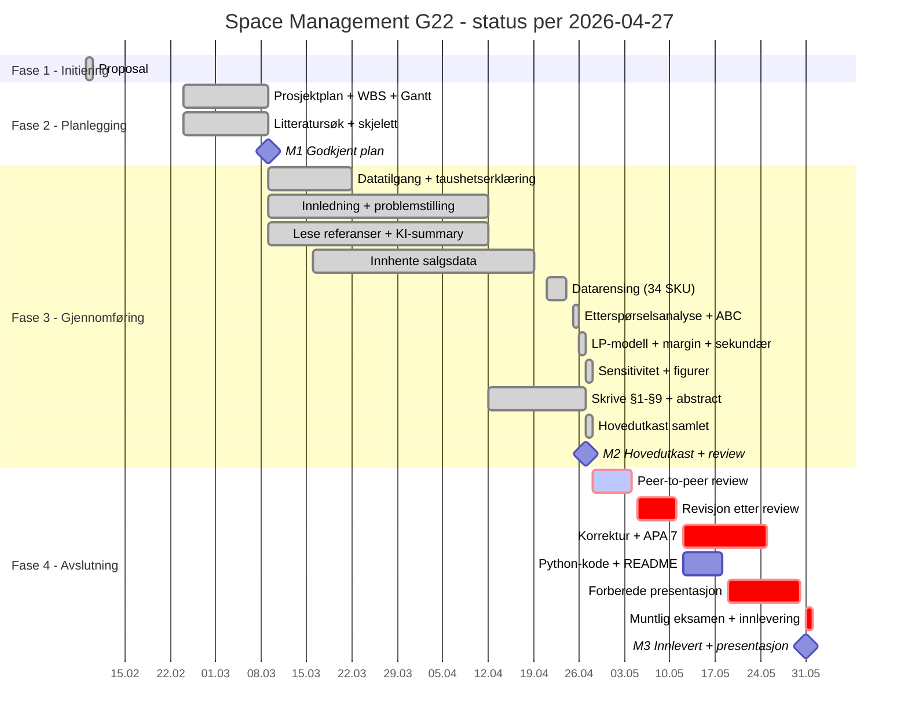

# Status for Space Management G22-prosjektet

Statusdato: 2026-04-27

Denne statusen er basert på planbaseline og aktivitetsstatus i `prosjektplan.md`, `schedule.json`, `wbs.json` og slagplanen for siste fem uker (`/slagplan-fase3.md`).

## Kort status

- Prosjektet er ved slutten av Fase 3 — gjennomføring.
- Milepæl M2 (Hovedutkast + peer review) faller på statusdato 2026-04-27. Hovedutkastet er ferdig — alle ti kapitler i `005 report/rapport.md` har innhold, inklusive sammendrag, abstract, figurer og bibliografi.
- Etter en periode med skippertak i mars/april har gruppen tatt igjen forsinkelsen og leverer hovedutkastet to–tre dager før slagplanens harde frist 2026-04-30.
- Oliver Matre Hille er ute av prosjektet per 2026-04-24. Sebastian har overtatt analytiske oppgaver; Frida har overtatt mer av skriveoppgavene. Ressursfordelingen i prosjektplanen er foreldet på dette punktet.
- Kritisk sti går nå gjennom peer-to-peer review (uke 18), revisjon (uke 20) og kvalitetssikring/korrektur (uke 21) frem til M3 2026-05-31.
- Høyeste gjenværende risiko er tid: 5 uker mellom hovedutkast og innlevering, og en muntlig presentasjon i uke 22.

## Gjennomført

| Aktivitet | Periode | Status |
| --- | --- | --- |
| Proposal (Fase 1) | 2026-02-09 | Ferdig |
| Prosjektplan, WBS, Gantt | 2026-02-24 til 2026-03-09 | Ferdig |
| Risikoanalyse | 2026-03-03 til 2026-03-09 | Ferdig |
| Litteratursøk + lese referanser | 2026-02-24 til 2026-04-12 | Ferdig (10+ referanser i §10) |
| Avklare datatilgang Coop Extra X | 2026-03-09 til 2026-03-22 | Ferdig (R1 lukket) |
| Signere taushetserklæring | 2026-03-09 til 2026-03-15 | Ferdig (Vedlegg C) |
| Beskrive metodevalg | 2026-03-09 til 2026-03-15 | Ferdig (§5.1) |
| Innledning + problemstilling | 2026-03-09 til 2026-04-12 | Ferdig (§1) |
| Innhente salgsdata + hylleplassdata | 2026-03-16 til 2026-04-19 | Ferdig (Coop sell-out u6–15) |
| Datarensing og strukturering (34 SKU) | 2026-04-21 til 2026-04-24 | Ferdig (`01_datarensing.py`) |
| Etterspørselsanalyse + ABC | 2026-04-25 til 2026-04-26 | Ferdig (Tabell 5.2.1, Pareto) |
| Formulere LP-modell | 2026-04-26 til 2026-04-27 | Ferdig (§6) |
| Implementere LP i PuLP (S1/S2/S3) | 2026-04-26 til 2026-04-27 | Ferdig (`03_lp_modell.py`) |
| Margin-vekting + sekundæreksponering | 2026-04-26 til 2026-04-27 | Ferdig (omfang utvidet etter scope-skifte til leverandørperspektiv) |
| Sensitivitetsanalyse | 2026-04-27 | Ferdig (1D + 2D heatmap) |
| Resultater + figurer | 2026-04-27 | Ferdig (§7, 14 figurer + Sankey + pipeline-diagram) |
| Diskusjonskapittel | 2026-04-27 | Ferdig (§8) |
| Konklusjon + abstract/sammendrag | 2026-04-27 | Ferdig (§9) |
| Hovedutkast samlet | 2026-04-27 | Ferdig (47 KB rapport.md → 48 KB rapport.docx) |

## Pågående / neste aktiviteter

| Prioritet | Aktivitet | Planlagt periode | Ressurs | Avhengighet |
| --- | --- | --- | --- | --- |
| 1 | Peer-to-peer review | 2026-04-28 til 2026-05-04 | Frida (mottar/gir review) | M2 |
| 1 | Revidere etter review | 2026-05-05 til 2026-05-11 | Sebastian + Frida | Review-tilbakemelding |
| 2 | Ferdigstille innledning og konklusjon (sluttpolering) | 2026-05-12 til 2026-05-18 | Frida | §1, §9 |
| 2 | Kvalitetssikring + korrektur | 2026-05-12 til 2026-05-25 | Begge | Revidert utkast |
| 2 | APA 7 referanseliste — endelig pass | 2026-05-12 til 2026-05-18 | Frida | §10 |
| 2 | Rydde Python-kode + README for vedlegg | 2026-05-12 til 2026-05-18 | Sebastian | §11 |
| 3 | Forberede muntlig presentasjon | 2026-05-19 til 2026-05-30 | Begge | Endelig rapport |
| 3 | Innlevering + muntlig | 2026-05-31 | Begge | Alt over |

## Milepæler

| Milepæl | Dato | Status |
| --- | --- | --- |
| M0: Godkjent proposal | 2026-02-09 | Oppnådd |
| M1: Godkjent prosjektplan + Gantt | 2026-03-09 | Oppnådd |
| M2: Godkjent hovedutkast + peer review | 2026-04-27 | Hovedutkast levert; peer review starter 28.04 |
| M3: Rapport + kode innlevert, presentasjon | 2026-05-31 | Planlagt |

## Gantt-status

## Sjekkliste for aktiviteter

### Fullført

#### Proposal, prosjektplan, WBS, risikoanalyse (Fase 1+2)
- [x] M0 og M1 oppnådd

#### Datatilgang og taushetserklæring
- [x] Kontaktet Coop Extra X
- [x] Mottatt salgsdata uke 06–15 2026 (34 SKU sell-out + planogramkapasitet)
- [x] Mottatt margindata fra leverandørens egen rapportering
- [x] Signert taushetserklæring

#### Datarensing og strukturering
- [x] Identifisere og håndtere manglende verdier (1 SKU forkastet uten kapasitet, 306 obs etter rensing)
- [x] Pseudonymisere produktnavn (A1–A14, B1–B9, C1–C11)
- [x] Strukturere data for analyse (parquet + CSV)

#### Modellering
- [x] Beslutningsvariabler x_i (primær), z_i (sekundær), y_i (forventet salg)
- [x] Margin-vektet målfunksjon (max Σ m_i · y_i)
- [x] Restriksjoner R1–R5 (primær total, produktivitet, etterspørsel, sortimentsgulv, sekundærbudsjett)
- [x] Implementere i PuLP med CBC-solver
- [x] Kjøre S1/S2/S3 + sensitivitetsrutenett

#### Rapport (alle kapitler)
- [x] §1 Innledning + problemstilling
- [x] §2 Litteratur (10+ referanser)
- [x] §3 Teori (space elasticity, LP, ABC, OOS)
- [x] §4 Casebeskrivelse (leverandørperspektiv, 1 079 facings + 3 sekundær)
- [x] §5 Metode + data (34 SKU, margin, anonymisering)
- [x] §6 Modellering (matematisk formulering)
- [x] §7 Analyse + resultater (S1/S2/S3, hovedanbefaling, sensitivitet)
- [x] §8 Diskusjon (begrensninger, generaliserbarhet)
- [x] §9 Konklusjon
- [x] §10 Bibliografi (APA 7, foreløpig)
- [x] §11 Vedlegg (kode, pseudonymregister, taushetserklæring, rådata)
- [x] Sammendrag (norsk) + Abstract (engelsk)

### Pågående / neste

#### Peer-to-peer review
- [ ] Avtale review-makker og leveringstid
- [ ] Levere `rapport.docx` til peer
- [ ] Motta tilbakemelding senest 2026-05-04
- [ ] Gi tilsvarende review tilbake til peer

#### Revisjon etter review
- [ ] Logge tilbakemeldinger og prioritere
- [ ] Implementere endringer
- [ ] Sluttpolere innledning og konklusjon

#### Kvalitetssikring og korrektur
- [ ] Konsistens-sjekk på tvers av kapitler (problemstilling → konklusjon)
- [ ] Figur- og tabellnummerering
- [ ] APA 7-referanseliste (DOI-er, tidsskriftsnavn verifisert)
- [ ] Språk og typografi
- [ ] Sjekke at alle merkenavn er anonymisert (taushetserklæring)

#### Vedlegg og kode
- [ ] Rydde Python-scripts og legge til docstrings/README
- [ ] Generere reproduserbar pipeline-instruksjon
- [ ] Kontrollere at `intern/`-folder ikke er versjonert

#### Muntlig presentasjon
- [ ] Slide-deck (15–20 min)
- [ ] Demo av modell og resultater
- [ ] Trene presentasjon minst to ganger

## Vurdering

Prosjektet har tatt igjen forsinkelsen som hopet seg opp i mars/tidlig april. Etter at scope ble omdefinert til leverandørperspektiv (slutten av april) og full 34-SKU-portefølje + margindata ble gjort tilgjengelig, har Sebastian gjennomført dataarbeid, modellering og resultatanalyse i et sammenhengende sprint på få dager. Frida har bidratt med litteratur, teori og deler av casebeskrivelsen. Hovedutkastet er nå ferdig og leveres til peer review på M2-dato.

Den realistiske risikoen i den siste fasen er ikke datatilgang eller modellering (begge løst), men:

- **Tidspress mellom peer review og innlevering.** Med Oliver ute er teamet redusert, og 5 uker er stramt for revisjon + korrektur + presentasjon. Tiltak: tidlig peer review-avtale, daglige mikro-iterasjoner på rapporten.
- **Konsistens etter scope-skifte.** Rapporten ble omformulert fra butikk- til leverandørperspektiv sent i prosessen. Peer-reviewer kan finne narrative inkonsistenser mellom §1 og §6–§7. Tiltak: full lesegjennom før innsending.
- **Anonymisering.** Alle merkenavn er fjernet fra rapporten, men interne LP-rapport-filer i `intern/` har fortsatt merkenavn. Disse skal ikke følge med i innleveringen — kontrolleres i kvalitetssikringsfasen.

Anbefalt fokus neste 14 dager: levere peer review-versjon i dag, hente tilbakemeldinger, og bruke uke 19 utelukkende på revisjon.
