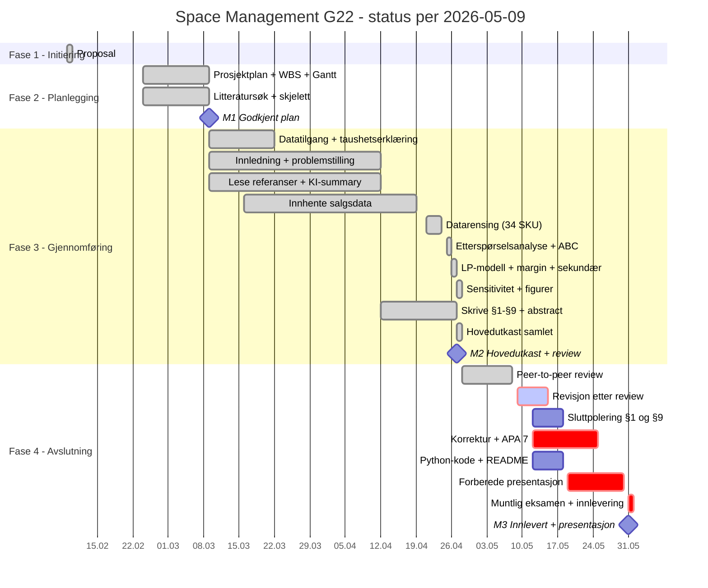

# Status for Space Management G22-prosjektet

Statusdato: 2026-05-09

Denne statusen er basert på planbaseline og aktivitetsstatus i `prosjektplan.md`, `schedule.json`, `wbs.json` og slagplanen for siste fem uker (`/slagplan-fase3.md`).

## Kort status

- Prosjektet er gått inn i Fase 4 — avslutning. M2 (Hovedutkast + peer review) er oppnådd 2026-05-08.
- Hovedutkast ble levert til peer-makker 2026-04-28; gruppens egen review av deres rapport er levert; gruppen har mottatt og lest peer-rapporten på vår rapport. Tilbakemeldingene starter vi nå å arbeide gjennom.
- 22 dager (3 uker + 1 dag) gjenstår til innlevering 2026-05-31.
- Oliver Matre Hille er fortsatt ute av prosjektet (per 2026-04-24). Sebastian + Frida fortsetter med samme arbeidsdeling som under Fase 3.
- Kritisk sti for Fase 4 går gjennom: revisjon etter peer review (uke 19) → konklusjon/innledning sluttpolering (uke 19–20) → kvalitetssikring + APA 7 + figursjekk (uke 20–21) → presentasjonsforberedelse (uke 21–22) → M3 2026-05-31.
- Høyeste gjenværende risiko: tid (3 uker), implementere peer-review-tilbakemeldinger uten å skape nye inkonsistenser, og endelig anonymiseringssjekk før innlevering.

## Gjennomført

| Aktivitet | Periode | Status |
| --- | --- | --- |
| Proposal (Fase 1) | 2026-02-09 | Ferdig |
| Prosjektplan, WBS, Gantt | 2026-02-24 til 2026-03-09 | Ferdig |
| Risikoanalyse | 2026-03-03 til 2026-03-09 | Ferdig |
| Litteratursøk + lese referanser | 2026-02-24 til 2026-04-12 | Ferdig (10+ referanser i §10) |
| Avklare datatilgang Coop Extra X | 2026-03-09 til 2026-03-22 | Ferdig (R1 lukket) |
| Signere taushetserklæring | 2026-03-09 til 2026-03-15 | Ferdig (Vedlegg C) |
| Beskrive metodevalg | 2026-03-09 til 2026-03-15 | Ferdig (§5.1) |
| Innledning + problemstilling | 2026-03-09 til 2026-04-12 | Ferdig (§1) |
| Innhente salgsdata + hylleplassdata | 2026-03-16 til 2026-04-19 | Ferdig (Coop sell-out u6–15) |
| Datarensing og strukturering (34 SKU) | 2026-04-21 til 2026-04-24 | Ferdig (`01_datarensing.py`) |
| Etterspørselsanalyse + ABC | 2026-04-25 til 2026-04-26 | Ferdig (Tabell 5.2.1, Pareto) |
| Formulere LP-modell | 2026-04-26 til 2026-04-27 | Ferdig (§6) |
| Implementere LP i PuLP (S1/S2/S3) | 2026-04-26 til 2026-04-27 | Ferdig (`03_lp_modell.py`) |
| Margin-vekting + sekundæreksponering | 2026-04-26 til 2026-04-27 | Ferdig (omfang utvidet etter scope-skifte til leverandørperspektiv) |
| Sensitivitetsanalyse | 2026-04-27 | Ferdig (1D + 2D heatmap) |
| Resultater + figurer | 2026-04-27 | Ferdig (§7, 14 figurer + Sankey + pipeline-diagram) |
| Diskusjonskapittel | 2026-04-27 | Ferdig (§8) |
| Konklusjon + abstract/sammendrag | 2026-04-27 | Ferdig (§9) |
| Hovedutkast samlet | 2026-04-27 | Ferdig (47 KB rapport.md → 48 KB rapport.docx) |
| Peer-to-peer review (begge veier) | 2026-04-28 til 2026-05-08 | Ferdig — tilbakemelding mottatt og lest |

## Pågående / neste aktiviteter

| Prioritet | Aktivitet | Planlagt periode | Ressurs | Avhengighet |
| --- | --- | --- | --- | --- |
| 1 | Revidere etter peer review (kategorisere + implementere) | 2026-05-09 til 2026-05-15 | Sebastian + Frida | Peer-rapport |
| 1 | Sluttpolere innledning og konklusjon | 2026-05-12 til 2026-05-18 | Frida | §1, §9 |
| 2 | APA 7 referanseliste — endelig pass | 2026-05-12 til 2026-05-18 | Frida | §10 |
| 2 | Kvalitetssikring + korrektur (konsistens, figurer, anonymisering) | 2026-05-12 til 2026-05-25 | Begge | Revidert utkast |
| 2 | Rydde Python-kode + README for vedlegg | 2026-05-12 til 2026-05-18 | Sebastian | §11 |
| 3 | Forberede muntlig presentasjon | 2026-05-19 til 2026-05-30 | Begge | Endelig rapport |
| 3 | Innlevering + muntlig eksamen | 2026-05-31 | Begge | Alt over |

## Milepæler

| Milepæl | Dato | Status |
| --- | --- | --- |
| M0: Godkjent proposal | 2026-02-09 | Oppnådd |
| M1: Godkjent prosjektplan + Gantt | 2026-03-09 | Oppnådd |
| M2: Godkjent hovedutkast + peer review | 2026-04-27 | Oppnådd (peer review ferdig 2026-05-08) |
| M3: Rapport + kode innlevert, presentasjon | 2026-05-31 | Planlagt — 22 dager igjen |

## Gantt-status

```mermaid
gantt
    title Space Management G22 - status per 2026-05-09
    dateFormat  YYYY-MM-DD
    axisFormat  %d.%m

    section Fase 1 - Initiering
    Proposal                            :done, f1, 2026-02-09, 1d

    section Fase 2 - Planlegging
    Prosjektplan + WBS + Gantt          :done, p1, 2026-02-24, 2026-03-09
    Litteratursøk + skjelett            :done, p2, 2026-02-24, 2026-03-09
    M1 Godkjent plan                    :milestone, m1, 2026-03-09, 0d

    section Fase 3 - Gjennomføring
    Datatilgang + taushetserklæring     :done, g1, 2026-03-09, 2026-03-22
    Innledning + problemstilling        :done, g2, 2026-03-09, 2026-04-12
    Lese referanser + KI-summary        :done, g3, 2026-03-09, 2026-04-12
    Innhente salgsdata                  :done, g4, 2026-03-16, 2026-04-19
    Datarensing (34 SKU)                :done, g5, 2026-04-21, 2026-04-24
    Etterspørselsanalyse + ABC          :done, g6, 2026-04-25, 2026-04-26
    LP-modell + margin + sekundær       :done, g7, 2026-04-26, 2026-04-27
    Sensitivitet + figurer              :done, g8, 2026-04-27, 1d
    Skrive §1-§9 + abstract             :done, g9, 2026-04-12, 2026-04-27
    Hovedutkast samlet                  :done, g10, 2026-04-27, 1d
    M2 Hovedutkast + review             :milestone, m2, 2026-04-27, 0d

    section Fase 4 - Avslutning
    Peer-to-peer review                 :done, a1, 2026-04-28, 2026-05-08
    Revisjon etter review               :crit, active, a2, 2026-05-09, 2026-05-15
    Sluttpolering §1 og §9              :a2b, 2026-05-12, 2026-05-18
    Korrektur + APA 7                   :crit, a3, 2026-05-12, 2026-05-25
    Python-kode + README                :a4, 2026-05-12, 2026-05-18
    Forberede presentasjon              :crit, a5, 2026-05-19, 2026-05-30
    Muntlig eksamen + innlevering       :crit, a6, 2026-05-31, 1d
    M3 Innlevert + presentasjon         :milestone, m3, 2026-05-31, 0d
```

## Sjekkliste for aktiviteter

### Fullført

#### Proposal, prosjektplan, WBS, risikoanalyse (Fase 1+2)
- [x] M0 og M1 oppnådd

#### Datatilgang og taushetserklæring
- [x] Kontaktet Coop Extra X
- [x] Mottatt salgsdata uke 06–15 2026 (34 SKU sell-out + planogramkapasitet)
- [x] Mottatt margindata fra leverandørens egen rapportering
- [x] Signert taushetserklæring

#### Datarensing og strukturering
- [x] Identifisere og håndtere manglende verdier (1 SKU forkastet uten kapasitet, 306 obs etter rensing)
- [x] Pseudonymisere produktnavn (A1–A14, B1–B9, C1–C11)
- [x] Strukturere data for analyse (parquet + CSV)

#### Modellering
- [x] Beslutningsvariabler x_i (primær), z_i (sekundær), y_i (forventet salg)
- [x] Margin-vektet målfunksjon (max Σ m_i · y_i)
- [x] Restriksjoner R1–R5 (primær total, produktivitet, etterspørsel, sortimentsgulv, sekundærbudsjett)
- [x] Implementere i PuLP med CBC-solver
- [x] Kjøre S1/S2/S3 + sensitivitetsrutenett

#### Rapport (alle kapitler)
- [x] §1 Innledning + problemstilling
- [x] §2 Litteratur (10+ referanser)
- [x] §3 Teori (space elasticity, LP, ABC, OOS)
- [x] §4 Casebeskrivelse (leverandørperspektiv, 1 079 facings + 3 sekundær)
- [x] §5 Metode + data (34 SKU, margin, anonymisering)
- [x] §6 Modellering (matematisk formulering)
- [x] §7 Analyse + resultater (S1/S2/S3, hovedanbefaling, sensitivitet)
- [x] §8 Diskusjon (begrensninger, generaliserbarhet)
- [x] §9 Konklusjon
- [x] §10 Bibliografi (APA 7, foreløpig)
- [x] §11 Vedlegg (kode, pseudonymregister, taushetserklæring, rådata)
- [x] Sammendrag (norsk) + Abstract (engelsk)

#### Peer-to-peer review
- [x] Avtale review-makker og leveringstid
- [x] Levere `rapport.docx` til peer
- [x] Gi tilsvarende review tilbake til peer
- [x] Motta tilbakemelding på vår rapport

### Pågående / neste

#### Revisjon etter review (uke 19)
- [ ] Logge tilbakemeldinger og kategorisere (must-fix / should-fix / nice-to-have)
- [ ] Implementere må-endringer
- [ ] Sluttpolere innledning (§1) og konklusjon (§9) basert på review

#### Kvalitetssikring og korrektur
- [ ] Konsistens-sjekk på tvers av kapitler (problemstilling → konklusjon)
- [ ] Figur- og tabellnummerering
- [ ] APA 7-referanseliste (DOI-er, tidsskriftsnavn verifisert)
- [ ] Språk og typografi
- [ ] Sjekke at alle merkenavn er anonymisert (taushetserklæring)

#### Vedlegg og kode
- [ ] Rydde Python-scripts og legge til docstrings/README
- [ ] Generere reproduserbar pipeline-instruksjon
- [ ] Kontrollere at `intern/`-folder ikke er versjonert

#### Muntlig presentasjon
- [ ] Slide-deck (15–20 min)
- [ ] Demo av modell og resultater
- [ ] Trene presentasjon minst to ganger

## Vurdering

M2 er passert. Hovedutkastet ble levert til peer-makker 2026-04-28; gruppen har gitt review tilbake og mottatt egen review innenfor avtalt vindu. Fase 4 starter nå med 22 dager igjen til innlevering.

Realistiske risikoer i sluttspurten:

- **Tidspress.** 3 uker til M3 dekker revisjon, sluttpolering, kvalitetssikring, kode-rydding og presentasjonsforberedelse. Tiltak: kategorisere peer-tilbakemeldingene (must / should / nice) før uke 19, og time-boxe revisjon til 2026-05-15.
- **Konsistens etter scope-skifte.** Rapporten ble omformulert til leverandørperspektiv sent i prosessen. Peer-reviewer kan ha funnet narrative inkonsistenser mellom §1 og §6–§7 — fanges opp i revisjonsrunden.
- **Anonymisering.** Alle merkenavn er fjernet fra rapporten, men interne LP-rapport-filer i `intern/` har fortsatt merkenavn. Disse skal ikke følge med i innleveringen — kontrolleres i kvalitetssikringsfasen.
- **Implementere review-tilbakemeldinger uten regresjon.** Endringer i §6/§7 kan utilsiktet skape inkonsistens med abstract/sammendrag/§1. Tiltak: full lesegjennom etter revisjon, før korrektur.

Anbefalt fokus neste 7 dager: gå systematisk gjennom peer-tilbakemeldingene, kategorisere, implementere må-endringer i §1–§9, og forberede uke 20–21 for kvalitetssikring og kode.
