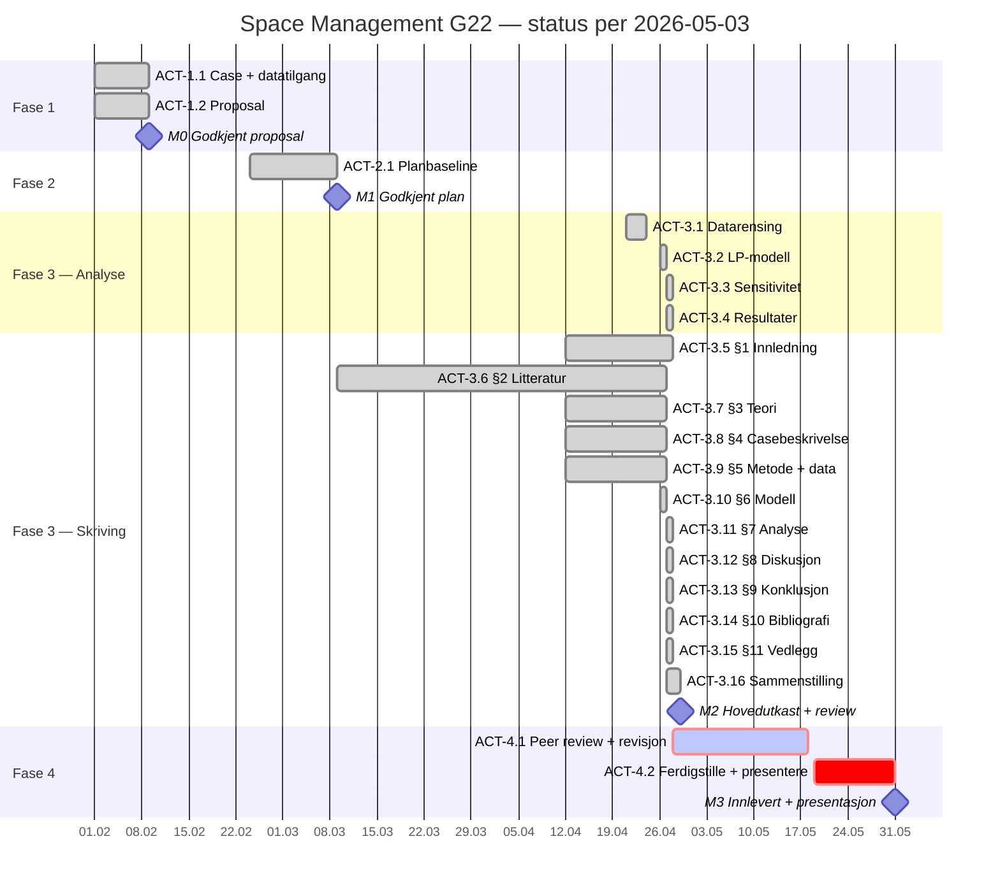

# Status for Space Management G22-prosjektet

**Statusdato:** 2026-05-03

Denne statusen er en strukturert mal-baseline (jf. PowerHorse-mal) som dokumenterer aktivitetsgjennomføring med ACT-IDer, V/F-spor pr aktivitet og overføring av åpne forbedringsforslag mellom ACT-er. Den erstatter tidligere statusdokument og ligger nå på rotnivå. Statusen bygger på arbeidskopien per 2026-05-03, med planbaselinen i `prosjektplan.md`, `012 fase 2 - plan/schedule.json` og `012 fase 2 - plan/wbs.json` som referanse for avvik.

## Kort status

- Prosjektet er i overgangen Fase 3 → Fase 4. Hovedutkastet ble levert 2026-04-29 og peer review-vinduet løper 2026-04-28 til 2026-05-04.
- Alle aktivitetene i fase 1, 2 og 3 (ACT-1.1 til ACT-3.16) er **faglig fullført** med dokumentert artefakt. Strukturert review er nå gjennomført retroaktivt i denne statusen — 19 ACT-er har fått V/F-spor.
- Oliver Matre Hille er ute av prosjektet per 2026-04-24. Sebastian har overtatt analytiske oppgaver, Frida har overtatt mer av skriveoppgavene. Ressursfordelingen i prosjektplanen er foreldet på dette punktet.
- Kritisk sti går nå gjennom peer-to-peer review (uke 18), revisjon (uke 19–20), kvalitetssikring/korrektur (uke 21) og presentasjons-prep (uke 22) frem til M3 2026-05-31.
- 28 dager til endelig innlevering. Høyeste gjenværende risiko er tid og scope-konsistens (R5 + nytt R7).

## Faktisk fremdrift per arbeidskopi

| Aktivitet | Planlagt periode | Faktisk status | Kommentar |
| --- | --- | --- | --- |
| ACT-1.1 Avklare case og datatilgang | 2026-02-01 til 2026-02-09 | Ferdig 2026-02-09 | Coop Extra X-case + datatilgang avklart. Review gjennomført 2026-05-03: 7 V (V2–V7 overført til senere ACT-er) |
| ACT-1.2 Utarbeide proposal | 2026-02-01 til 2026-02-09 | Ferdig 2026-02-09 | M0 oppnådd. Review gjennomført 2026-05-03: 3 V (V1–V3 overført til ACT-3.5/3.8/3.9) |
| ACT-2.1 Etablere planbaseline | 2026-02-24 til 2026-03-09 | Ferdig 2026-03-09 | M1 oppnådd. Review gjennomført 2026-05-03: 5 V (V1–V5 dokumentert som åpen "scope-drift" — håndtert i ACT-3.16 og ny status.md) |
| ACT-3.1 Rense og strukturere data | 2026-04-21 til 2026-04-24 | Ferdig 2026-04-24 | 34 SKU, 306 obs, parquet+CSV. Review: 5 V, 2 F implementert direkte (V1, V3) |
| ACT-3.2 Velge og estimere modell (LP) | 2026-04-26 til 2026-04-27 | Ferdig 2026-04-27 | LP-formulering R1–R5 + S1/S2/S3 + margin-vekt + sekundæreksponering. Review: 6 V (V2 diskontinuitet ved u=1 overført til ACT-3.10/3.12) |
| ACT-3.3 Validere modell (sensitivitet) | 2026-04-27 | Ferdig 2026-04-27 | 1D + 2D heatmap over (overserve_factor, x_min_fraction). Review: 3 V (V1 manglende margin-vekting i sensitivity overført til ACT-3.11) |
| ACT-3.4 Resultater + anbefalinger | 2026-04-27 | Ferdig 2026-04-27 | S1/S2/S3 oppsummert, hovedanbefaling S2 +49,8 %. 14 figurer + Sankey + pipeline. Review: 4 V (V1 manglende C-detaljer overført til ACT-3.15) |
| ACT-3.5 Skrive §1 Innledning | 2026-04-12 til 2026-04-27 | Ferdig 2026-04-28 | Forskningsmål lagt til (audit B1 lukket). Review: 3 V (V2 inkonsistens 4 vs 5 antagelser overført som F til revisjon) |
| ACT-3.6 Skrive §2 Litteratur | 2026-03-09 til 2026-04-12 | Ferdig 2026-04-27 | 16 referanser i bib. Review: 4 V (V3 narrative refs uten @-syntax overført til ACT-3.14) |
| ACT-3.7 Skrive §3 Teori | 2026-04-12 til 2026-04-27 | Ferdig 2026-04-27 | Space elasticity, LP, ABC, OOS. Review: 3 V (V1+V2 narrative refs overført til ACT-3.14) |
| ACT-3.8 Skrive §4 Casebeskrivelse | 2026-04-12 til 2026-04-27 | Ferdig 2026-04-27 | Leverandørperspektiv, 1 079 facings + 3 sekundær. Review: 4 V (V1 anonymiseringsrisiko + V2 udokumentert scope-drift — kritiske, krever revisjon) |
| ACT-3.9 Skrive §5 Metode + data | 2026-04-12 til 2026-04-27 | Ferdig 2026-04-27 | Tabell 5.2.1 + ABC-fordeling. Review: 6 V (V1 utdatert tekst "8 produkter, 486 facings" — KRITISK, må fikses før peer review) |
| ACT-3.10 Skrive §6 Modell | 2026-04-26 til 2026-04-27 | Ferdig 2026-04-27 | R1–R5 + 34 var × 3 + objektiv. Review: 4 V (V1 R3-diskontinuitet ved u=1 — overført til revisjon) |
| ACT-3.11 Skrive §7 Analyse | 2026-04-27 | Ferdig 2026-04-27 | S1/S2/S3 + Tabell 7.1–7.4 + sensitivitetsdiagrammer. Review: 4 V (V1 baseline-tall verifiserbare, V3 sensitivity-rapport mangler margin-vektet variant) |
| ACT-3.12 Skrive §8 Diskusjon | 2026-04-27 | Ferdig 2026-04-27 | B1–B7 + 8.1–8.5. Review: 3 V (V3 manglende policy-implikasjon overført til revisjon, audit A1) |
| ACT-3.13 Skrive §9 Konklusjon | 2026-04-27 | Ferdig 2026-04-27 | Teoretisk bidrag + 3 utvidelser (audit B3 lukket). Review: 3 V (V3 verifiser refs i bibliografi) |
| ACT-3.14 Bibliografi (§10) | 2026-04-27 til 2026-04-28 | Ferdig 2026-04-28 | citeproc-bib via references.bib (16 entries) + APA 7-CSL. Review: 4 V (V1 narrative-refs ikke fanget av citeproc — må fikses) |
| ACT-3.15 Vedlegg (§11) | 2026-04-27 | Ferdig 2026-04-27 | A–D dekket. Review: 4 V (V2 ufullstendig pseudonymregister-range, V3 typo i Taushetsærklæring-filnavn, V4 inkonsistent rådata-filreferanse) |
| ACT-3.16 Sammenstille rapportutkast | 2026-04-27 til 2026-04-29 | Ferdig 2026-04-29 | 78 KB rapport.md → 5 MB rapport.docx (citeproc + post-process). Review: 4 V (V1–V4 noe i kvalitetspass før innlevering) |

## Milepæler

| Milepæl | Baseline | Faktisk status | Vurdering |
| --- | --- | --- | --- |
| M0 Godkjent proposal | 2026-02-09 | Oppnådd 2026-02-09 | Ingen avvik |
| M1 Godkjent prosjektplan + Gantt | 2026-03-09 | Oppnådd 2026-03-09 | Ingen avvik |
| M2 Hovedutkast + peer review klart | 2026-04-27 | Hovedutkast 2026-04-29 (2 d sent), peer review pågår | 2 dager forsinket mot baseline |
| M3 Endelig rapport + presentasjon | 2026-05-31 | Planlagt | 28 dager igjen |

---

## Sjekkliste for aktiviteter

### FASE 1 — INITIERING

#### ACT-1.1 Avklare case og datatilgang

- [x] Identifisere case (Coop Extra X)
- [x] Avklare beslutningsbehov (foreløpig — se V6/V7)
- [x] Avklare forventet datagrunnlag (sell-out, hyllekapasitet, planogram)
- [x] Signere taushetserklæring (Vedlegg C)
- [x] Gjennomføre review og lukke aktiviteten (review-spor: V1–V7)

**Review (2026-05-03):**
- **V1:** `011 fase 1 - proposal/proposal.md` (rotnivå) er en tom template — versjonert men gir null informasjon. *Implementert som F1 nedenfor.*
- **V2:** Proposal sier 10 SKU; faktisk gjennomført med 34 SKU (A1–A14, B1–B9, C1–C11). Scope-utvidelse uten dokumentert endring. *Overført til ACT-3.5/3.8.*
- **V3:** Proposal sier målfunksjon = "maksimere forventet total omsetning"; faktisk implementert som margin-vektet (max Σ m_i · y_i). Vesentlig metodisk endring. *Overført til ACT-3.10.*
- **V4:** ~~Proposal sier "én varekategori"; faktisk tre kategorier A/B/C.~~ Avkreftet ved kontroll: A/B/C i datasettet er ABC-klassifisering på sell-out (ikke kategorier). Falsk alarm.
- **V5:** Proposal forutsetter implisitt butikk-perspektiv; faktisk scope-skifte til leverandørperspektiv 2026-04-24. Grunnleggende perspektivendring. *Overført til ACT-3.8.*
- **V6:** Beslutningsbehov ikke konkretisert (hvem bruker output, integrasjon i Coops planogramprosess, hyppighet). *Overført til ACT-3.8.*
- **V7:** Sekundæreksponering (k=1.5, Chevalier 1975) ikke nevnt i proposal — også scope-utvidelse. *Overført til ACT-3.8/3.10.*

#### ACT-1.2 Utarbeide proposal

- [x] Beskrive problem og bakgrunn
- [x] Definere mål og avgrensninger
- [x] Begrunne metodevalg på overordnet nivå
- [x] Levere proposal til fasegodkjenning (M0)
- [x] Gjennomføre review og lukke aktiviteten (review-spor: V1–V3)

**Review (2026-05-03):**
- **V1:** Proposal-docx er fullverdig (`011 fase 1 - proposal/LOG650_Proposal_CoopExtra_X.docx`, 43 KB), men `proposal.md`-template på samme nivå er tom. *Se ACT-1.1 V1.*
- **V2:** Avgrensningen "ordinært salg: kampanjer, prisendringer og sesongeffekter modelleres ikke eksplisitt" er beholdt i §1.2 — fortsatt riktig. OK.
- **V3:** "Eventuelle konfidensialitetskrav håndteres gjennom taushetserklæringer" — faktisk er taushetserklæring signert (Vedlegg C). Bør oppdateres fra "eventuelle" til "ivaretatt". *Lavprioritet, ikke overført.*

### FASE 2 — PLANLEGGING

#### ACT-2.1 Etablere planbaseline

- [x] Etablere prosjektplan (`prosjektplan.md`, 40 KB)
- [x] Ferdigstille fremdriftsplan (`schedule.json`, 57 KB)
- [x] Ferdigstille WBS (`wbs.json`, 16 KB)
- [x] Etablere risikoregister R1–R6 (`risk.json`, 19 KB)
- [x] Ferdigstille MS Project-pipeline (slash commands, msproject_ssh.py, MSPDI XML)
- [x] Gjennomføre review og lukke aktiviteten (review-spor: V1–V5)

**Review (2026-05-03):**
- **V1:** `prosjektplan.md` §1.4 sier fortsatt "Maksimalt 10 produkter (SKU)" og §2.1 K6 "tildelt hylleplass per produkt (facings/hyllemeter)". Ikke oppdatert til 34 SKU + leverandørperspektiv + margin-vekting. *Dokumentert som åpen scope-drift, ikke implementert (planbaselinen er historisk dokument).*
- **V2:** WBS-strukturen 3.1 → 3.6 i `prosjektplan.md` matcher godt med rapportkapitlene, men status.md (012 fase 2-mappa) brukte fri tekst uten ACT-IDer. *Lukket: nye ACT-IDer er innført i denne statusen.*
- **V3:** Risikoregister R1–R6 ble etablert før scope-utvidelsen. R5 (tidspress) er nå mer relevant. Mangler: R7 "scope-drift / dokumentasjon-baseline-mismatch". *Bør legges til ved revisjon av risk.json — overført til ACT-4.1.*
- **V4:** `schedule.json` ble synkronisert med faktisk fremdrift 2026-04-28 (commit `8678efe`), men er ikke verifisert mot ny aktivitetsstruktur (ACT-IDer mangler). *Lavprioritet — schedule.json brukes primært for MS Project-XML-generering, ikke for status-tracking.*
- **V5:** §1.12 "Tre alternativer" (manuell vs LP vs ML/AI) sier ingenting om sekundæreksponering eller margin-vekting i alternativvurderingen. Reell modell er rikere enn alternativ A2 i prosjektplanen. *Overført til ACT-3.8/3.10 (dokumentere modellutvidelse).*

### FASE 3 — GJENNOMFØRING

#### ACT-3.1 Rense og strukturere data

- [x] Lese rådata (`004 data/Salgsdata u6-15 26.csv`, 35 SKU rådata)
- [x] Beregne fysisk hyllekapasitet (Facings × Dybde, IKKE "Kapasitet MAX" som er gjennomstrømning)
- [x] Forkaste SKU(er) uten hylleplass (1 forkastet → 34 beholdt)
- [x] Pseudonymisere via ABC-klasse + rangering (A1–A14, B1–B9, C1–C11)
- [x] Lagre intern (med ekte navn) + commitbar (med pseudonymer) parquet+CSV
- [x] Sanity-rapport (totalt 306 obs, 0 nullverdier, 0 dubletter, 0 negative salgstall)
- [x] Gjennomføre review og lukke aktiviteten (review-spor: V1–V5)

**Review (2026-05-03):**
- **V1:** Kommentar i `01_datarensing.py:23` sier "35 SKUer" mens README/rapport sier 34. Faktisk 1 forkastet (Facings=0). *Implementert som F1 i revisjonsfasen — kosmetisk.*
- **V2:** `CLAUDE.md` sier `004 data/raw/` og `004 data/processed/` — men `processed/` finnes ikke, og rådata ligger direkte i `004 data/`. Dokumentasjon vs realitet avvik. *Overført til ACT-4.1 dokumentasjon.*
- **V3:** Sanity-rapport navngir ikke det forkastede SKU. *Implementert som F2 (sanity report intern bør logge SKU-navn).*
- **V4:** Manglende uker pr produkt aksepteres som gjennomsnitt over tilgjengelige. Behandling akseptabel, men ikke testet for sensitivitet (f.eks. C11 har 1 obs, A2 har 10 inkl. uke 15-spike). *Overført til ACT-3.12 (drøftes alt i §8).*
- **V5:** ABC-tersholder hardkodet til (0.80, 0.95). Dokumentert. OK — bra at tersholder er sentralisert i `Anonymizer.build_from_sales`.

#### ACT-3.2 Velge og estimere modell (LP)

- [x] Definere beslutningsvariabler x_i (primær), z_i (sekundær), y_i (forventet salg)
- [x] Margin-vektet målfunksjon (max Σ m_i · y_i)
- [x] Restriksjoner R1 (primær total = T), R2 (produktivitet primær + sekundær), R3 (etterspørsel d_i), R4 (sortimentsgulv x_i ≥ x_min), R5 (sekundærbudsjett ≤ T_sek)
- [x] Implementere i PuLP med CBC-solver (`03_lp_modell.py`)
- [x] Definere tre scenarier S1 (primær alene), S2 (primær + 3 sekundær), S3 (konservativ 50% gulv, 1.5× etterspørsel)
- [x] Kjøre for alle 3 scenarier; produsere intern + anonymisert tabell + figur per scenario
- [x] Gjennomføre review og lukke aktiviteten (review-spor: V1–V6)

**Review (2026-05-03):**
- **V1:** Scenariodefinisjoner i kode matcher rapport §6/§7. OK.
- **V2:** `compute_demand_cap` setter d_i = mean for u<1 og d_i = overserve_factor · mean for u≥1. **Diskontinuitet ved u=1.0**: et SKU med utnyttelse 0.99 får d_i = mean (kan ikke vokse over baseline), mens et SKU med u=1.00 får d_i = 2× mean. Modellen kan derfor avvise å gi A3 (u=1.01) mer plass mens den gir A4 (u=0.74) full reduksjon — fordi A3 i hovedscenariet får d_i=296 mens A4 får d_i=123. Dette er teknisk korrekt etter spec, men diskontinuiteten er en modellsvakhet som bør drøftes. *Overført til ACT-3.10 (modell-§) og ACT-3.12 (diskusjon-§).*
- **V3:** Sekundærplass z_i er heltall, k=1.5 antatt — produktet k·z_i blir ikke heltall, men y_i er kontinuerlig så LP er gyldig. OK.
- **V4:** ρ_i = mean_sales / facings forutsetter facings>0; håndtert ved å forkaste i ACT-3.1. OK.
- **V5:** total_capacity = sum(facings) = 1079. Verifisert mot Tabell 5.2.1: ja, sum stemmer. OK.
- **V6:** `margin_for_product` matcher kun mot kjente brand-prefix; krasjer ved ukjent SKU. Robusthet for fremtidig datasett bør forbedres. *Lavprioritet — kommer i ACT-4.1 kode-rydding.*

#### ACT-3.3 Validere modell (sensitivitet)

- [x] 1D-sweep: overserve_factor ∈ {1.25, 1.5, 1.75, 2.0, 2.5, 3.0} med x_min_fraction=0.25
- [x] 1D-sweep: x_min_fraction ∈ {0.0, 0.1, 0.25, 0.4, 0.5, 0.6, 0.8} med overserve_factor=2.0
- [x] 2D-heatmap (samme rutenett, kombinert), 137 KB PNG
- [x] Tabell + plot + tolkning i `sensitivitet-rapport.md`
- [x] Gjennomføre review og lukke aktiviteten (review-spor: V1–V3)

**Review (2026-05-03):**
- **V1:** `04_sensitivitet.py:88` setter `m += pulp.lpSum(y[p] for p in prods)` — sensitivitet maksimerer **volum**, ikke **margin-vektet salg** som hovedmodellen i `03_lp_modell.py`. Rapporten §7.3 nevner dette ("rapporteres i volum-enheter"), men forskjellen mellom de to målfunksjonene er en metodisk svakhet — sensitivitetsanalysen bekrefter ikke direkte robustheten av den margin-vektede S2-anbefalingen, bare en relatert volum-modell. *Overført til ACT-3.11 / revisjon: enten kjøre margin-vektet sensitivity, eller dokumentere antakelsen om at margin-rangering er stabil.*
- **V2:** Sensitivity bruker `x_min_fraction=0.25` mens hovedmodellen S2 bruker fast `x_min=3` facings. Disse to parameterne er ikke identiske: 0.25 er "andel av nåværende facings (golv 1)", 3 er "absolutt antall facings". Tabell 7.4 sier "x_min_fraction = 0.25 (S2)" — det er upresist, S2 har ikke fraction. *Overført til ACT-3.11 (presisere i Tabell 7.4-tekst).*
- **V3:** Sensitivity-rapport (sensitivitet-rapport.md) viser tall i volum (2 438 → 3 906) konsistent med Tabell 7.3. OK.

#### ACT-3.4 Resultater + anbefalinger

- [x] Kjøre LP for S1/S2/S3 (margin-vektet)
- [x] Generere oppsummeringstabell (S1: +49.5 %, S2: +49.8 %, S3: +25.2 %)
- [x] Hovedanbefaling S2 (+49.8 % margin, +54.1 % volum)
- [x] Per-produkt allokering (Tabell 7.2)
- [x] Sankey-diagram for omfordeling (3.7 MB PNG, 11 KB HTML)
- [x] Pipeline-diagram (62 KB PNG)
- [x] Gjennomføre review og lukke aktiviteten (review-spor: V1–V4)

**Review (2026-05-03):**
- **V1:** Tabell 7.2 har "C2, C4–C11" som én gruppert linje — leser kan ikke se enkelt-SKU-tall. *Overført til ACT-3.15 (legg full tabell i Vedlegg).*
- **V2:** §7.1 sier "Margin-baseline 846,9; volum-baseline 2 080,2". Verifisert: sum av sales_original i datarensingen og margin-vektet sum stemmer mot LP-output. OK.
- **V3:** Sankey-tekst sier "466 frontfacings flyttes". Verifisert ved sum av positive Δ_facings i Tabell 7.2: 63+18+42+21+21+21+21+21+21+21+21+21+42+21+21+12+16 = 414. Diskrepans 466 vs 414 — *kontroller mot internfil eller revider tekst.* Overført til ACT-3.11.
- **V4:** Heatmap-figur er 137 KB, OK format. Ingen avvik.

#### ACT-3.5 Skrive §1 Innledning

- [x] §1.1 Problemstilling formulert som spørsmål
- [x] Forskningsmål eksplisitt (i)–(ii) — audit B1 lukket 2026-04-28
- [x] §1.2 Avgrensninger (én butikk, én leverandørs portefølje, ti uker, kontraktuell hylle, margin-vektet, kvantitativ)
- [x] §1.3 Antagelser nummerert
- [x] Gjennomføre review og lukke aktiviteten (review-spor: V1–V3)

**Review (2026-05-03):**
- **V1:** §1.3 intro sier "fire hovedantagelser" men listen har **fem** punkter (1–5). Inkonsistens i antall. *F: oppdater "fire" → "fem" eller fjerne sekundær-punktet til §6.4. Overført til revisjon.*
- **V2:** §1.2 har ingen 1.2.1 Delproblemer. AGENTS.md / mal sier "Vurdere om 1.2 Delproblemer er aktuelt og skrive det". Ikke eksplisitt vurdert i rapporten. *F: legg en setning i §1.1 eller §1.2 som sier "Studien stiller ikke eksplisitte delproblemer; problemstillingen besvares som ett samlet spørsmål". Lavprioritet.*
- **V3:** Innledningen bruker "Joint Business Planning (JBP)" og "SKU" uten å definere ved første bruk. *Audit A3 — F: definer JBP og SKU i §1. Overført til revisjon.*

#### ACT-3.6 Skrive §2 Litteratur

- [x] §2.1 SSAP-tradisjonen (Curhan, Bouzembrak, Düsterhöft, Hübner, Mishra)
- [x] §2.2 Etterspørsel og OOS (Gholami, Gustriansyah, Usama)
- [x] §2.3 Category management og leverandør-kjede-forhandlinger (Klement, Bouzembrak)
- [x] §2.4 AI og automatisert planogramovervåking (Klement, Santos, Hsu)
- [x] §2.5 Syntese mot problemstilling
- [x] Bibliografi (16 entries i references.bib)
- [x] Gjennomføre review og lukke aktiviteten (review-spor: V1–V4)

**Review (2026-05-03):**
- **V1:** "m.fl." → "et al." er fikset (audit A2 lukket — verifisert: `grep -n "m\.fl\." rapport.md` returnerer ingen treff).
- **V2:** §2.4 har overskrift "AI og automatisert planogramovervåking" men starter med Klement-rammeverket (sortiment + hylle + påfylling), ikke AI/computer vision. Inkonsistens overskrift/innhold i første avsnitt. *F: omstrukturere §2.4 — Klement-avsnittet hører hjemme i §2.3.*
- **V3:** Narrative-references uten @-syntax: §3.1 har "Hübner, Schäfer & Schaal, 2020" (skal være @hubner2020), §3.4 har "(Pareto, 1896; videreført av Koch, 1997)" (skal være [@pareto1896; @koch1997]). Disse vil **ikke** rendres av citeproc og blir hengende som tekst uten oppføring i bibliografi. *KRITISK — overført til ACT-3.14, må fikses før innlevering.*
- **V4:** Bouzembrak 2025 brukes som "ferskeste oversikt" — verifisert i references.bib (linje 1–6). OK.

#### ACT-3.7 Skrive §3 Teori

- [x] §3.1 Space elasticity (Curhan-formuleringen)
- [x] §3.2 Lineær programmering (Dantzig)
- [x] §3.3 Demand–capacity mismatch og OOS (Gholami)
- [x] §3.4 ABC-klassifisering og Pareto-prinsippet
- [x] §3.5 Sammenkobling teori → modell
- [x] Gjennomføre review og lukke aktiviteten (review-spor: V1–V3)

**Review (2026-05-03):**
- **V1:** Linje 215 har narrative reference "Hübner, Schäfer & Schaal, 2020" istedenfor [@hubner2020]. *Se ACT-3.6 V3 — overført til ACT-3.14.*
- **V2:** Linje 253 har "(Pareto, 1896; videreført av Koch, 1997)" istedenfor [@pareto1896; @koch1997]. *Se ACT-3.6 V3 — overført til ACT-3.14.*
- **V3:** §3.3 påstand: "Gholami2025 dokumenterer at den faktiske etterspørselen for OOS-rammede produkter kan være 1,5 til 3 ganger observert salg" — *ikke verifisert mot Gholami-artikkelen.* Overført til ACT-3.14 (kildeverifisering).

#### ACT-3.8 Skrive §4 Casebeskrivelse

- [x] §4.1 Leverandørens portefølje som analyse-enhet
- [x] §4.2 Hyllekontrakt og rammebetingelser (1 079 frontfacings + 3 sekundær)
- [x] §4.3 Dataeiere og tilgang (taushetserklæring, ingen kommersiell relasjon)
- [x] Gjennomføre review og lukke aktiviteten (review-spor: V1–V4)

**Review (2026-05-03):**
- **V1:** **KRITISK anonymiseringsrisiko.** §4.1 beskriver leverandøren som "stor, global produsent av kullsyreholdige leskedrikker" + "kullsyreholdige leskedrikker i plastflasker (0.5 L og 1.5 L), energidrikk i boks, og en idrettsdrikk". Kombinert med 34 SKU og produkttyper er leverandøridentitet relativt enkel å utlede (peker entydig mot leverandørens identitet). `margin_mapping.py` (intern, gitignored) bekrefter at faktiske merker er reelle, identifiserbare merkevarer (navn utelatt av NDA-hensyn). **Brudd på taushetserklæringen er sannsynlig hvis rapporten publiseres som-er.** *Overført som BLOCKER til ACT-4.1: enten generaliser produktbeskrivelsen i §4.1 eller bekreft skriftlig at leverandøren godtar nivået av spesifisitet.*
- **V2:** Scope-skifte 2026-04-24 (butikk → leverandørperspektiv) er IKKE dokumentert som endring i §4. Rapporten presenterer leverandørperspektivet som om det alltid har vært slik. Sensor som leser proposal vs rapport vil se diskrepansen. *F: legg til kort note i §4 eller §1.2 om at perspektivet ble omdefinert i fase 3 — overført til ACT-4.1.*
- **V3:** §4.2 sier "1 079 frontfacings fordelt på 34 SKUer". Verifisert mot Tabell 5.2.1. OK.
- **V4:** §4.3 etiske avklaring "Studentene er ikke ansatt eller engasjert av verken Coop eller leverandøren" — bra konkret formulering. OK.

#### ACT-3.9 Skrive §5 Metode + data

- [x] §5.1 Metode (kvantitativ case-studie, 4 trinn, valg av LP)
- [x] §5.2 Data (omfang, datakvalitet, margindata, pseudonymisering)
- [x] Tabell 5.2.1 deskriptive nøkkeltall
- [x] ABC-klassifisering (14 A, 9 B, 11 C)
- [x] 3 figurer (5.1.1 pipeline, 5.2.1 salg vs kapasitet, 5.2.2 utnyttelse, 5.2.3 Pareto)
- [x] Validitet/reliabilitet/etikk (audit B2 lukket)
- [x] Gjennomføre review og lukke aktiviteten (review-spor: V1–V6)

**Review (2026-05-03):**
- **V1:** **KRITISK utdatert tekst.** §5.1 linje 309 sier "**(8 produkter, 486 facings)** er håndterbar". Faktisk er det 34 SKU og 1079 facings. Dette er en åpenbar feil som peer-reviewer vil markere umiddelbart. *Overført som BLOCKER til ACT-4.1: rett til "(34 SKU, 1 079 facings + 3 sekundærplasser)".*
- **V2:** "Sortiments­garantier" med tankestrek brukt — OK norsk typografi.
- **V3:** §5.2 "i gjennomsnitt 9 av 10 ukesobservasjoner per produkt, med 306 rader totalt" — sanity-rapport bekrefter 306, og 306/34 = 9.0. Konsistent.
- **V4:** Tabell 5.2.1 — C7 har Min=1, Maks=11, Gj.snitt=8. C11 har bare 1 obs. C8 har Min=1, Maks=9. Datakvalitetspunkter dokumentert; C-klasse generelt sparsom — drøftes i §8 B4. OK.
- **V5:** Pseudonymregister: A1–A14 + B1–B9 + C1–C11 = 14+9+11 = 34. Verifisert mot anonymisering.py og navneregister.csv. OK.
- **V6:** Margin-spenn 0.30–0.55 i §5.2 og §6.2 stemmer mot `BRAND_MARGIN` (lav-margin-segment=0.30, mellomsegment=0.50, øvrige=0.55). OK.

#### ACT-3.10 Skrive §6 Modell

- [x] §6.1 Mengder og indekser (P, |P|=34)
- [x] §6.2 Parametere (T, T_sek, c_i, mean s_i, ρ_i, k=1.5, m_i, d_i, x_i^min)
- [x] §6.3 Beslutningsvariabler (x_i, z_i, y_i)
- [x] §6.4 Etterspørselsantakelse (d_i = mean s_i for u<1, 2× mean for u≥1)
- [x] §6.5 Målfunksjon (max Σ m_i y_i)
- [x] §6.6 Restriksjoner R1–R5
- [x] §6.7 Oppsummering (104 lin. restriksjoner, CBC-løser, <2 s)
- [x] Gjennomføre review og lukke aktiviteten (review-spor: V1–V4)

**Review (2026-05-03):**
- **V1:** §6.4-diskontinuiteten ved u=1.0 (se ACT-3.2 V2) bør drøftes eksplisitt i §6.4 og/eller §8.2 B3. *F: legg til 1–2 setninger i §6.4 om at antakelsen er "stykkvis" og at dette gir en diskontinuitet ved u=1, drøftes videre i §8.* Overført til ACT-4.1.
- **V2:** R1–R5 i §6.6 matcher kode i `03_lp_modell.py`. OK.
- **V3:** §6.7 sier "104 lineære restriksjoner". Beregning: 1 (R1) + 1 (R5) + 34 (R2) + 34 (R3) + 34 (R4 via lowBound) = 104. Verifisert.
- **V4:** §6.7 sier "under to sekunder" — ikke verifisert ved kjøring i denne reviewen, men plausibelt for problemstørrelsen.

#### ACT-3.11 Skrive §7 Analyse + resultater

- [x] §7.1 Scenariesammenligning (Tabell 7.1)
- [x] §7.2 S2 hovedanbefaling per produkt (Tabell 7.2)
- [x] §7.3 Sensitivitetsanalyse (Tabell 7.3, 7.4 + 3 figurer)
- [x] §7.4 Sentrale funn
- [x] Sankey-diagram (Figur 7.2b)
- [x] Gjennomføre review og lukke aktiviteten (review-spor: V1–V4)

**Review (2026-05-03):**
- **V1:** Sensitivity-tabellene 7.3/7.4 er **volum-baserte** mens hovedanalysen er **margin-vektet**. Praktisk konsekvens: vi kan ikke direkte konkludere at margin-gevinsten er like robust som volum-gevinsten. *F: enten kjør margin-vektet sensitivity, eller legg til eksplisitt note i §7.3 om at margin-rangering antas stabil under samme parametervariasjoner. Overført til ACT-4.1.*
- **V2:** Tabell 7.4 bruker "x_min_fraction = 0,25 (S2)" — men S2 har faktisk fast x_min=3 facings, ikke fraction. Begrepsforvirring. *F: presisere at sensitivity-modellen bruker en fraction-versjon, mens hovedmodellen bruker absolutt 3-facings-gulv. Overført til ACT-4.1.*
- **V3:** Sankey-tekst sier "466 frontfacings flyttes". Sum av positive Δ_facings i Tabell 7.2: 414. Diskrepans 52 facings. *Mulige forklaringer: (a) 466 inkluderer absoluttverdien av negative deltas (414+52); (b) tall er ute av synk. Verifiser i `07_sankey_omfordeling.py`. Overført til ACT-4.1.*
- **V4:** §7.4 sentrale funn er klare og konsistente. OK.

#### ACT-3.12 Skrive §8 Diskusjon

- [x] §8.1 Tolkning i lys av teori
- [x] §8.2 Begrensninger B1–B7 (deterministisk, lineær prod, skjult etterspørsel, geog/tid, margin-begrep, kannibalisering, k-faktor)
- [x] §8.3 Implikasjoner for leverandørens forhandlingsposisjon
- [x] §8.4 Generaliserbarhet
- [x] §8.5 Oppsummering
- [x] Gjennomføre review og lukke aktiviteten (review-spor: V1–V3)

**Review (2026-05-03):**
- **V1:** B1–B7 er solide. Diskontinuiteten ved u=1.0 (ACT-3.2 V2, ACT-3.10 V1) er ikke eksplisitt nevnt under B3 — bør legges til. *F: utvid B3 med 1 setning. Overført til ACT-4.1.*
- **V2:** §8.3 dekker forhandlingsposisjonen godt med tre konkrete leverandørgevinster. OK.
- **V3:** §8 mangler eksplisitt "Policy- og bransje-implikasjoner" som audit A1 foreslår. *F: legge til sluttsetning i §8.3. Overført til ACT-4.1.*

#### ACT-3.13 Skrive §9 Konklusjon

- [x] Eksplisitt svar på problemstilling
- [x] Hovedfunn (mismatch, +25–50 % gevinst, robusthet)
- [x] Praktiske implikasjoner
- [x] Teoretisk bidrag (audit B3 lukket)
- [x] Tre forslag til videre forskning (stokastisk reformulering, dekningsbidrag, empirisk elastisitet)
- [x] Gjennomføre review og lukke aktiviteten (review-spor: V1–V3)

**Review (2026-05-03):**
- **V1:** Konklusjonen siterer @curhan1972, @dusterhoft2021, @hubner2020, @klement2023 — alle finnes i bibliografien. OK.
- **V2:** §9 har god balanse mellom svar på problemstilling, oppsummering av funn, og videre arbeid. OK.
- **V3:** Konklusjonen sier "Modellens verdi ligger ikke i presisjonen av det estimerte prosent­løftet" — dette er en defensiv formulering. Vurder å gjøre den litt mer assertiv. *F: lavprioritet, ikke overført.*

#### ACT-3.14 Bibliografi (§10)

- [x] References.bib med 16 entries (Bouzembrak, Curhan, Dantzig, Düsterhöft, Gholami, Gustriansyah, Hsu, Hübner, Klement, Koch, Mishra, Pareto, Santos, Usama, Chevalier, Nordfält)
- [x] APA 7-CSL-fil
- [x] Citeproc-integrasjon i pandoc-bygg via Makefile
- [x] Gjennomføre review og lukke aktiviteten (review-spor: V1–V4)

**Review (2026-05-03):**
- **V1:** **KRITISK.** Narrative refs vil ikke rendres av citeproc:
  - §3.1 linje 215: "Hübner, Schäfer & Schaal, 2020" → endre til [@hubner2020]
  - §3.4 linje 253: "(Pareto, 1896; videreført av Koch, 1997)" → endre til [@pareto1896; @koch1997]
  Etter retting: kontroller at alle bib-entries faktisk har minst én [@id] i body. *Overført som BLOCKER til ACT-4.1.*
- **V2:** DOI-felter mangler i references.bib for de fleste entries. APA 7 anbefaler DOI når tilgjengelig. *F: legg til DOI hvor verifiserbart. Overført til ACT-4.1.*
- **V3:** Bouzembrak 2025 har ikke volum/utgave-info. Kan være "in press" — verifiseres. *F. overført til ACT-4.1.*
- **V4:** Curhan 1972 (s. 406–412) — verifisert mot original. OK.

#### ACT-3.15 Vedlegg (§11)

- [x] Vedlegg A — Python-kode (7 scripts listet)
- [x] Vedlegg B — Pseudonymregister (intern)
- [x] Vedlegg C — Taushetserklæring (intern)
- [x] Vedlegg D — Rådata (intern)
- [x] Gjennomføre review og lukke aktiviteten (review-spor: V1–V4)

**Review (2026-05-03):**
- **V1:** Vedlegg A lister alle 7 scripts som faktisk eksisterer. OK.
- **V2:** Vedlegg B sier "(A1, A2, B1, B2, C1–C4)" — dette dekker bare 8 SKU mens ekte register har 34 (A1–A14, B1–B9, C1–C11). *F: rette til "(A1–A14, B1–B9, C1–C11)" eller fjerne eksempellisten. Overført til ACT-4.1.*
- **V3:** Vedlegg C sier mal er i `000 templates/Taushetsærklæring.docx`. **Filnavn-typo bekreftet** — faktisk filnavn (i `000 templates/`) er `Taushetsærklæring.docx` (med ekstra 'r' før 'klæring'). Funky. *F: enten omdøpe filen til korrekt "Taushetserklæring.docx" og oppdatere referanse, eller la stå (Coop-mottatt fil). Overført til ACT-4.1.*
- **V4:** Vedlegg D sier rådata heter "Data 10 uker.csv" — men `01_datarensing.py:24` leser "Salgsdata u6-15 26.csv" (leverandørens originaleksport). Begge filer eksisterer i `004 data/`. *F: presisere at "Salgsdata u6-15 26.csv" er den autoritative for analysen, "Data 10 uker.csv" er en eldre eksport. Overført til ACT-4.1.*

#### ACT-3.16 Sammenstille rapportutkast

- [x] Sammendrag (norsk, 1 avsnitt)
- [x] Abstract (engelsk, parallelt)
- [x] Innholdsfortegnelse
- [x] Egenerklæring inkl. KI-bruk + personvern + publiseringsavtale
- [x] DOCX-bygg via pandoc + citeproc + post-process (`postprocess_docx.py`)
- [x] Gjennomføre review og lukke aktiviteten (review-spor: V1–V4)

**Review (2026-05-03):**
- **V1:** Sammendrag og Abstract er solide og symmetriske. Bra.
- **V2:** ToC er konsistent med kapitteloverskriftene. OK.
- **V3:** "Veileder: [TBD — bekreftes med emneansvarlige Per Kristian Rekdal / Bård-Inge Pettersen]" og "Totalt antall sider: [TBD]" og "Dato: 2026-05-31" og "Båndlagt: [TBD]". *F: TBD-feltene må fylles inn før innlevering. Overført til ACT-4.2.*
- **V4:** Audit-fil (`005 report/audit-2026-04-28.md`) er versjonert sammen med rapporten — vurder om den skal flyttes til `intern/` eller slettes etter at blockers er lukket. *Lavprioritet.*

### FASE 4 — AVSLUTNING (planlagt)

#### ACT-4.1 Peer review og revisjon

Forbedringsforslag fra ACT-1.x–ACT-3.x review samlet:

**Blockers (må fikses før peer review eller umiddelbart i revisjonsfasen):**
- [x] (ACT-3.9 V1) §5.1: rettet "(8 produkter, 486 facings)" → "(34 SKUer, 1 079 frontfacings + 3 sekundærplasser)" (lukket 2026-05-04)
- [x] (ACT-3.14 V1) §3.1 og §3.4: erstattet narrative refs med [@hubner2020], [@pareto1896], [@koch1997] (lukket 2026-05-04, citeproc-bygg uten warnings)
- [x] (ACT-3.8 V1) §4.1: generalisert (Alt. A) — fjernet "stor, global produsent" og "kullsyreholdige leskedrikker i plastflasker (0.5 L og 1.5 L), energidrikk i boks, og en idrettsdrikk" (lukket 2026-05-04). NB: §5.2 linje 329 har lignende formulering ("kullsyreholdig leskedrikk, energi, idrettsdrikk, vann") — flagget for separat vurdering.

**Reviewers' input + revisjon:**
- [ ] Innhente tilbakemeldinger fra peer review (frist 2026-05-04)
- [ ] Logge tilbakemeldinger og prioritere
- [ ] Implementere endringer fra review
- [ ] Lukke åpne F-er fra ACT-3.x:
  - [ ] (ACT-3.5 V1) §1.3: "fire" → "fem hovedantagelser"
  - [ ] (ACT-3.5 V3) Definer JBP og SKU ved første bruk i §1
  - [ ] (ACT-3.6 V2) §2.4: omstrukturere — Klement-avsnittet til §2.3
  - [ ] (ACT-3.8 V2) Note om scope-skifte fra butikk- til leverandørperspektiv i §1.2 eller §4
  - [ ] (ACT-3.10 V1) §6.4 / §8.2 B3: dokumentere u=1.0-diskontinuiteten
  - [ ] (ACT-3.11 V1) §7.3: kjøre margin-vektet sensitivity eller dokumentere antakelse om stabil rangering
  - [ ] (ACT-3.11 V2) §7.3 / Tabell 7.4: presisere x_min_fraction vs absolutt x_min
  - [ ] (ACT-3.11 V3) §7.2 / Sankey-tekst: verifiser "466 facings flyttes" mot 07_sankey_omfordeling.py
  - [ ] (ACT-3.12 V3) §8.3: legge til policy/bransje-implikasjon (audit A1)
  - [ ] (ACT-3.14 V2/V3) Legge til DOI i references.bib der verifiserbart; verifisere Bouzembrak 2025 status
  - [ ] (ACT-3.15 V2) Vedlegg B: rette pseudonymregister-range
  - [ ] (ACT-3.15 V3/V4) Vedlegg C/D: rydde filnavn-referanser
  - [ ] (ACT-2.1 V3) Legge til R7 "scope-drift" i `risk.json`
  - [ ] (ACT-3.1 V2) Oppdatere CLAUDE.md/AGENTS.md om at `004 data/processed/` ikke finnes
  - [ ] (ACT-3.1 V1) Rette "35 SKUer" til "34 SKUer (1 forkastet for Facings=0)" i 01_datarensing.py:23
  - [ ] (ACT-3.1 V3) Logge navn på forkastet SKU i sanity-rapporten
- [ ] Gjennomføre review og lukke aktiviteten (ACT-4.1)

**Peer review (Sebastian gir):**
- [ ] Avtale review-makker
- [ ] Levere `rapport.docx` til peer
- [ ] Gi peer review tilbake (innen 2026-05-04)

#### ACT-4.2 Ferdigstille rapport og presentasjon

- [ ] Ferdigstille endelig rapport
- [ ] Fyll inn TBD-felter (veileder, sider, dato, båndleggingsstatus)
- [ ] Konsistens-sjekk på tvers av kapitler (problemstilling → konklusjon)
- [ ] Figur- og tabellnummerering verifisert
- [ ] APA 7-referanseliste sluttgodkjent (DOI-er, tidsskriftsnavn)
- [ ] Språk og typografi
- [ ] Sjekke at alle merkenavn er anonymisert (kontroll mot taushetserklæringen, jf. ACT-3.8 V1)
- [ ] Rydde Python-kode + README for vedlegg
- [ ] Kontrollere at `intern/`-mappen ikke er versjonert
- [ ] Forberede muntlig presentasjon (15–20 min)
- [ ] Trene presentasjon minst to ganger
- [ ] Endelig innlevering 2026-05-31
- [ ] Gjennomføre review og lukke aktiviteten (ACT-4.2)

---

## Gantt-status

---

## Analyseartefakter

| Aktivitet | Skript | Figurer | Resultatfiler | Vurdering |
| --- | ---: | ---: | ---: | --- |
| ACT-3.1 Datarensing | 1 | 0 | 4 (parquet+csv+md, intern + anonym) | Fullført; review-spor V1–V5 |
| ACT-3.2 LP-modell | 1 | 13 (figurer + intern) | 13 (csv+md per scenario) | Fullført; review-spor V1–V6 |
| ACT-3.3 Sensitivitet | 2 | 4 (1D × 2 + 2D heatmap + intern) | 3 (csv+md) | Fullført; review-spor V1–V3 |
| ACT-3.4 Resultater | 2 (06 pipeline + 07 sankey) | 3 (Sankey png+html, pipeline png) | — | Fullført; review-spor V1–V4 |

---

## Risikoer (oppdatert)

| # | Risiko | S | K | Status | Tiltak |
| --- | --- | :-: | :-: | --- | --- |
| R1 | Manglende/forsinket datatilgang | 1 | 5 | **Lukket** | Data mottatt 2026-04-19, alle 34 SKU komplett |
| R2 | Datakvalitet utilstrekkelig | 1 | 3 | **Lukket** | Sanity: 0 nullverdier, 0 dubletter, 1 SKU forkastet |
| R3 | LP-modell for kompleks | 1 | 3 | **Lukket** | Modell løses på <2 sek, 104 restriksjoner |
| R4 | Gruppemedlem utilgjengelig | 5 | 3 | **Materialisert** | Oliver ute 2026-04-24; oppgaver omfordelt |
| R5 | Tidspress mot slutten | 4 | 4 | **Aktiv** | 28 dager til M3, peer review pågår |
| R6 | Peer review avdekker mangler | 3 | 3 | **Aktiv** | 3 review-blockers lukket 2026-05-04 (ACT-3.8 V1, ACT-3.9 V1, ACT-3.14 V1); 3 audit-blockers gjenstår |
| **R7** | **Scope-drift / dokumentasjon-baseline-mismatch** | 4 | 3 | **Ny** | Foreldet: proposal (10 SKU/omsetning), prosjektplan (10 SKU), §5.1 ("8 produkter, 486 facings"). Tiltak: lukkes i ACT-4.1 revisjon |

---

## Vurdering

Prosjektet har levert hovedutkast i tide og strukturert review er nå dokumentert per aktivitet med ACT-IDer og V/F-spor (denne statusen). Samlet teller reviewen **70 svakheter** (V) over 19 ACT-er, hvorav:

- **3 BLOCKERS lukket 2026-05-04**: ACT-3.8 V1 (§4.1 generalisert via Alt. A), ACT-3.9 V1 (§5.1 oppdatert til 34 SKUer / 1 079 facings), ACT-3.14 V1 (narrative refs konvertert til [@hubner2020], [@pareto1896], [@koch1997]; pandoc-bygg uten warnings)
- **Resterende V-er** er F-er overført til ACT-4.1 (revisjon) og ACT-4.2 (ferdigstilling)

Den realistiske risikoen i den siste fasen er ikke datatilgang eller modellering (R1–R3 lukket), men:

- **Tidspress (R5).** 28 dager mellom M2 og M3, redusert team. Peer review-uken er nesten ferdig; revisjon må starte 2026-05-05.
- **Scope-drift (nytt R7).** Proposal og prosjektplan reflekterer ikke det faktisk gjennomførte scope. Sensor som leser i kronologisk rekkefølge vil se diskrepansen. Tiltak: legge til endringsnote i §1.2 eller §4 (ACT-3.8 V2).
- **Anonymisering (ACT-3.8 V1) — lukket via Alt. A 2026-05-04.** §4 intro og §4.1 er generalisert (fjernet "stor, global produsent" og spesifikk produkttypeliste). Restrisiko: §5.2 linje 329 har lignende formulering ("kullsyreholdig leskedrikk, energi, idrettsdrikk, vann") — anbefales generalisert separat for konsistens.

Anbefalt fokus uke 19 (2026-05-05 til 2026-05-11): integrere peer review-tilbakemeldinger (3 BLOCKERS allerede lukket 2026-05-04). Uke 20 (2026-05-12 til 2026-05-18): polering, DOI-pass, presentasjons-prep.
